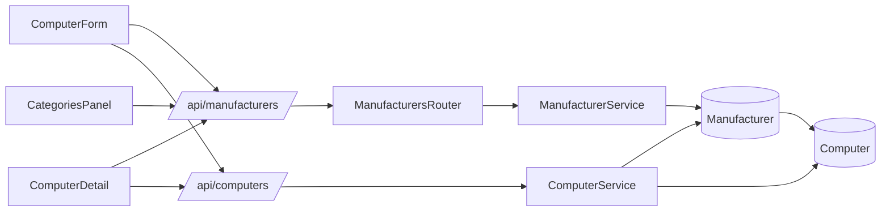
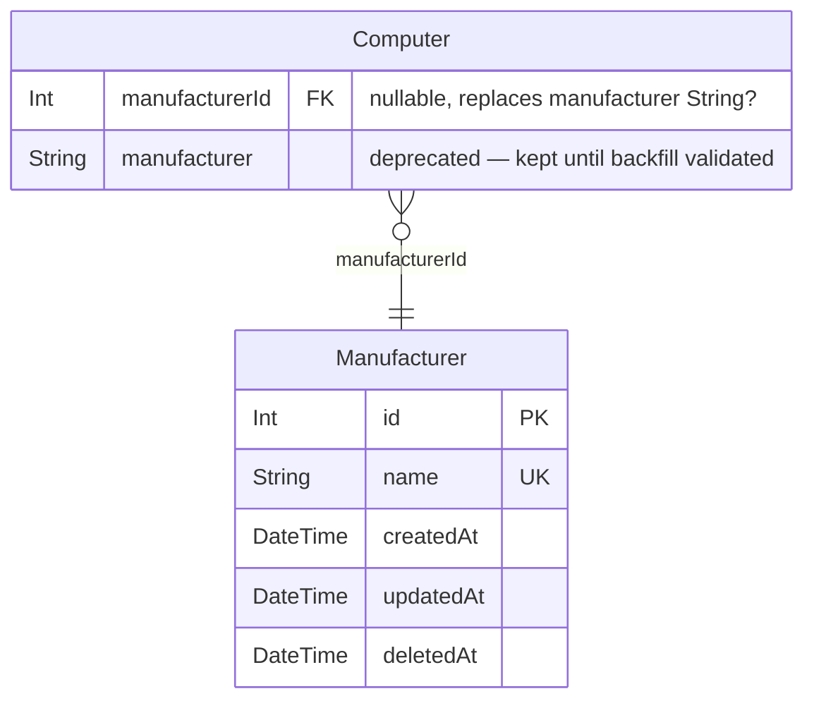

# Architecture Update r1 — Manufacturer as a First-Class Entity

This document is an addendum to `architecture-update.md`. It covers the schema
change, data migration, and server/client additions required to promote
`manufacturer String?` on Computer into a full `Manufacturer` entity, following
the same pattern as Category and OperatingSystem.

---

## Step 1: Problem Understanding

Sprint 001 added the manufacturer field to ComputerForm.tsx as a hardcoded
dropdown. The stakeholder identified during that review that there is no way to
add or rename a manufacturer without a code change — the same gap that
Categories and OperatingSystems solved earlier. This addendum closes that gap
by treating Manufacturer identically to those two models.

---

## Step 2: Responsibilities

**R1 — Manufacturer data model**: Own the canonical list of manufacturers.
Store name, timestamps, soft-delete support.

**R2 — Manufacturer server API**: Expose CRUD for Manufacturer, guard with
`requireQuartermaster`.

**R3 — Computer FK integration**: Add `manufacturerId Int?` FK on Computer;
backfill existing string values; keep `manufacturer String?` alive until
backfill is validated.

**R4 — Computer service/contracts**: Thread `manufacturerId` through
`ComputerService`, `COMPUTER_INCLUDES`, `ComputerRecord`, `CreateComputerInput`,
and `UpdateComputerInput`.

**R5 — Client form + detail surfaces**: Replace hardcoded manufacturer option
lists in ComputerForm.tsx and ComputerDetail.tsx with API-fetched lists.

**R6 — Admin panel surface**: Add a Manufacturers tab to CategoriesPanel.tsx
using the existing `EditableList` component.

---

## Step 3: Module Definitions

### Manufacturer Prisma Model (new)
Purpose: Canonical, admin-managed lookup table for hardware manufacturers.
Boundary: owns id, name, createdAt, updatedAt, deletedAt (no slug, no external
IDs — matches Category/OperatingSystem shape except OperatingSystem lacks
deletedAt; add deletedAt here to match Category).
Use cases: tickets 004, 005, 006, 007.

### ManufacturersRouter (new — `server/src/routes/manufacturers.ts`)
Purpose: HTTP CRUD for the Manufacturer entity.
Boundary: delegates all business logic to ManufacturerService; does not touch
Computer rows directly.
Use cases: tickets 005, 007.

### ManufacturerService (new — `server/src/services/manufacturer.service.ts`)
Purpose: list, create, update, soft-delete Manufacturer rows.
Boundary: identical interface contract to CategoryService; reads/writes only the
Manufacturer table.
Use cases: tickets 005, 007.

### ComputerService (modified)
Purpose: orchestrates Computer CRUD with full relation resolution.
Change: add `manufacturerId` to `COMPUTER_INCLUDES`, validation guard, and
`data` build in create/update. Add `manufacturerId` to `auditFields`.
Use cases: tickets 005.

### Computer Contracts (modified — `server/src/contracts/computer.ts`)
Purpose: Zod/interface types for Computer read/write.
Change: add `manufacturerId?: number | null` to inputs; add
`manufacturer: { id: number; name: string } | null` to `ComputerRecord`.
Use cases: tickets 005.

### ComputerForm.tsx (modified)
Purpose: create/edit form for Computer records.
Change: fetch `/api/manufacturers`; replace hardcoded `<option>` list with
API-populated select using `manufacturerId` instead of the string `manufacturer`.
Use cases: ticket 006.

### ComputerDetail.tsx (modified)
Purpose: inline-editable detail page for a single Computer.
Change: same as ComputerForm — fetch manufacturers, replace hardcoded select
with API-driven one, drive the `EditableCell` via `manufacturerId`.
Use cases: ticket 006.

### CategoriesPanel.tsx (modified)
Purpose: admin lookup-table management tab panel.
Change: add `manufacturers` tab entry; render `<EditableList endpoint="/api/manufacturers" label="Manufacturers" />`.
Use cases: ticket 007.

---

## Step 4: Diagrams

### Component / Module Diagram



### Entity-Relationship Diagram (changes only)



### Dependency Direction

```
[CategoriesPanel / ComputerForm / ComputerDetail]
    → [ManufacturersRouter / ManufacturerService]
    → [Manufacturer Prisma model]
    ← [ComputerService extends to include]
```

No cycles. Direction is presentation → server → persistence.

---

## Step 5: What Changed, Why, Impact, Migration Concerns

### What Changed

1. New `Manufacturer` Prisma model with soft-delete (`deletedAt`).
2. `Computer.manufacturerId Int?` FK added; `Computer.manufacturer String?`
   retained as deprecated.
3. New `/api/manufacturers` router and service mirroring categories.
4. `ComputerService` extended: `COMPUTER_INCLUDES` gains manufacturer relation;
   create/update accept `manufacturerId`; contracts updated.
5. ComputerForm.tsx and ComputerDetail.tsx: manufacturer is now a relation
   select driven by `/api/manufacturers`.
6. CategoriesPanel.tsx: new Manufacturers tab.

### Why

Manufacturer was a hardcoded client-side list with no admin path. Adding,
renaming, or retiring a manufacturer value required a code change and
redeployment. The Category and OperatingSystem precedents established the
correct pattern; this change brings Manufacturer into parity.

### Impact on Existing Components

- `ComputerRecord` gains `manufacturer: { id: number; name: string } | null`
  and `manufacturerId: number | null`. The old `manufacturer: string | null`
  field is removed from the read contract once the FK is live.
- `CreateComputerInput` / `UpdateComputerInput` stop accepting
  `manufacturer: string`; accept `manufacturerId: number | null` instead.
- Any client code currently writing `manufacturer: "Dell"` to the API must
  switch to `manufacturerId: <id>`. Within this sprint that is only
  ComputerForm.tsx and ComputerDetail.tsx.
- MCP-based Computer creation (if any) passes `manufacturer` as string today;
  that path should send `manufacturerId` after ticket 005 ships.

### Migration Concerns — HIGH PRIORITY

**Backfill strategy (ticket 004):**

The Prisma migration adds `manufacturerId Int?` and does NOT drop
`manufacturer String?` in the same transaction. After the column is added, a
seeded TypeScript script (`server/prisma/seed-manufacturer-backfill.ts`) must:

1. Collect all distinct `manufacturer` values from Computer rows where the
   string is non-null and non-empty (trim before comparing).
2. For each distinct value, `upsert` a Manufacturer row (name = trimmed value).
3. For each Computer row where `manufacturer` is a non-null, non-empty string,
   update `manufacturerId` to the matching Manufacturer id.
4. Rows where `manufacturer IS NULL` or `manufacturer = ''` (after trim): leave
   `manufacturerId = NULL` — no action required.

**Two-migration rule (ticket 004):**
Migration 1 (this sprint): add `Manufacturer` table + `manufacturerId` FK on
Computer. The old `manufacturer String?` column is left in place.
Migration 2 (follow-up sprint): after verifying `manufacturerId` is correctly
populated for all rows that had a string value, drop `manufacturer String?`.
Do not combine these into one migration.

**Risk**: if any Computer rows have manufacturer values that differ only by
whitespace or casing (e.g. `"dell"` vs `"Dell"`), the upsert will create two
Manufacturer rows. The backfill script should normalize to title-case before
upserting.

---

## Step 6: Design Rationale

**Decision**: Keep `manufacturer String?` alive through this sprint rather than
dropping it in the same migration.
Context: the string column has live data; if the backfill fails mid-run the
string values remain recoverable.
Alternatives: drop atomically in a single migration (faster, risky) or use a
transaction that backfills + drops together (complex, still risky if Prisma
client is mid-deploy).
Why this choice: safety. The column costs nothing to keep. A second migration
after validation is the industry-standard pattern for additive FK migrations.
Consequences: two deploys are required to fully remove the string column. The
old column is visible in Prisma studio and in the DB but not used by any code
after ticket 005 ships.

**Decision**: Match `Category` shape (with `deletedAt`) rather than
`OperatingSystem` shape (without `deletedAt`).
Context: OperatingSystem lacks soft delete. Category has it. Manufacturer is a
lookup table that might reference production hardware — soft delete allows
retiring a manufacturer without breaking existing Computer records.
Why this choice: future-proof; consistent with the more capable pattern already
in use.

---

## Step 7: Open Questions

None blocking — the backfill strategy is fully specified and the module
boundaries are clear. One advisory:

- The MCP Computer-creation tool (if it sends `manufacturer: string`) will
  silently ignore the field once ticket 005 removes it from the service input.
  The team-lead should verify whether the MCP tool is in active use and whether
  it needs a coordinated update.
