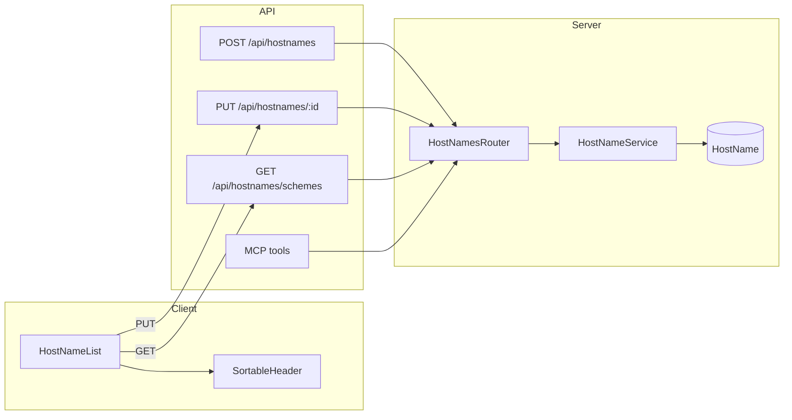
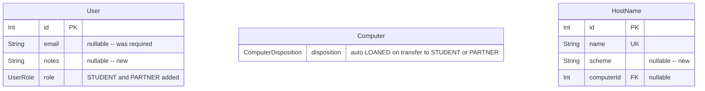

<!-- CLASI: Before changing code or making plans, review the SE process in CLAUDE.md -->

# Architecture Update — Sprint 002: Loan-only custodians & hostname schemes

## Step 1: Problem Understanding

This sprint has two independent tracks.

**Track A — Student/Partner custodians**: The system currently maps every
custodian to a `User` row that can log in via Google OAuth. Students and
external partners who hold equipment have no representation in the system.
The fix introduces two new `UserRole` enum values (`STUDENT`, `PARTNER`) that
mark users as non-login-capable. These users appear in custodian pickers below
a divider, carry a nullable email and optional notes, and automatically flip
`Computer.disposition` to `LOANED` when they receive a transfer.

**Track B — HostName scheme**: The `HostName` model has no field to track which
naming universe a hostname belongs to (e.g. "computer scientists" vs. "computer
graphics terms"). Admins need to sort and filter by scheme in the hostnames list
and set scheme via the MCP agent. The fix adds `scheme String?` to the Prisma
model, wires it through contracts/service/routes/MCP tools, and extends the
hostnames list with a Scheme column, a discrete-filter Status column, and inline
edit with datalist autocomplete.

## Step 2: Responsibilities

**Track A**

- R-A1 Loan-only user identity: `UserRole` enum gains `STUDENT` and `PARTNER`;
  `User.email` becomes nullable; `User.notes` is added.
- R-A2 Access control: OAuth callback and `requireAuth` middleware reject
  sessions for STUDENT/PARTNER users. `/api/admin/users` gains `requireAdmin`.
- R-A3 Admin user management: `POST /api/admin/users` and
  `PUT /api/admin/users/:id` accept new roles, nullable email, and notes.
- R-A4 Custodian-picker rendering: a shared `<CustodianSelect>` component
  renders staff-then-divider-then-loanees using `role` from `/auth/users`.
- R-A5 Auto-LOANED disposition: `TransferService.transferComputer()` sets
  `Computer.disposition = LOANED` when the incoming custodian is STUDENT or
  PARTNER. (Kit has no disposition field; computer-only.)

**Track B**

- R-B1 HostName scheme data model: `HostName.scheme String?` in Prisma.
- R-B2 HostName API surface: `PUT /api/hostnames/:id` (currently missing HTTP
  wiring) and `GET /api/hostnames/schemes` (new).
- R-B3 MCP tool extension: `create_hostname` and `update_hostname` input schemas
  gain `scheme`.
- R-B4 Discrete column filter UI: `SortableHeader` gains
  `filterMode: 'discrete'` and `discreteOptions` props; backward-compatible.
- R-B5 HostName list UX: Scheme column, Status discrete filter, inline edit with
  datalist autocomplete for scheme.

## Step 3: Module Definitions

### UserRole Enum (modified — `server/prisma/schema.prisma`)
Purpose: Classifies users by login capability and operational role.
Boundary: Enum only; no business logic. Values `STUDENT` and `PARTNER` signal
non-login-capable custodians; all login guards read this enum.
Use cases: SUC-001, SUC-002, SUC-003.

### User Model (modified — `server/prisma/schema.prisma`)
Purpose: Stores identity and contact information for all system actors.
Boundary: `email String?` (was required); `notes String?` (new). No other
structural changes to relations or indexes.
Use cases: SUC-001, SUC-004.

### AdminUsersRouter (modified — `server/src/routes/admin/users.ts`)
Purpose: CRUD for User records; admin-only.
Boundary: Now guarded by `requireAdmin` (previously missing); accepts null email
and notes when role is STUDENT or PARTNER; skips email-uniqueness check for
null emails.
Use cases: SUC-001.

### AuthRouter — `/auth/users` (modified — `server/src/routes/auth.ts`)
Purpose: Returns the user list for custodian pickers.
Boundary: Now includes `role` on each user record; sorts staff roles first,
then STUDENT/PARTNER alphabetically. Single source of truth for picker ordering.
Use cases: SUC-002.

### OAuth Callback + requireAuth (modified)
Files: `server/src/routes/auth.ts`, `server/src/middleware/requireAuth.ts`
Purpose: Login gate.
Boundary: Both locations reject sessions where `user.role` is STUDENT or
PARTNER. `requireAuth` is the belt-and-suspenders guard; OAuth callback is the
primary rejection point.
Use cases: SUC-003.

### TransferService (modified — `server/src/services/transfer.service.ts`)
Purpose: Records chain-of-custody changes for Computer and Kit.
Boundary: `transferComputer()` now conditionally sets `disposition = LOANED`
when the resolved custodian's role is STUDENT or PARTNER. The custodian lookup
already happens in the method; this adds one conditional field to the Prisma
update. Kit transfer is unchanged (Kit has no disposition field).
Use cases: SUC-002.

### CustodianSelect (new — `client/src/components/CustodianSelect.tsx`)
Purpose: Shared `<select>` component that renders users as staff / divider /
loanees.
Boundary: Accepts the fetched user list and current custodianId; emits
`onChange(id)`. Encapsulates the disabled-option divider logic. Does not fetch
users itself — caller owns the fetch.
Use cases: SUC-002.

### roles.ts (modified — `client/src/lib/roles.ts`)
Purpose: Client-side role constants, labels, and badge styles.
Boundary: Additive only — STUDENT and PARTNER entries added to `USER_ROLES`,
`ROLE_LABELS`, and `ROLE_BADGE_STYLES`.
Use cases: SUC-001, SUC-002.

### UsersPanel (modified — `client/src/pages/admin/UsersPanel.tsx`)
Purpose: Admin UI for managing User records.
Boundary: Role dropdown gains STUDENT and PARTNER; email field becomes optional
when role is STUDENT/PARTNER; notes textarea is added for all users.
Use cases: SUC-001.

### Nullable Email Audit (cross-cutting — multiple files)
Purpose: Ensure all display sites handle `email: string | null` gracefully.
Boundary: Guard sites: `auth.ts:156`, `token.service.ts:72`,
`AppLayout.tsx:372`, `Account.tsx:112`, `UsersPanel.tsx:298`,
`AdminTokens.tsx:109`, `oauth.ts:92,235`.
Use cases: SUC-004.

---

### HostName Model (modified — `server/prisma/schema.prisma`)
Purpose: Stores hostname-to-computer assignments.
Boundary: `scheme String?` added (nullable, no unique constraint). Additive
migration only.
Use cases: SUC-005, SUC-006, SUC-008.

### HostNameContracts (modified — `server/src/contracts/hostName.ts`)
Purpose: Zod/interface types for HostName read/write.
Boundary: `HostNameRecord` gains `scheme: string | null`; introduces
`UpdateHostNameInput { name?: string; scheme?: string | null }`.
Use cases: SUC-005, SUC-008.

### HostNameService (modified — `server/src/services/hostname.service.ts`)
Purpose: Business logic for HostName CRUD.
Boundary: `create()` and `update()` accept `scheme`; `'scheme'` added to
`auditFields`.
Use cases: SUC-005, SUC-008.

### HostNamesRouter (modified — `server/src/routes/hostnames.ts`)
Purpose: HTTP API for HostName operations.
Boundary: Existing POST gains `scheme` in body. Two new endpoints added:
`PUT /hostnames/:id` (guarded by `requireQuartermaster`) and
`GET /hostnames/schemes` (returns distinct non-null scheme values, unguarded).
Use cases: SUC-005, SUC-008.

### MCP Tools (modified — `server/src/mcp/tools.ts`)
Purpose: LLM-accessible tool interface for inventory operations.
Boundary: `create_hostname` input schema adds `scheme: z.string().optional()`.
`update_hostname` input schema adds `scheme: z.string().optional()` alongside
the existing `name` field; at least one of `name` or `scheme` is required.
Use cases: SUC-005.

### SortableHeader (modified — `client/src/components/SortableHeader.tsx`)
Purpose: Reusable table column header with sort and filter controls.
Boundary: Adds `filterMode?: 'text' | 'discrete'` (default `'text'`) and
`discreteOptions?: string[]` props. When `discrete`, the search icon reveals a
`<select>` instead of a text input. `onFilter(key, value)` callback and
`useTableSort` are unchanged.
Use cases: SUC-006, SUC-007.

### HostNameList (modified — `client/src/pages/computers/HostNameList.tsx`)
Purpose: List of HostName records with sort, filter, and inline edit.
Boundary: Adds Scheme column (sortable, discrete filter); switches Status column
to discrete filter; adds inline edit for name and scheme with datalist
autocomplete (scheme datalist reads from `GET /api/hostnames/schemes`).
Use cases: SUC-006, SUC-007, SUC-008.

## Step 4: Diagrams

### Component / Module Diagram — Track A (Student/Partner)

```mermaid
graph LR
    subgraph Client
        UP[UsersPanel]
        CS[CustodianSelect]
        CD[ComputerDetail]
        TM[TransferModal]
        KD[KitDetail]
        TA[TransferAction]
    end

    subgraph API
        AUsers[/api/admin/users]
        AuthUsers[/auth/users]
        Transfers[/api/transfers]
    end

    subgraph Server
        AdminUsersRouter
        AuthRouter
        TransferService
        RequireAuth[requireAuth]
    end

    UP -->|POST/PUT| AUsers
    AUsers --> AdminUsersRouter

    CS -->|GET| AuthUsers
    AuthUsers --> AuthRouter

    CD --> CS
    TM --> CS
    KD --> CS
    TA --> CS

    CD -->|POST| Transfers
    TM -->|POST| Transfers
    KD -->|POST| Transfers
    TA -->|POST| Transfers
    Transfers --> TransferService
```

### Component / Module Diagram — Track B (HostName Scheme)



### Entity-Relationship Diagram (changes only)



## What Changed

**Track A**
1. `UserRole` enum: added `STUDENT`, `PARTNER`.
2. `User.email`: `String @unique` → `String? @unique`.
3. `User.notes String?`: new nullable column.
4. `/api/admin/users`: gains `requireAdmin`; accepts null email and notes for
   STUDENT/PARTNER.
5. OAuth callback + `requireAuth`: reject STUDENT/PARTNER.
6. `/auth/users`: includes `role` field; server sorts staff first.
7. `TransferService.transferComputer()`: conditionally sets
   `disposition = LOANED`.
8. New `CustodianSelect` component; 4 picker files updated; `roles.ts` extended;
   UsersPanel extended.
9. Nullable email audit: `?? '—'` guards at all identified display sites.

**Track B**
1. `HostName.scheme String?`: new nullable column.
2. `HostNameContracts`: `UpdateHostNameInput` type introduced; `scheme` on
   `HostNameRecord`.
3. `HostNameService`: `create()` and `update()` accept `scheme`.
4. `PUT /api/hostnames/:id`: new HTTP endpoint.
5. `GET /api/hostnames/schemes`: new HTTP endpoint.
6. MCP tools: `create_hostname` and `update_hostname` accept `scheme`.
7. `SortableHeader`: `filterMode` and `discreteOptions` props.
8. `HostNameList`: Scheme column, Status discrete filter, inline edit.

## Why

Track A: equipment loans to non-staff have no system representation; admins
work around this with proxy accounts or leave the field blank, breaking
transfer history.

Track B: hostnames from different naming universes cannot be distinguished or
filtered; the MCP agent cannot record scheme on records it creates or updates.

## Impact on Existing Components

- `UserRecord` contract: `email` changes to `string | null`; gains
  `notes: string | null`. All callers that display email must add null guards.
- `HostNameRecord`: gains `scheme: string | null`. No existing callers read
  scheme, so no consumers break.
- `SortableHeader`: additive props only; all existing usages retain default
  `filterMode: 'text'` behaviour without modification.
- `TransferService.transferComputer()`: gains a conditional disposition update.
  The Kit transfer path is not touched.
- `/auth/users` response: gains `role` on each user entry. Existing consumers
  that ignore unknown fields are unaffected.

## Migration Concerns

Both migrations are additive only:

**Track A**: Adding two enum values to `UserRole` requires `ALTER TYPE ... ADD
VALUE` in Postgres — Prisma generates this correctly. Making `User.email`
nullable is `ALTER TABLE ALTER COLUMN DROP NOT NULL` — safe on live data;
existing rows retain their email values. `User.notes` defaults null; no
backfill needed.

**Track B**: Adding `HostName.scheme String?` is `ALTER TABLE ADD COLUMN` with
no default. All existing rows get NULL. No backfill needed.

No data loss risk. No deployment sequencing concern beyond running migrations
before deploying the updated server binary.

## Design Rationale

**Server-side staff-first sort on `/auth/users`**
Context: Four client locations render custodian pickers. Bucketing logic must
live somewhere shared.
Alternatives: client-side bucketing in each picker; dedicated endpoint returning
pre-split arrays.
Why this choice: Single source of truth; all four pickers share identical
rendering via `<CustodianSelect>`. Exposing `role` on `/auth/users` is a
minimal, non-breaking additive change.
Consequences: `/auth/users` now returns `role`. Existing consumers that ignore
unknown fields are unaffected.

**CustodianSelect is a dumb rendering component (no internal fetch)**
Context: All four picker locations already fetch the user list. Fetching inside
the component would add redundant API calls.
Why this choice: Simpler; no over-fetching; callers already own the user list.

**Auto-LOANED is Computer-only**
Context: `Kit` has no `disposition` field (confirmed by schema inspection).
Why this choice: Nothing to set on Kit. If Kit disposition is introduced later,
that sprint adds the parallel behaviour.

**SortableHeader discrete mode leaves `useTableSort` unchanged**
Context: The existing `includes` filter treats values as substrings. An exact
`<select>` value matches correctly via includes (exact ⊆ includes). The status
values "Assigned" and "Available" do not substring-match each other.
Why this choice: Zero risk; no changes to a utility used across all list pages.

**`GET /api/hostnames/schemes` returns distinct non-null values only**
Context: The client uses this for datalist autocomplete and filter dropdown.
Null means "unset" — not a filterable category.

## Open Questions

None blocking. One implementation note to verify during ticket 001 execution:

- `oauth.ts:92,235` calls `emailToClientId(user.email)`. These paths only run
  for users completing a real OAuth flow, so email will be present. Confirm the
  correct location for an invariant assertion at the OAuth-authorize entry
  during implementation (rather than scattering non-null casts at the call
  sites).
