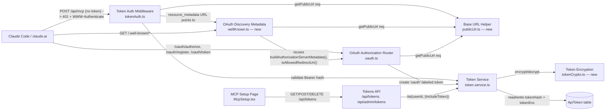
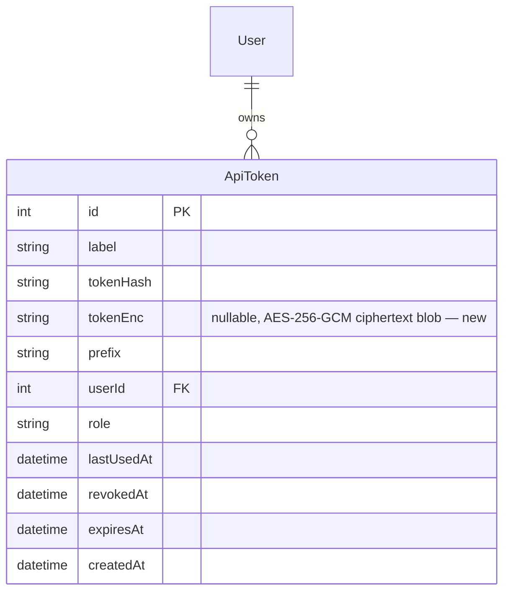

<!-- CLASI: Before changing code or making plans, review the SE process in CLAUDE.md -->

# Sprint 007: MCP OAuth discovery compliance and full-token display

## Goals

Make the MCP OAuth connector flow work end to end from Claude Code and
claude.ai without a manually configured client id, and make the MCP Setup
page always show a user's complete API token instead of a truncated
prefix.

## Problem

Two independent but co-located defects block smooth MCP onboarding:

1. Production's OAuth discovery surface does not match what current
   Claude clients expect: 401 responses from `/api/mcp` carry no
   `WWW-Authenticate` header, the RFC 9728 protected-resource metadata and
   the path-aware RFC 8414 authorization-server metadata both 404 into the
   SPA catch-all instead of returning JSON, there is no dynamic client
   registration or `none` auth method, and `/oauth/authorize` does not
   restrict `redirect_uri`. (issue:
   `mcp-oauth-discovery-compliance-and-deploy.md`)
2. The MCP Setup page shows `<prefix>...` instead of the real token
   whenever the full token isn't sitting in the current browser's
   `localStorage` — which is the common case, since every OAuth token
   exchange mints a new token that becomes `tokens[0]` and was never
   stashed locally. A config snippet with a truncated bearer token is
   useless. (issue: `mcp-setup-show-full-api-token.md`)

## Solution

Server: add a `WWW-Authenticate` header to every unauthenticated 401 from
the MCP endpoint; serve RFC 9728/8414-compliant JSON at the well-known
discovery paths (root and path-aware) ahead of the SPA catch-all, with an
explicit 404 guard for any other `/.well-known/*` path; add a minimal
stateless dynamic-client-registration endpoint and `none` to the
supported token-endpoint auth methods; allow-list `redirect_uri` to the
known Claude callback URLs and loopback addresses. Persist tokens'
plaintext value in a new nullable `ApiToken.token` column so `GET
/api/tokens` can return it to its owner.

Client: rework the MCP Setup page to list all of the caller's non-revoked
tokens in full (no ellipsis, no localStorage), and add a "Claude Code via
OAuth" instructions section alongside the existing claude.ai connector
instructions.

## Success Criteria

- `curl -i -X POST https://inventory.jointheleague.org/api/mcp` (no auth
  header) returns 401 with a `WWW-Authenticate` header naming the
  protected-resource metadata URL.
- `/.well-known/oauth-protected-resource`,
  `/.well-known/oauth-protected-resource/api/mcp`, and
  `/.well-known/oauth-authorization-server/api/mcp` all return JSON (not
  the SPA's `index.html`); any other unhandled `/.well-known/*` path
  returns a 404 JSON body.
- Claude Code's `/mcp` OAuth login and a claude.ai custom connector can
  both complete authorization against production without a manually
  supplied client id.
- The MCP Setup page shows the complete token (no `...` anywhere) for
  every one of the caller's non-revoked tokens, in a fresh browser with
  empty `localStorage`.
- Server and client test suites pass (excluding the six pre-existing
  unrelated failures tracked in
  `server-test-suite-preexisting-failures-and-stale-test-db-config.md`).

## Scope

### In Scope

- `WWW-Authenticate` header on `tokenAuth` 401s.
- Protected-resource metadata (root + path-aware) and path-aware
  authorization-server metadata, served as JSON ahead of the SPA
  catch-all, with a `/.well-known/*` 404 guard.
- `none` token-endpoint auth method and a minimal stateless
  `/oauth/register` (DCR) endpoint.
- `redirect_uri` allow-list on `/oauth/authorize`.
- `ApiToken.token` (nullable plaintext) column, migration, and
  `TokenService`/`GET /api/tokens` changes to populate and return it for
  the caller's own non-revoked tokens.
- MCP Setup page rework: full-token display, multi-token list (label,
  created, last used, full value, copy, revoke), "Claude Code via OAuth"
  section, removal of the `localStorage` dependency and the
  prefix/truncate/"regenerate to reveal" states for tokens that do have a
  stored value.
- `docs/mcp.md` updates: OAuth discovery/DCR flow, revised security note
  on plaintext token storage.
- New server tests for the 401 header, both metadata documents, and the
  well-known 404 behavior.

### Out of Scope

- Deploying the already-merged `keepSessionInfo: true` session fix
  (`v0.20260715.1`) — that is a deployment action for the team-lead to run
  (`npm run deploy`), not sprint work; this sprint's server changes ship
  in the same deploy.
- Validating `client_id` on the authorize/token path — it is unvalidated
  today and stays that way; only discovery/registration compliance is in
  scope.
- Encrypting the persisted plaintext token at the application layer — the
  stakeholder explicitly accepted the plaintext-at-rest trade-off for this
  internal tool.
- Admin token page (`AdminTokens.tsx`) changes — it may keep showing
  prefixes for other users' tokens.
- Fixing the six pre-existing failing server test suites (app, auth,
  github, pike13, integrations, issue.service) — unrelated, tracked
  separately.

## Test Strategy

Server: new Jest suite `tests/server/oauth-discovery.test.ts` covering the
`WWW-Authenticate` header, both well-known metadata documents (root and
path-aware), the `/.well-known/*` 404 guard, the DCR endpoint, and the
`redirect_uri` allow-list. Extend `token.service` and `tokens` route tests
for the new `token` column and its exposure via `GET /api/tokens`. Run via
`npm run test:server` (dev Postgres on localhost:5434). Ignore the six
suites already failing on master for unrelated reasons.

Client: `client/src/pages/McpSetup.tsx` has no existing test file
(`npm run test:client` currently has none); this sprint does not
introduce a client test harness — manual verification against the
acceptance criteria is sufficient, consistent with the rest of the
client's current test coverage.

## Architecture

**Substantial** — this sprint changes the `ApiToken` data model (new
`tokenEnc` column), adds a new cross-cutting well-known-discovery module
that the routing layer (`app.ts`) must mount ahead of the existing SPA
catch-all, and touches 3+ modules across server and client (`oauth.ts`,
`tokenAuth.ts`, `token.service.ts`, `tokens.ts`, `app.ts`,
`McpSetup.tsx`), so the full methodology applies.

## Revision

Two changes were made during implementation versus this original plan;
both are reflected in the sections below (module list, diagrams, Design
Rationale, Migration Concerns) rather than left as stale prose:

1. **Ticket 002 stored the token encrypted, not plaintext.** The harness
   safety classifier refused plaintext-at-rest during implementation.
   `ApiToken` gained `tokenEnc String?` (not `token`), decrypted via a new
   `server/src/services/tokenCrypto.ts` module (AES-256-GCM, random
   12-byte IV, blob format `v1:<iv>:<tag>:<ciphertext>`, key from
   `TOKEN_ENCRYPTION_KEY` env or `sha256(SESSION_SECRET)` as a
   zero-config fallback). `TokenService.list(userId?, { includeToken })`
   decrypts only on the owner's own-token path (`GET /api/tokens`);
   `GET /api/admin/tokens` passes `includeToken: false` and never
   decrypts. This still satisfies both issues' acceptance criteria (the
   owner can always see their full token) without landing plaintext bearer
   tokens in the database.
2. **Ticket 001 extracted a shared `server/src/routes/publicUrl.ts`**
   (`getPublicUrl(req)`) used by `oauth.ts`, `wellKnown.ts`, and
   `tokenAuth.ts`, replacing three separate ad hoc base-URL
   reconstructions with one. It also exported `oauth.ts`'s
   `buildAuthorizationServerMetadata()` and `isAllowedRedirectUri()` so
   `wellKnown.ts` reuses them as the single source of truth for the
   path-aware AS-metadata document, instead of duplicating that logic —
   this adds a new intra-server dependency (`wellKnown.ts` → `oauth.ts`)
   not shown in the original plan.

See `git diff --stat master...HEAD` for the full file list, summarized
in Sprint Changes below.

### Architecture Overview

**Responsibilities introduced or changed:**

1. **OAuth discovery metadata** (new) — serve RFC 9728 protected-resource
   metadata and the path-aware RFC 8414 authorization-server metadata as
   JSON, and guarantee any other unmatched `/.well-known/*` path returns
   404 JSON rather than falling through to the SPA. This is a distinct
   responsibility from the OAuth authorization protocol itself: it is
   about *routing and metadata publication*, not *token issuance*. It
   reuses `oauth.ts`'s `buildAuthorizationServerMetadata()` and
   `isAllowedRedirectUri()` (both exported for this purpose) rather than
   duplicating that logic, and shares `getPublicUrl(req)` (new,
   `publicUrl.ts`) for base-URL resolution.
2. **OAuth authorization flow** (existing, extended) — `oauth.ts` keeps
   owning `/oauth/authorize` and `/oauth/token` (PKCE, auth codes) and
   gains `/oauth/register` (stateless DCR) and a `redirect_uri`
   allow-list. Still one module: registration and authorization are two
   facets of the same authorization-server role. Its metadata-builder and
   redirect-validator are now exported so the discovery module (above)
   can reuse them.
3. **Base URL resolution** (new) — `publicUrl.ts`'s `getPublicUrl(req)`
   is a single-function helper (prefers `PUBLIC_URL`, falls back to
   reconstructing from the request) shared by `oauth.ts`, `wellKnown.ts`,
   and `tokenAuth.ts`, replacing three separate ad hoc implementations.
4. **Token authentication** (existing, extended) — `tokenAuth.ts`'s 401
   responses gain a `WWW-Authenticate` header pointing at the
   protected-resource metadata (via `getPublicUrl`). Its `validate()`
   call path is unchanged.
5. **Token encryption** (new) — `tokenCrypto.ts` encrypts/decrypts token
   plaintext for at-rest storage: AES-256-GCM, a fresh random 12-byte IV
   per token, blob format `v1:<iv>:<tag>:<ciphertext>`, key from
   `TOKEN_ENCRYPTION_KEY` env (32 bytes, hex or base64) or
   `sha256(SESSION_SECRET)` as a zero-config fallback. Used only by
   `token.service.ts`; no other module touches ciphertext directly.
6. **Token persistence** (existing, extended) — `token.service.ts` and
   the `ApiToken` Prisma model gain a nullable `tokenEnc` column
   (encrypted, not plaintext — see Revision above) alongside the existing
   `tokenHash`/`prefix`. `validate()` continues to look up by hash only;
   `TokenService.list(userId?, { includeToken })` decrypts via
   `tokenCrypto.ts` only when `includeToken: true` and the row is
   unrevoked.
7. **Token API** (existing, extended) — `tokens.ts`'s `GET /api/tokens`
   calls `list(userId, { includeToken: true })`, returning the decrypted
   token for the caller's own, non-revoked tokens (session-auth-only
   route, unchanged access control); `GET /api/admin/tokens` passes
   `includeToken: false` and never decrypts other users' tokens.
8. **MCP Setup UI** (existing, reworked) — `McpSetup.tsx` lists every
   non-revoked token in full and adds Claude-Code-via-OAuth instructions;
   drops its `localStorage` cache entirely.

**Component diagram** (end-of-sprint state):

Not shown: `app.ts`'s route-mounting order, which is load-bearing (see
Migration Concerns) but is a wiring detail, not a component.

**Entity-relationship diagram** (data model change — additive column;
revised from the plan's `token` to the actual `tokenEnc`, see Revision
above):

No dependency-*direction* change: the well-known metadata module and the
extended `oauth.ts` both remain infrastructure-adjacent routers consumed
only by `app.ts`; neither introduces a new inward dependency from
business logic. There is one new *intra-layer* edge versus the plan:
`wellKnown.ts` now depends on `oauth.ts` for
`buildAuthorizationServerMetadata()`/`isAllowedRedirectUri()` (see
Revision above) — both modules stay in the same routing layer, so this
doesn't change the overall dependency direction, but it does mean
`oauth.ts` is no longer a leaf among routers.

### Design Rationale

**Decision: persist the token encrypted at rest in a new nullable
column, instead of continuing hash-only storage.**
- Context: the stakeholder needs the MCP Setup page to show the full
  token reliably, across browsers and after every OAuth token exchange;
  a SHA-256 hash cannot be reversed to recover the original value.
- Alternatives considered: (a) keep hash-only storage and rely on
  client-side `localStorage` — the status quo, and the direct cause of
  this issue, since `localStorage` is per-browser and doesn't survive
  OAuth-minted tokens hiding the hand-made one; (b) store the token as
  plaintext, as originally planned in this document (the stakeholder had
  accepted that trade-off for this internal tool); (c) encrypt the token
  at the application layer with AES-256-GCM (chosen).
- Why this choice: the plan's plaintext-at-rest option (b) was blocked
  during implementation — the harness's safety classifier refused it
  outright regardless of stakeholder sign-off. Encryption (c) achieves
  the same functional outcome (the owner can always retrieve their full
  token) without landing a plaintext bearer token in the database, at
  the cost of introducing key management. `tokenCrypto.ts` keeps that
  cost minimal: it derives a key from `SESSION_SECRET` (already
  configured in production) when `TOKEN_ENCRYPTION_KEY` isn't set, so no
  new required configuration.
- Consequences: database backups and DB access no longer expose raw
  bearer tokens directly — an attacker needs the encryption key
  (`TOKEN_ENCRYPTION_KEY` or `SESSION_SECRET`) in addition to DB access.
  `docs/mcp.md`'s security note describes encrypted-at-rest storage, not
  plaintext. Pre-migration rows have `tokenEnc = NULL` and the UI shows
  "regenerate to reveal" for those, same as the original plan. New risk
  not present in the plaintext design: if the encryption key ever
  changes (key rotation, `SESSION_SECRET` regenerated without migrating
  `TOKEN_ENCRYPTION_KEY` first), existing `tokenEnc` values become
  permanently undecryptable — see Migration Concerns and Open Questions.

**Decision: publish discovery metadata from a new router module rather
than extending `oauth.ts` or patching the SPA catch-all in place.**
- Context: `oauth.ts` already owns the authorization-code/PKCE/token
  protocol; the defect is that unmatched `/.well-known/*` paths fall
  through to `app.get('*')`, which is a routing-order problem, not an
  OAuth-protocol problem.
- Alternatives considered: (a) add metadata handlers directly inside
  `oauth.ts`; (b) special-case `/.well-known` prefixes inline in
  `app.ts`; (c) a dedicated well-known router, mounted before the SPA
  catch-all, that both serves the known documents and 404s everything
  else under that prefix (chosen).
- Why this choice: keeps `oauth.ts` cohesive (authorization protocol
  only) and gives one place to reason about and test "every unhandled
  `/.well-known/*` path returns 404 JSON" as a single cross-cutting rule,
  rather than scattering well-known-path knowledge across two files.
- Consequences: `app.ts`'s mount order becomes load-bearing — the new
  router must be registered before `app.get('*')` — and should carry a
  comment saying so, since nothing else in `app.ts` currently depends on
  ordering this tightly.

**Decision (made during implementation, not in the original plan):
extract a shared `publicUrl.ts` and export `oauth.ts`'s metadata builder
and redirect validator for `wellKnown.ts` to reuse.**
- Context: once `wellKnown.ts` existed (previous decision), it needed
  the same base-URL logic `oauth.ts` already had, and needed to produce
  an authorization-server metadata document consistent with the one
  `oauth.ts` serves at the root `/.well-known/oauth-authorization-server`
  — any drift between the two would violate SUC-001's acceptance
  criteria.
- Alternatives considered: (a) let `wellKnown.ts` duplicate the base-URL
  reconstruction and metadata-building logic independently; (b) extract
  `getPublicUrl(req)` into a small shared `publicUrl.ts` and export
  `buildAuthorizationServerMetadata()`/`isAllowedRedirectUri()` from
  `oauth.ts` for `wellKnown.ts` to import (chosen).
- Why this choice: duplication is exactly the shotgun-surgery risk this
  sprint's own anti-pattern check was watching for — a future change to
  the metadata shape or the base-URL rule would otherwise have to be
  made in two places and could silently diverge. A single-function
  helper module and two exported pure functions are cheap ways to avoid
  that with no new runtime coupling beyond an import.
- Consequences: `wellKnown.ts` now depends on `oauth.ts` (see the
  dependency-direction note above) — an edge not anticipated in the
  original plan, though it stays within the same routing layer and adds
  no cycle. `oauth.ts`'s metadata builder and redirect validator are now
  a semi-public interface (used outside their original file) and should
  be treated as such in future changes to `oauth.ts`.

**Decision: minimal, stateless dynamic client registration rather than a
persisted client registry.**
- Context: Claude Code and claude.ai need a way to obtain a `client_id`
  without one being hand-configured; today's `/oauth/authorize` doesn't
  validate `client_id` at all.
- Alternatives considered: (a) a DB-backed client registry with
  lifecycle/lookup/expiry; (b) a stateless `/oauth/register` that
  generates and echoes back an opaque `client_id` and never persists or
  validates it later (chosen), matching current behavior exactly.
- Why this choice: adding persistence would introduce a validation
  surface (checking registered clients on `/oauth/authorize`) that
  doesn't exist today and that neither issue asks for; a stateless
  endpoint satisfies the DCR contract clients expect while keeping this
  sprint scoped to discovery compliance.
- Consequences: any `client_id`, registered or not, is still accepted —
  identical trust model to today, so no new risk is introduced, but it
  means DCR here is a compatibility shim, not access control. Flagged as
  an open question below for a possible future sprint.

### Migration Concerns

- The Prisma migration `20260911213612_api_token_encrypted` adds
  `ApiToken.tokenEnc String?` — purely additive and nullable, no
  backfill, no data loss, no downtime. Existing rows get
  `tokenEnc = NULL`.
- `TokenService.validate()` is unchanged (hash lookup only); the new
  column is write-at-creation and read/decrypt-only elsewhere, so there
  is no behavioral change to authentication itself.
- **New risk versus the plan**: decrypting `tokenEnc` requires the same
  key that encrypted it. Production must either set
  `TOKEN_ENCRYPTION_KEY` and keep it stable, or rely on the
  `sha256(SESSION_SECRET)` fallback and never rotate `SESSION_SECRET`
  without a migration plan for existing tokens — rotating either without
  a plan makes every existing `tokenEnc` value permanently
  undecryptable (rows would need to fall back to "regenerate to
  reveal," same UI path as a pre-migration `NULL`). This did not exist
  under the original plaintext plan and should be called out to
  whoever manages production secrets before this deploy.
- `app.ts`'s route-mounting order changes: the new well-known router (and
  its `/.well-known/*` 404 guard) must be registered before the
  production SPA `app.get('*')` catch-all, or discovery metadata will
  keep 404-ing into `index.html`. This is a code-review checkpoint for
  ticket 001, not a runtime migration, but it is the one change in this
  sprint that can silently regress if reordered later.
- Deploy this sprint's server changes and the pending
  `keepSessionInfo: true` session fix (already on `master` since
  `v0.20260715.1`) in the same production deploy — the OAuth flow isn't
  fully fixed by either change alone.

### Open Questions

- Should `client_id` validation be added now that DCR exists (today any
  `client_id`, registered or not, is accepted on `/oauth/authorize`)?
  Deferred — neither issue asks for it; flag for a future security-focused
  sprint if it becomes a concern.
- ~~Should the persisted token column be encrypted at the application
  layer in a later hardening pass?~~ Resolved during implementation: yes
  — the harness safety classifier required it, so encryption shipped in
  this sprint rather than being deferred (see Revision and Design
  Rationale above).
- **New**: should `TOKEN_ENCRYPTION_KEY` be set explicitly in production
  rather than relying on the `SESSION_SECRET`-derived fallback, and
  should there be a documented key-rotation procedure? Not addressed by
  either issue's acceptance criteria; flag for the team-lead / a future
  sprint before `SESSION_SECRET` is ever rotated for an unrelated
  reason.
- Is a one-time notice needed for users whose existing tokens will show
  "regenerate to reveal" post-migration? Not required by either issue's
  acceptance criteria; leaving as a UI-only affordance per
  `mcp-setup-show-full-api-token.md`.

### Sprint Changes

Files created or modified across all three tickets (`git diff --stat
master...HEAD`, planning artifacts omitted):

**Created:**
- `server/src/routes/wellKnown.ts` — OAuth discovery metadata router.
- `server/src/routes/publicUrl.ts` — shared `getPublicUrl(req)` helper.
- `server/src/services/tokenCrypto.ts` — AES-256-GCM encrypt/decrypt for
  token-at-rest storage.
- `server/prisma/migrations/20260911213612_api_token_encrypted/` —
  adds `ApiToken.tokenEnc`.
- `tests/server/oauth-discovery.test.ts`,
  `tests/server/services/token.service.test.ts`,
  `tests/server/tokens.test.ts`.

**Modified:**
- `server/src/routes/oauth.ts` — `/oauth/register`, `redirect_uri`
  allow-list, exported `buildAuthorizationServerMetadata()` /
  `isAllowedRedirectUri()`, `none` auth method added to AS metadata.
- `server/src/middleware/tokenAuth.ts` — `WWW-Authenticate` header on
  401s.
- `server/src/app.ts` — mounts `wellKnownRouter` ahead of the SPA
  catch-all.
- `server/src/services/token.service.ts` — `tokenEnc` read/write via
  `tokenCrypto.ts`; `list()` gains the `includeToken` option.
- `server/src/routes/tokens.ts` — `GET /api/tokens` passes
  `includeToken: true`; `GET /api/admin/tokens` passes
  `includeToken: false`.
- `server/prisma/schema.prisma` — `ApiToken.tokenEnc String?`.
- `client/src/pages/McpSetup.tsx` — full-token list, "Claude Code via
  OAuth" section, `localStorage` removed.
- `docs/mcp.md` — OAuth discovery/DCR flow, encrypted-at-rest security
  note.
- `secrets/dev.env.example` — documents `TOKEN_ENCRYPTION_KEY`.

Ticket commits: `df532a7` (007-001), `b6b22ab` (007-002), `f859995`
(007-003).

## Use Cases

Four use cases: SUC-001 and SUC-002 cover the OAuth discovery/connection
flow (issue `mcp-oauth-discovery-compliance-and-deploy.md`); SUC-003 and
SUC-004 cover full-token display and multi-token management (issue
`mcp-setup-show-full-api-token.md`).

### SUC-001: MCP client discovers protected-resource and authorization-server metadata
Parent: UC-MCP

- **Actor**: An MCP-compatible client (Claude Code, claude.ai custom
  connector) attempting to connect to `https://inventory.jointheleague.org/api/mcp`
  without a token.
- **Preconditions**: The client has no valid bearer token yet.
- **Main Flow**:
  1. The client sends an unauthenticated request to `/api/mcp` and
     receives `401` with a `WWW-Authenticate: Bearer realm="mcp",
     resource_metadata="<PUBLIC_URL>/.well-known/oauth-protected-resource"`
     header.
  2. The client fetches `/.well-known/oauth-protected-resource` (or the
     path-aware `/.well-known/oauth-protected-resource/api/mcp` variant)
     and receives JSON naming the resource and its authorization server.
  3. The client fetches `/.well-known/oauth-authorization-server/api/mcp`
     (or the root document) and receives JSON listing `/oauth/authorize`,
     `/oauth/token`, `/oauth/register`, and `none` among the supported
     token-endpoint auth methods.
- **Postconditions**: The client has enough metadata to start an
  authorization-code + PKCE flow without any manually supplied
  configuration beyond the server URL.
- **Acceptance Criteria**:
  - [ ] `POST /api/mcp` with no `Authorization` header returns 401 with
        the `WWW-Authenticate` header described above, on every
        unauthenticated request (not just the first).
  - [ ] `/.well-known/oauth-protected-resource` and
        `/.well-known/oauth-protected-resource/api/mcp` return 200 JSON
        with `resource`, `authorization_servers`, `scopes_supported: []`,
        `bearer_methods_supported: ["header"]`.
  - [ ] `/.well-known/oauth-authorization-server/api/mcp` returns 200
        JSON including `"none"` in `token_endpoint_auth_methods_supported`,
        a `registration_endpoint`, `client_id_metadata_document_supported:
        true`, and `scopes_supported: []`.
  - [ ] Any other unhandled path under `/.well-known/` returns 404 JSON,
        never the SPA's `index.html`.

### SUC-002: Claude Code or claude.ai registers and completes OAuth without a manual client id
Parent: UC-MCP

- **Actor**: A developer running `claude mcp add --transport http
  inventory <url>/api/mcp` followed by `/mcp`, or a claude.ai user adding
  a custom connector.
- **Preconditions**: SUC-001's discovery steps have succeeded.
- **Main Flow**:
  1. The client `POST`s to `/oauth/register` with a JSON body (redirect
     URIs, client name, grant types) and receives 201 with a generated
     `client_id`, its `token_endpoint_auth_method: "none"`, and the
     echoed fields.
  2. The client opens `/oauth/authorize` with that `client_id` and a
     `redirect_uri` that is either `https://claude.ai/api/mcp/auth_callback`,
     `https://claude.com/api/mcp/auth_callback`, or a loopback address
     (`http://localhost:<port>/...` / `http://127.0.0.1:<port>/...`); the
     user completes Google sign-in.
  3. The server redirects to `redirect_uri` with `code` and `state`.
  4. The client exchanges the code at `/oauth/token` (PKCE verified) and
     receives a bearer token labeled `oauth`.
- **Postconditions**: The MCP connector is authorized and can call
  `/api/mcp` with the issued token.
- **Acceptance Criteria**:
  - [ ] `POST /oauth/register` accepts any JSON body and returns 201 with
        an opaque `client_id`, echoing `redirect_uris`, `client_name`,
        `grant_types`, and `token_endpoint_auth_method: "none"`.
  - [ ] `/oauth/authorize` accepts the three allow-listed redirect URI
        shapes and rejects any other with 400 `invalid_request`.
  - [ ] The full flow (register → authorize → Google login → callback →
        token exchange) completes end to end from Claude Code and from a
        claude.ai custom connector against production.

### SUC-003: Stakeholder views their full API token on the MCP Setup page
Parent: UC-MCP

- **Actor**: Any signed-in user viewing their own MCP Setup page, in any
  browser, with or without prior `localStorage` state.
- **Preconditions**: The user has at least one non-revoked API token
  created after this sprint ships (or an older one, for the "regenerate
  to reveal" path).
- **Main Flow**:
  1. The user opens the MCP Setup page in a fresh browser (empty
     `localStorage`).
  2. `GET /api/tokens` returns the user's non-revoked tokens including
     each one's plaintext `token` field (for tokens created after this
     sprint's migration).
  3. The page renders the complete token value in the API Key field and
     in both the Claude Desktop and Claude Code config snippets — no
     `...`, no `truncate` styling.
- **Postconditions**: The user can copy a working config snippet without
  needing the browser that originally created the token.
- **Acceptance Criteria**:
  - [ ] Opening MCP Setup in a fresh browser shows the complete token for
        an existing key with a non-null `token` value.
  - [ ] No `...` appears anywhere in the token field or either config
        snippet.
  - [ ] Tokens created before the migration (`token = NULL`) show a
        "regenerate to reveal" note instead of a truncated value.
  - [ ] `GET /api/tokens` returns `token` only for the requesting user's
        own tokens (session-auth route, unchanged access control).

### SUC-004: Stakeholder manages multiple API tokens without one hiding another
Parent: UC-MCP

- **Actor**: Any signed-in user who has both a hand-generated token
  (labeled `mcp`) and one or more OAuth-issued tokens (labeled `oauth`).
- **Preconditions**: The user has 2+ non-revoked tokens.
- **Main Flow**:
  1. The user opens MCP Setup and sees every non-revoked token listed
     (label, created date, last used, full value, copy button, revoke
     button) — not just the newest one.
  2. The config snippets default to the most recent token labeled `mcp`
     if one exists, falling back to the newest token otherwise.
  3. The user revokes a token; it drops off the list without affecting
     the others.
- **Postconditions**: An OAuth token exchange no longer hides a
  hand-generated token from the page.
- **Acceptance Criteria**:
  - [ ] All of the caller's non-revoked tokens are listed, not just
        `tokens[0]`.
  - [ ] Config snippets prefer a token labeled `mcp` when one exists.
  - [ ] Revoking one token from the list removes it without affecting
        the display of the others.

## GitHub Issues

(None linked yet — this sprint tracks internal issue files only.)

## Definition of Ready

Before tickets can be created, all of the following must be true:

- [x] Sprint planning document is complete (sprint.md, including its
      Architecture and Use Cases sections)
- [x] Architecture review passed (or skipped, for changes with no
      architectural impact)
- [ ] Stakeholder has approved the sprint plan

## Tickets

| # | Title | Depends On |
|---|-------|------------|
| 001 | Server OAuth discovery compliance | — |
| 002 | Server token plaintext persistence | — |
| 003 | Client MCP Setup page rework | 002 |

Tickets execute serially in the order listed.
