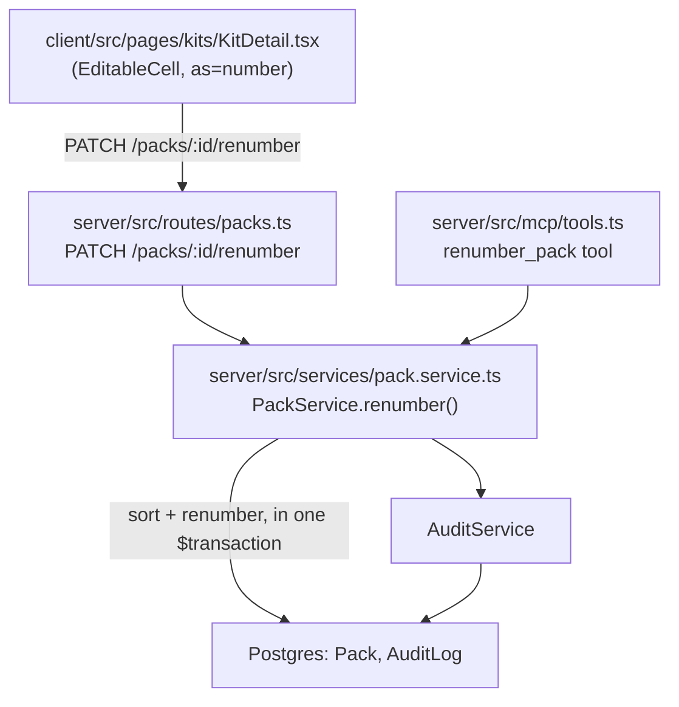
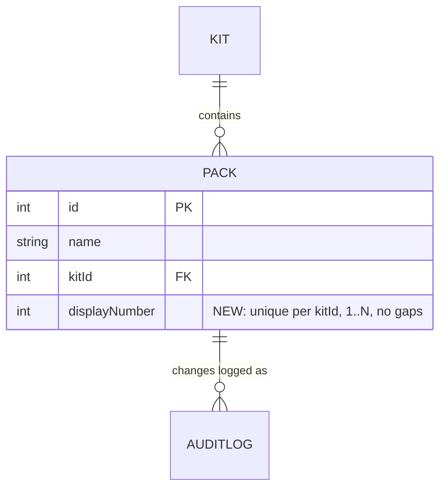

<!-- CLASI: Before changing code or making plans, review the SE process in CLAUDE.md -->

# Sprint 003: Editable Pack Numbers on Kit Page

## Goals

Give each pack a persisted, user-facing **display number** ("pack 1, 2,
3…") that is distinct from its database `id`, show it in the kit page's
pack list, make it inline-editable via number entry, and resolve
numbering collisions deterministically. The renumber logic must live in
exactly one place — a shared `PackService` method called identically by
the web REST route and the MCP server tool — so the two surfaces can
never diverge in behavior.

## Problem

Packs today have no persisted ordering/display field at all. The only
existing "pack number" concept is computed on the fly in
`label.service.ts` (`getPackSequence`), which re-derives a 1-based
sequence from `Pack.findMany({ orderBy: { id: 'asc' } })` purely to print
on physical labels. It is not stored, not shown on the kit page, and not
editable. Stakeholders want a real, persisted, user-editable number
shown in the pack list, with a well-defined rule for what happens when
an edit collides with a number already in use.

## Solution

- Add a persisted `Pack.displayNumber` integer column, unique per kit
  (`@@unique([kitId, displayNumber])` — not globally unique, since
  different kits each number their own packs starting at 1).
- Add `PackService.renumber(kitId, packId, requestedNumber, userId)` — a
  single shared method that: validates the requested number is in
  `1..N` for the kit's current pack count, applies the stakeholder's
  sort-and-renumber algorithm (assigned number, with the just-edited
  pack winning ties), and persists the entire resulting `1..N` sequence
  atomically in one Prisma transaction.
- Expose that same method via a new REST endpoint
  (`PATCH /packs/:id/renumber`) and a new MCP tool (`renumber_pack`).
  Both call `services.packs.renumber(...)` directly — no route- or
  tool-side duplication of the algorithm.
- Show `displayNumber` in the kit page's pack list and make it
  inline-editable using the existing `EditableCell` component (`as=
  "number"`), consistent with how pack `name`/`description` and item
  fields are already edited on that page.

## Success Criteria

- The kit page's pack list shows each pack's display number.
- Clicking a pack's number lets a user type a new integer and save it.
- Editing a number that collides with another pack's number resolves
  per the stakeholder's algorithm (edited pack wins the contested
  number; the full kit's packs renumber to a continuous `1..N` with no
  gaps or duplicates), verified by both stakeholder examples (7→4 and
  3→6) as unit tests.
- The renumber operation is available as an MCP tool with identical
  behavior to the REST path (same underlying service call).
- A single edit persists the whole renumbered set atomically — no
  intermediate state is observable and no unique-constraint violation
  occurs mid-write.
- Pack number changes are audit-logged consistent with existing
  pack/kit mutation conventions (`AuditLog`, `source` = UI or MCP as
  appropriate).

## Scope

### In Scope

- `Pack.displayNumber` column, migration, and backfill for existing
  packs (ordered by `id ASC` per kit, matching the current ad hoc label
  sequence so existing printed labels stay numerically consistent
  immediately after migration).
- `PackService.renumber()` shared method with unit tests covering both
  stakeholder examples plus edge cases (edit to same number, edit to
  first/last position, single-pack kit).
- `PackService.create()` (and `KitService.clone()`'s pack-copy loop)
  updated to assign a valid `displayNumber` to every new pack, since the
  new `NOT NULL UNIQUE (kitId, displayNumber)` constraint makes this a
  correctness requirement for every pack-creation path, not just the new
  renumber endpoint.
- Pack list ordering (`PackService.list/listAll/get`, and
  `KitService.get`'s embedded `packs`) changed from `name: asc` to
  `displayNumber: asc`, so the kit page's pack order matches the shown
  numbers.
- `PATCH /packs/:id/renumber` REST endpoint.
- `renumber_pack` MCP tool.
- Kit page pack list: display `displayNumber`, inline-edit via
  `EditableCell`, refresh the full pack list from the endpoint's
  response after a renumber (since more than one pack's number may
  change).
- Audit logging for `displayNumber` changes, written inside the same
  transaction as the pack updates.

### Out of Scope

- Drag-and-reorder UI (issue explicitly scopes this to number-entry
  only).
- Changing `label.service.ts`'s independently-derived pack-label
  sequence to use the new persisted `displayNumber` — flagged as an
  open question below; leaving it as is means printed labels and the
  kit page could show different numbers for the same pack until
  addressed in a follow-up.
- Auto-compacting `displayNumber`s when a pack is **deleted** (as
  opposed to edited) — flagged as an open question below.

## Test Strategy

- **Unit tests** (`tests/server/services/`, alongside the existing
  `pack-item.service.test.ts` conventions): `PackService.renumber()`
  covering both stakeholder examples (7→4, 3→6), a no-op edit (number
  unchanged), edits at the first/last position, and a single-pack kit.
  Verify the persisted set is always a contiguous `1..N` with no
  duplicates after every case, and that `AuditLog` rows are written only
  for packs whose `displayNumber` actually changed.
- **Route tests**: `PATCH /packs/:id/renumber` — success path, invalid
  (out-of-range) number returns a validation error, response contains
  the full renumbered pack list for the kit.
- **MCP tool test**: `renumber_pack` produces the same result as the
  REST path for an equivalent input (same service call, so this is
  mainly a contract/wiring check — args parsed correctly, QM access
  enforced, `source: MCP` recorded on the audit rows).
- Follow existing jest conventions in `tests/server/` (isolated `app`
  test database via the hardcoded fallback `DATABASE_URL`). The 6
  pre-existing failures on master (app/auth/github/pike13/integrations/
  issue.service) are not this sprint's concern and are not expected to
  change.

## Architecture

**Substantial** — introduces a new persisted data-model field
(`Pack.displayNumber`) with a per-kit unique constraint, a new shared
service method consumed by two independent entry points (REST route and
MCP tool), and touches five modules (Prisma schema, `PackService`,
the packs REST route, the MCP tool registry, and the kit-page client) —
a data-model change and a new cross-module dependency (MCP tools →
`PackService.renumber`) each independently trigger the substantial tier
per the sizing rubric, so the full methodology and diagrams are used.

### Architecture Overview

**Responsibilities introduced or changed:**

1. **Persisted pack ordering** — a new column and per-kit uniqueness
   invariant on `Pack`, replacing the previous "no stored order, derive
   one for labels" approach.
2. **Renumber algorithm + transactional persistence** — a single sort
   (by `(assignedNumber, recencyFlag)`) and re-assignment of `1..N`,
   written atomically so the invariant is never observably violated.
3. **Dual-surface exposure** — the same algorithm reachable from the web
   UI and from MCP-driven (assistant) interactions, with no duplicated
   logic.
4. **Pack-list presentation** — showing and inline-editing the number on
   the kit page.

These are grouped as: (1)+(2) belong together (both are "how a pack's
number is stored and recomputed" — same reason to change, same owner:
`PackService`); (3) is a thin exposure concern split across two existing
registries (`packsRouter`, `registerTools`) that each already forward to
`PackService` for every other pack operation, so no new module is
needed, only new entries in each; (4) is presentation-only and changes
independently of the storage/algorithm concern (the client only needs to
know "call this endpoint, replace my pack list with the response").

**Modules:**

- **`server/prisma/schema.prisma` (`Pack` model)** — Purpose: define
  where a pack's display number and its per-kit uniqueness invariant
  live. Boundary: schema and migration only, no behavior. Serves:
  SUC-001, SUC-002.
- **`server/src/services/pack.service.ts` (`PackService`)** — Purpose:
  own all pack data mutations, including the renumber algorithm and its
  atomic persistence. Boundary: takes validated input (kitId, packId,
  requestedNumber, userId), returns the freshly-ordered pack list for
  the kit; does not know whether it was called from HTTP or MCP. Serves:
  SUC-002, SUC-003.
- **`server/src/routes/packs.ts` (`packsRouter`)** — Purpose: translate
  an authenticated HTTP request into a `PackService.renumber()` call.
  Boundary: HTTP concerns only (auth middleware, param parsing, status
  codes) — no algorithm logic. Serves: SUC-002.
- **`server/src/mcp/tools.ts` (`registerTools`)** — Purpose: translate
  an MCP tool call into a `PackService.renumber()` call. Boundary: tool
  schema (zod) and QM-access check only — no algorithm logic. Serves:
  SUC-003.
- **`client/src/pages/kits/KitDetail.tsx` (pack list rendering)** —
  Purpose: display each pack's number and let a user edit it inline.
  Boundary: presentation and the single fetch call to the renumber
  endpoint; on success, replaces its whole `packs` state array with the
  response rather than patching one pack, since many packs' numbers may
  have shifted. Serves: SUC-001, SUC-002.

**Component diagram:**

**Entity-relationship diagram (data model change):**

`@@unique([kitId, displayNumber])` — scoped to the kit, not global,
because two different kits both legitimately have a "pack 1".

**Why:**

The stakeholder wants a number that behaves like a dense rank (`1..N`,
no gaps, no duplicates) and can be typed directly, not a fractional/
lexicographic ordering key (which would support reordering without
renumbering everything, but does not match the issue's explicit
sort-and-renumber-to-1..N algorithm). A persisted integer column with a
per-kit unique constraint is the natural fit, and the constraint gives a
database-level backstop against the invariant being violated by a bug
or a future direct-DB edit, not just an application-level promise.

**Impact on Existing Components:**

- `PackService.list/listAll/get` and `KitService.get`: `orderBy` changes
  from `name: asc` to `displayNumber: asc` so the kit page's pack order
  visually matches the shown numbers.
- `PackService.create` and `KitService.clone`'s pack-copy loop: must now
  stamp a valid `displayNumber` on every new pack (next available
  integer, or preserved relative order for clone) — required by the new
  `NOT NULL` constraint, not just a nicety.
- `label.service.ts` (`getPackSequence`): **unchanged** in this sprint —
  continues to derive its own sequence from `id ASC` independently of
  the new persisted field. See Open Questions — this is a known,
  deliberate scope boundary, not an oversight.
- `contracts/pack.ts` (`PackRecord`): gains `displayNumber: number`.

### Design Rationale

**Decision: persisted dense integer column, not a derived or
fractional-key ordering.**
Context: no ordering field exists on `Pack` today; the closest analog
(`label.service.ts`'s `getPackSequence`) computes a sequence at read
time from `id ASC` purely for label printing, and is not stored or
editable.
Alternatives considered: (a) keep numbering fully derived/computed —
rejected, cannot support an arbitrary user-typed number without
redefining what "order" means; (b) a fractional/lexicographic ordering
key (Trello-style) — rejected, the issue explicitly specifies a dense
`1..N` renumber-cascade algorithm, not a sparse reorderable key, and
drag-reorder (the use case fractional keys are optimized for) is
explicitly out of scope.
Consequence: every pack-creation code path must now stamp a valid
number (see Impact, above), and label numbering diverges from the new
field unless addressed later (Open Questions).

**Decision: two-phase (negative-sentinel, then final) update inside one
`$transaction`, not a deferred unique constraint.**
Context: `@@unique([kitId, displayNumber])` rejects any intermediate
state where two packs momentarily share a number during the shuffle
that the renumber algorithm requires (e.g., pack 7 and pack 4 both
transiently wanting the value `4`).
Alternatives considered: (a) `DEFERRABLE INITIALLY DEFERRED` constraint
via hand-written SQL in the migration — technically works, but Prisma's
schema/migrate model doesn't represent deferrable constraints natively,
so it would have to be hand-edited into the generated migration and is
easy to silently lose on a future `prisma migrate diff`/reset;
(b) drop the unique constraint and rely on application logic alone —
rejected, loses a database-level backstop for the invariant.
Chosen: within a single Prisma interactive transaction
(`prisma.$transaction(async (tx) => ...)`), first move every pack in the
kit whose number is changing to a negative sentinel unique to that row
(e.g., `-id`, guaranteed collision-free since ids are unique), then in a
second pass assign the final positive `1..N` ranks — the positive
number space is fully vacated before any final value is written, so no
intermediate row ever collides with another.
Consequence: two `UPDATE`s per affected pack instead of one; acceptable
given kit pack counts are small (tens, not thousands). The audit writes
for changed packs happen inside the same transaction, so the pack
mutation and its audit trail commit or roll back together.

**Decision: `renumber()` lives on the existing `PackService`, not a new
service module.**
Context: the issue requires "a shared service function" usable from both
REST and MCP.
Alternatives considered: a standalone `pack-renumber.service.ts` —
rejected as unneeded indirection; `PackService` already owns every pack
mutation and its audit wiring, and other entity services already host
entity-specific operations beyond plain CRUD (e.g., `KitService.clone()`,
`KitService.retire()`).
Consequence: `packsRouter` and `registerTools` both call
`services.packs.renumber(...)` — identical call, so behavior cannot
diverge between the two surfaces, satisfying issue requirement 4
directly.

**Decision: a dedicated `PATCH /packs/:id/renumber` endpoint, not an
overload of `PUT /packs/:id`.**
Context: `PUT /packs/:id` today updates `name`/`description` only and
returns one `PackDetailRecord`.
Alternatives considered: folding `displayNumber` into the generic `PUT`
body — rejected; the renumber operation's response shape is
fundamentally different (the whole kit's freshly-ordered pack list, not
one row), and conflating the two makes the endpoint's contract
ambiguous about what a caller gets back.
Consequence: client code that renumbers a pack must replace its entire
`packs` array from the response, not patch one entry in place — this is
called out explicitly in ticket 003's acceptance criteria to avoid a
common bug (patching only the edited pack and leaving stale numbers on
the others in local state).

**Decision: `recencyFlag` is a transient, in-memory tie-breaker, not a
persisted column.**
Context: the issue's own framing says an actual timestamp isn't needed
— "just initialize the values to 1, then set the one you just changed
to 0" — because at most one pack is ever edited per call.
Consequence: `renumber()` computes the `(assignedNumber, recencyFlag)`
tuple array in memory for the duration of the call and discards it;
`updatedAt` (already on `Pack`) is untouched by this feature beyond
Prisma's automatic bump on any row `UPDATE`.

### Migration Concerns

- **Adding a `NOT NULL` column to a populated table**: standard
  three-step migration — (1) add `displayNumber` as nullable, (2)
  backfill every existing pack via a windowed `UPDATE` ordered by `id
  ASC` per `kitId` (matching the current ad hoc label-sequence order, so
  already-printed labels stay numerically consistent immediately after
  deploy), (3) alter the column to `NOT NULL` and add the
  `@@unique([kitId, displayNumber])` index, in that order, so the
  backfill runs before the constraint can reject anything.
- **Deployment sequencing**: no dual-write/expand-contract window is
  needed — the column is additive and nothing reads it until this
  sprint's own route/tool/UI ship in the same deploy.
- **Backward compatibility**: `PackRecord`'s new `displayNumber` field
  is additive; existing consumers of `PackRecord` that don't look at it
  are unaffected.

## Use Cases

### SUC-001: View pack display numbers on the kit page
Parent: UC-009

- **Actor**: Instructor or Quartermaster viewing a kit's detail page.
- **Preconditions**: The kit has one or more packs.
- **Main Flow**:
  1. User opens a kit's detail page.
  2. Each pack in the list shows its display number alongside its name.
- **Postconditions**: The user can see each pack's number without
  needing to infer it from list position or database id.
- **Acceptance Criteria**:
  - [ ] `GET /api/kits/:id` returns each pack's `displayNumber`.
  - [ ] The kit page's pack list renders the number for every pack, in
        `displayNumber` order.

### SUC-002: Quartermaster edits a pack's display number
Parent: UC-009

- **Actor**: Quartermaster on the kit detail page.
- **Preconditions**: The kit has N packs, each numbered `1..N` with no
  gaps or duplicates.
- **Main Flow**:
  1. Quartermaster clicks a pack's number, which becomes an editable
     number input (via `EditableCell`).
  2. Quartermaster types a new number and commits (Enter or blur).
  3. If the number is unused, the edited pack simply takes it and the
     rest of the kit's packs keep their `1..N` positions relative to
     each other, still forming a contiguous sequence.
  4. If the number is already held by another pack, the edited pack
     wins the contested number; the sort-and-renumber algorithm
     (assigned number, then recency — edited pack first on ties) is
     applied to every pack in the kit, and the whole set is persisted
     as a new contiguous `1..N` sequence in one atomic write.
  5. The kit page's pack list refreshes from the response, showing every
     pack's (possibly changed) number.
- **Postconditions**: All packs in the kit are numbered `1..N` with no
  gaps or duplicates; an `AuditLog` entry exists for every pack whose
  number changed, with `source` reflecting how the edit was made.
- **Acceptance Criteria**:
  - [ ] Editing pack 7 to `4` in a 7-pack kit results in: edited pack →
        4, old pack 4 → 5, old packs 5,6 → 6,7 (stakeholder example A).
  - [ ] Editing pack 3 to `6` results in: old pack 4 → 3, and the
        remainder renumbers continuously (stakeholder example B).
  - [ ] Requesting a number outside `1..N` (where N is the kit's current
        pack count) is rejected with a validation error and no packs
        are changed.
  - [ ] The full renumbered set is written in a single transaction; no
        partial/half-renumbered state is ever visible to a concurrent
        reader.
  - [ ] `AuditLog` rows are written only for packs whose `displayNumber`
        actually changed value.

### SUC-003: MCP client renumbers a pack with identical behavior to the web UI
Parent: UC-009

- **Actor**: An MCP-connected client (e.g., an AI assistant) with
  Quartermaster access.
- **Preconditions**: Same as SUC-002.
- **Main Flow**:
  1. MCP client calls the `renumber_pack` tool with a pack id and
     requested number.
  2. The tool enforces Quartermaster access and calls
     `PackService.renumber()` — the exact same method the REST route
     calls.
  3. The response reflects the same renumbered `1..N` sequence SUC-002
     describes, with `AuditLog` rows recorded with `source: MCP`.
- **Postconditions**: Renumbering via MCP produces results
  indistinguishable (other than audit `source`) from renumbering via the
  web UI for the same starting state and input.
- **Acceptance Criteria**:
  - [ ] `renumber_pack` tool exists, requires Quartermaster access, and
        calls `services.packs.renumber(...)` (no duplicated algorithm).
  - [ ] Given the same starting pack numbers and the same requested
        number, the MCP tool and the REST endpoint produce the same
        final `1..N` assignment.
  - [ ] Audit rows from an MCP-driven renumber have `source: MCP`; rows
        from a UI-driven renumber have `source: UI`.

## GitHub Issues

(No GitHub issues linked to this sprint's tickets.)

## Definition of Ready

Before tickets can be created, all of the following must be true:

- [x] Sprint planning document is complete (sprint.md, including its
      Architecture and Use Cases sections)
- [ ] Architecture review passed (or skipped, for changes with no
      architectural impact)
- [ ] Stakeholder has approved the sprint plan

## Open Questions

These require stakeholder input before or during execution; none block
writing the tickets, but each affects a concrete implementation choice:

1. **Delete-time compaction**: the issue's "no gaps, no duplicates"
   invariant is stated for the edit/renumber path (section 3). Deleting
   a pack (existing `PackService.delete()`) is not touched by this
   sprint and will leave a gap in `displayNumber` until the next manual
   edit triggers a renumber. Should delete also auto-compact the
   remaining numbers to keep the invariant continuously true, or is a
   temporary gap after deletion acceptable? Recommendation if no
   preference: leave delete as-is for this sprint (smaller, more
   contained change) and file a follow-up if compaction-on-delete turns
   out to matter in practice.
2. **Label numbering consistency**: `label.service.ts`'s
   `getPackSequence` independently derives a pack's printed-label number
   from `id ASC` order and will now diverge from the new persisted
   `displayNumber` once packs are renumbered. Should this sprint also
   switch label generation to use `pack.displayNumber` (so printed
   labels and the kit page always agree), or is that explicitly
   deferred to a later sprint? This sprint's tickets do not touch
   `label.service.ts` unless told otherwise.
3. **Endpoint/tool naming**: proposing `PATCH /packs/:id/renumber` and
   MCP tool `renumber_pack`. Confirm these names are acceptable and
   won't collide with a future drag-and-drop "reorder" feature's naming
   (which the issue says is out of scope here, but may come later).
4. **Backfill order**: the migration backfills existing packs' numbers
   ordered by `id ASC` per kit (matching today's ad hoc label sequence).
   Confirm this is the right historical ordering to preserve, as opposed
   to, e.g., `createdAt ASC` (equivalent in practice, but not guaranteed
   identical for bulk-imported data).

## Tickets

| # | Title | Depends On |
|---|-------|------------|
| 001 | Pack displayNumber data model + shared renumber service | — |
| 002 | REST endpoint + MCP tool exposure for pack renumbering | 001 |
| 003 | Kit page inline-edit UI for pack display numbers | 002 |

Tickets execute serially in the order listed.
