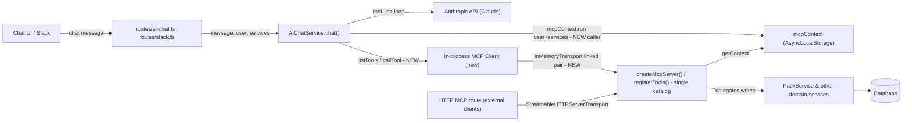

<!-- CLASI: Before changing code or making plans, review the SE process in CLAUDE.md -->

# Sprint 005: AI Chat Pack Renumbering Tools

## Goals

**Scope changed by the stakeholder before the architecture_review gate
was recorded** (direct instruction: "The in-app agent should have the
same tool set as the MCP server — actually, it should probably be using
the MCP server"). The deliverable is no longer a hand-patched pair of
chat tools. It is **one tool catalog**: the in-app chat (and Slack,
which shares the same chat service) exposes the exact same tool set as
the MCP server, by construction, so the two can never silently diverge
again. Pack renumbering (`renumber_pack`, `update_pack.displayNumber`)
arrives as a direct consequence of that unification, not as a second
hand-written tool pair.

## Problem

`server/src/services/ai-chat.service.ts` maintains its own hand-rolled
tool catalog (`getToolDefinitions()` / `executeTool()`), independent of
the MCP server's catalog (`server/src/mcp/tools.ts`, via
`registerTools()`). Sprints 003 and 004 added `renumber_pack` and
`update_pack.displayNumber` to the MCP catalog; the chat catalog never
received either. That gap is a symptom, not the disease: **this is the
second time the chat's duplicated catalog has silently diverged from the
MCP catalog** — the exact divergence class the original pack-numbering
issue was written to prevent (see the issue's Structural note). Patching
`renumber_pack` into the chat catalog a second time (as sprint 005 was
originally planned) would leave the underlying duplication in place,
guaranteeing a third incident the next time the MCP catalog grows.

The fix that actually closes the gap: make the chat consume the MCP
catalog directly, so there is exactly one place tools are defined and
"the chat's tool set" is a computed projection of "the MCP server's tool
set," not an independently maintained copy.

## Solution

Chat becomes an **in-process MCP client** of the same `McpServer`
instance external MCP clients use — via the MCP SDK's
`InMemoryTransport.createLinkedPair()` (client and server communicating
in-process, no HTTP, no tokens, same request). Concretely:

1. `server/src/mcp/server.ts` exports its `createMcpServer()` factory
   (currently module-private) so both the HTTP handler and the chat can
   build a server instance from the identical `registerTools()` catalog.
2. `server/src/mcp/tools.ts`'s ~47 tool registrations each gain a
   `_meta: { requiresQM: true }` annotation (only on the tools whose
   handler already calls `requireQM()`) — confirmed to round-trip
   through the SDK's `tools/list` response (see Design Rationale). This
   is the one new piece of information the chat needs that raw MCP
   tool-calling doesn't otherwise carry.
3. `AiChatService.chat()` creates a fresh `McpServer` + linked
   `InMemoryTransport` pair + `Client` per chat request (mirroring
   `createMcpHandler`'s existing per-HTTP-request pattern), wraps the
   entire request in `mcpContext.run({ user, services }, ...)` (same
   context-threading mechanism the HTTP path already uses), calls
   `client.listTools()` once and filters by `_meta.requiresQM` to build
   the role-appropriate Anthropic tool list (replacing
   `getToolDefinitions()`/`getToolsForRole`'s hand-rolled filter), and
   calls `client.callTool({ name, arguments })` for each `tool_use` block
   in the agentic loop (replacing the `executeTool()` switch statement).
4. `getToolDefinitions()` and `executeTool()` are deleted — there is no
   second tool table left to drift.

Pack renumbering follows automatically: `renumber_pack` and
`update_pack.displayNumber` already exist in `mcp/tools.ts`, already
delegate to `PackService.renumber()`, and already carry the correct
description guidance — the chat gets them the moment it lists and calls
tools through the shared `McpServer`, with zero pack-specific code in
`ai-chat.service.ts`.

## Success Criteria

- The chat's tool list (per role) is identical in name and schema to the
  MCP server's `tools/list` output filtered by that role's QM status —
  verified structurally in tests, not just by spot-checking individual
  tool names.
- A Quartermaster-role chat user's request to renumber a pack results in
  a `renumber_pack` (or `update_pack` + `displayNumber`) call that
  reaches `PackService.renumber()` and returns the kit's full,
  freshly-ordered pack list, with zero pack-specific code added to
  `ai-chat.service.ts`.
- Non-Quartermaster roles do not see QM-gated tools in the chat's tool
  list, and calling one anyway is rejected at execution time by the same
  `requireQM()` check MCP already enforces. **This is a fix, not just
  preservation**: today's `executeTool()` performs no call-time
  authorization check at all — `getToolsForRole`'s list-time filtering is
  the *only* gate (confirmed by reading every `executeTool` case; none
  calls anything QM-equivalent). This sprint closes that gap as a direct
  consequence of routing every chat tool call through `mcp/tools.ts`'s
  handlers, which already enforce `requireQM()` regardless of caller.
- `getToolDefinitions()`/`executeTool()` no longer exist; there is one
  tool catalog (`mcp/tools.ts`'s `registerTools()`), consumed by two
  transports (HTTP, in-process).
- Audit rows for chat/Slack-driven writes still record `source: 'MCP'`
  (already true today, now literally accurate since chat *is* an MCP
  client).
- Tests exercise the unified path without calling the Anthropic API
  (fake the tool-use loop / call `executeTool`'s replacement directly,
  per the MCP test suite's existing convention of invoking handlers
  directly rather than driving requests through a real LLM).

## Scope

### In Scope

- `server/src/mcp/server.ts`: export `createMcpServer()`.
- `server/src/mcp/tools.ts`: add `_meta.requiresQM` to each tool
  registration (mechanical, no behavior change to any handler).
- `server/src/services/ai-chat.service.ts`: replace
  `getToolDefinitions()`/`executeTool()`/`getToolsForRole()`'s internals
  with the in-process MCP client wiring described above. `chat()`'s
  public signature is preserved.
- Corresponding tests (new, updated, and removed, under
  `tests/server/services/`).
- A short system-prompt touch-up for newly-reachable tool categories the
  chat didn't expose before (Operating Systems, Images, Notes,
  `get_version`) — see Open Questions for scope of this touch-up.

### Out of Scope

- Any change to `PackService`, `mcp/tools.ts`'s handler bodies, or
  `routes/packs.ts` — all already correct and unchanged.
- Any change to `server/src/routes/slack.ts` or `routes/ai-chat.ts`'s
  public route contracts — both call `AiChatService.chat(...)` with the
  same arguments as today and inherit the unified catalog with zero
  route-level code changes.
- Changing the MCP HTTP transport's behavior for external clients (e.g.
  Claude Desktop) — `createMcpHandler` is unchanged; only its private
  `createMcpServer()` helper becomes exported/shared.
- Excluding any tool from the chat's now-larger set — investigated (see
  Open Questions); no concrete hazard found, so the full MCP set is
  exposed to the chat, filtered only by the existing QM/non-QM split.

## Test Strategy

No Anthropic API calls needed anywhere in this sprint's tests — the
behavior under test is tool listing/dispatch, not the agentic loop
itself. Three levels of coverage:

1. **Metadata/foundation** (ticket 001): a fake-collector test (same
   pattern as `tests/server/services/mcp-renumber-pack.test.ts`) that
   registers the real catalog and asserts, for every registered tool,
   that `_meta.requiresQM === true` if and only if calling it without QM
   role throws "Quartermaster access required" — an invariant test
   directly guarding against metadata/enforcement drift, the same class
   of bug this whole sprint exists to close.
2. **Catalog identity** (ticket 002): build the MCP tool list once (via
   a real `McpServer` + linked transport + `Client`, or via the fake
   collector) and the chat's role-filtered tool list for both
   `QUARTERMASTER` and `INSTRUCTOR`, and assert the chat's list is
   exactly the QM-filtered subset of the MCP list — a structural
   equality check, not a hand-picked sample of tool names.
3. **Delegation/semantics** (ticket 002): drive `renumber_pack` and
   `update_pack` through the chat's new execution path against a real
   `ServiceRegistry` and test DB (reusing `setupTestUser`/`getRegistry`/
   `getPrisma`/`getUserId`/`getSuffix` from
   `tests/server/services/setup.ts`), asserting the same full-list
   response/contiguity/audit-source behavior the MCP suite already
   verifies for these two tools, plus a QM-gating check that a
   non-QM-role call is rejected via the real `requireQM()` path (proving
   `mcpContext` threading works end-to-end through the in-memory
   transport, not just in isolation).

Run with `--maxWorkers=2` per the project's known flakiness baseline (18
pre-existing failures in app/auth/github/pike13/integrations/issue.service,
plus latent `inventory-check.service` flakiness — unrelated to this
sprint's change).

## Architecture

**Substantial — resized from this sprint's original "compact" plan.**
The stakeholder's scope change (unify the catalogs; don't hand-patch a
second tool pair) introduces a genuinely new cross-module dependency
(`ai-chat.service.ts` → `mcp/server.ts` and `mcp/context.ts`, neither of
which the chat service depended on before), a new subsystem shape (the
chat becomes an in-process MCP client of the same server instance
external clients use), and touches 4+ modules
(`ai-chat.service.ts`, `mcp/server.ts`, `mcp/tools.ts`, `mcp/context.ts`,
plus both chat routes as unchanged-but-relevant call sites). This crosses
the substantial threshold by both new composition and module count, so
the full methodology — including a diagram — applies.

### Architecture Overview

**Responsibilities introduced or changed:**

1. **Single tool catalog, two transports** — `mcp/tools.ts`'s
   `registerTools()` becomes the only place any tool is defined;
   `mcp/server.ts` exposes the `McpServer` factory (`createMcpServer()`)
   to both the existing HTTP transport and a new in-process transport.
2. **Role-visibility metadata** — the one piece of information the raw
   MCP protocol doesn't carry that the chat needs: which tools should be
   *hidden* (not just rejected) from a non-QM role's presented tool list.
3. **Chat tool-loop rewiring** — `AiChatService.chat()`'s tool listing
   and dispatch move from an in-process hand-rolled switch to an
   in-process MCP client/server round-trip.

These group as: (1) and (2) are one concern on the MCP side — "what the
catalog looks like and what it says about itself" — both live in
`mcp/tools.ts`/`mcp/server.ts` and change for the same reason (make the
catalog consumable by a second transport). (3) is independent — it's
entirely inside `ai-chat.service.ts` and changes for a different reason
(replace a duplicated implementation with a client of the first one).

**Modules:**

- **`server/src/mcp/tools.ts` (`registerTools`)** — Purpose: define
  every inventory tool exactly once. Boundary: zod schemas + QM checks +
  service calls; no transport-specific code (unchanged boundary from
  before this sprint — only additive `_meta` annotations are new).
  Serves: SUC-001, SUC-002.
- **`server/src/mcp/server.ts` (`createMcpServer`, `createMcpHandler`)**
  — Purpose: assemble a transport-ready `McpServer` from
  `registerTools()`. Boundary: transport wiring only, no tool logic.
  `createMcpServer()` becomes exported so a second caller (chat) can use
  it; `createMcpHandler()` (HTTP path) is unchanged. Serves: SUC-001.
- **`server/src/mcp/context.ts` (`mcpContext`)** — Purpose: carry the
  authenticated `user` + `ServiceRegistry` across the async boundary
  between "a request arrived" and "a tool handler runs," regardless of
  transport. Boundary: an `AsyncLocalStorage`, no transport or business
  logic. Unchanged by this sprint except that `ai-chat.service.ts` now
  imports and calls `mcpContext.run(...)` directly (previously only
  `mcp/server.ts` did). Serves: SUC-001.
- **`server/src/services/ai-chat.service.ts` (`AiChatService`)** —
  Purpose: run the Anthropic tool-use loop for the in-app/Slack chat.
  Boundary: owns the conversation loop and Anthropic SDK calls; tool
  *listing* and *execution* are now delegated to an in-process MCP
  client rather than implemented locally. `getToolDefinitions()` and
  `executeTool()` are deleted. Serves: SUC-001, SUC-002.
- **`server/src/routes/ai-chat.ts`, `server/src/routes/slack.ts`** — no
  change; both already call `AiChatService.chat(message, history, user,
  services, ...)` and already construct `services` with audit source
  `'MCP'`. Serves: SUC-001 (as unmodified beneficiaries).

**Diagram** — required: this sprint introduces a new cross-module
dependency and a new composition (chat as MCP client of the same server
instance), not just an internal change to one module.

**Why:**

The chat's catalog diverged from MCP's twice because it was a second,
independently-maintained implementation of "what tools exist and how
they're called." The only way to make a third divergence structurally
impossible — not just less likely — is for the chat to stop having its
own implementation and instead ask the MCP server, at runtime, what
tools exist and to run them. `InMemoryTransport.createLinkedPair()` (part
of the already-installed `@modelcontextprotocol/sdk`) makes this
possible with no network hop: a `Client` and the existing `McpServer` can
be connected in-process, in the same request, with the same latency
characteristics as a direct function call.

**Impact on Existing Components:**

- `mcp/tools.ts`: every `server.tool(...)` call whose handler calls
  `requireQM()` gains a fourth-position `_meta: { requiresQM: true }`
  argument. Confirmed by reading the SDK source
  (`server/mcp.js`'s tool-registration path stores `_meta` on the
  registered tool and includes it verbatim — `_meta: tool._meta` — when
  building the `tools/list` response) that this metadata round-trips to
  any client, including the chat's in-process one. No handler logic
  changes.
- `mcp/server.ts`: `createMcpServer()` changes from a private function to
  an exported one. `createMcpHandler()` (the HTTP path) is otherwise
  unchanged — it still calls `createMcpServer()` internally.
- `ai-chat.service.ts`: `getToolDefinitions()` and `executeTool()` are
  deleted. `getToolsForRole(role)` changes from synchronous to
  `async` (it now performs an in-process `listTools()` round-trip) —
  the one deliberate breaking change to this module's exported surface;
  see Design Rationale. `chat()`'s own signature
  (`chat(message, history, user, services, onDelta, onToolUse,
  pageContext)`) is unchanged.
- `routes/ai-chat.ts`, `routes/slack.ts`: no code change. Both already
  pass a `'MCP'`-sourced `ServiceRegistry` into `chat(...)`; that registry
  now flows into `mcpContext.run(...)` from inside `chat()` instead of
  being used to call `executeTool()` directly — an internal wiring
  change invisible to these callers.
- Audit trail: unchanged. Chat/Slack writes already record `source:
  'MCP'` (`ServiceRegistry.create(prisma, 'MCP')` in both routes); this
  sprint makes that label literally accurate instead of just consistent.

### Design Rationale

**Decision: chat becomes an in-process MCP client (option b) rather than
extracting a transport-agnostic shared catalog consumed by two adapters
(option a).**
Context: the stakeholder specified the non-negotiable outcome (one
catalog, zero drift) but left the mechanism open ("probably" MCP client),
asking for an explicit evaluation of both options against
maintainability, role-filtering, and how tool results flow back into the
chat loop.
Alternatives considered:
(a) **Shared registry**: refactor `registerTools()` into a
transport-agnostic array of `{ name, description, zodSchema, meta,
handler }`, with one adapter registering it onto a real `McpServer` and
a second adapter converting each entry to an Anthropic `Tool` (JSON
schema) for the chat. Rejected: this codebase has no
`zod-to-json-schema`-equivalent dependency today, so the second adapter
would need to either add one or hand-rolled a converter — and several
existing schemas (e.g. `zIdParam()`'s `z.union([z.number(), z.string()
.transform(...), z.null()])`) have non-trivial transform/union shapes
that the MCP SDK's own conversion already handles correctly for real
clients. A hand-rolled second converter risks silently diverging from
the SDK's own serialization on exactly these edge cases — undermining
the "zero drift" goal the sprint exists to deliver, via a subtler and
harder-to-test channel than the problem it replaces.
(b) **Chat as MCP client** (chosen): connect an in-process `Client` to
the existing `McpServer` via `InMemoryTransport.createLinkedPair()`.
`client.listTools()` returns each tool's schema already converted to
JSON Schema by the SDK's existing, production-proven conversion path —
the exact same conversion real MCP clients rely on — so there is no
second schema-conversion implementation to keep in sync at all, not even
a well-tested one.
Chosen: (b), because it deletes the schema-conversion problem instead of
solving it, and it means "the chat's tool set" is not merely *generated
from* the same source as "the MCP server's tool set" but *is* the MCP
server's tool set, retrieved live, every request.
Consequences: `ai-chat.service.ts` gains a real dependency on
`server/src/mcp/` (previously none); this is a one-directional edge
(`mcp/` has no reverse dependency on `ai-chat.service.ts`), so no cycle
is introduced. Tool execution now goes through one extra in-process
JSON-RPC round-trip per tool call versus a direct function call — see
the next decision for why this is an accepted, not just tolerated, cost.

**Decision: verify (rather than assume) that `mcpContext`'s
`AsyncLocalStorage` threading survives the in-process transport
boundary, and wrap `chat()`'s entire per-request lifecycle in a single
`mcpContext.run(...)` call.**
Context: `mcpContext.run({ user, services }, callback)` establishes an
`AsyncLocalStorage` store for `callback`'s execution; every tool
handler calls `getContext()` → `mcpContext.getStore()` to retrieve it.
The open question flagged when this scope change landed: does that store
survive the hop from "chat code calls `client.callTool()`" to "the
server's registered handler executes," given they're connected via a
transport object rather than a direct call?
Investigation: read `InMemoryTransport`'s implementation
(`node_modules/@modelcontextprotocol/sdk/dist/esm/inMemory.js`).
`send()` invokes the other side's `onmessage` callback **synchronously**
within the same call — there is no `setTimeout`/`queueMicrotask`/
macrotask boundary between a client-side `callTool()` and the
server-side handler dispatch. Node's `AsyncLocalStorage` is designed to
follow exactly this kind of continuation (synchronous calls and
promise/async-await chains originating from within the `run()`
callback), so a store established once, wrapping the whole `chat()`
invocation (not re-established per tool call), is visible to every
handler invocation triggered during that request — matching how
`mcp/server.ts`'s existing HTTP path already wraps one `mcpContext.run()`
around a single request's `transport.handleRequest(...)` call.
Alternatives considered: re-establish `mcpContext.run(...)` around each
individual `client.callTool()` call instead of once around the whole
request — rejected as unnecessary given the synchronous-dispatch finding
above, and it would be a needless deviation from the HTTP path's proven
"one `run()` per request" shape.
Chosen: one `mcpContext.run({ user, services }, async () => { ... })`
wrapping `chat()`'s entire tool-use loop, established once per `chat()`
call — same shape as `createMcpHandler`, same store lifetime as one
inbound request.
Consequences: if a future SDK upgrade changes `InMemoryTransport` to
dispatch asynchronously (e.g. via `queueMicrotask`), this reasoning
would need re-verification; the ticket's tests assert an actual QM-gated
tool call succeeds/fails correctly end-to-end (not just that the context
object is reachable), so a future regression here would fail loudly in
tests rather than silently.

**Decision: create a fresh `McpServer` + linked transport pair + `Client`
per `chat()` call, rather than a shared long-lived singleton.**
Context: `registerTools()` registers ~47 tools with no I/O (schema
construction + closures only), so per-call construction cost is small.
Alternatives considered: a module-level singleton server/client, reused
across all chat requests — rejected for this sprint, not because it's
provably unsafe, but because verifying it *is* safe under concurrent
overlapping requests (interleaved `client.callTool()` calls from
different users' simultaneous chats sharing one `Client`'s in-flight
request bookkeeping) is exactly the kind of extra verification burden
the "per-request, mirror the proven HTTP pattern" choice avoids needing
to take on. `createMcpHandler` already creates a fresh server per HTTP
request; matching that shape sidesteps a new question rather than
answering a harder version of it.
Chosen: fresh server/transport-pair/client per `chat()` invocation,
closed (`client.close()`/`server.close()`) when the call completes.
Consequences: a small, currently-unmeasured per-message construction
cost; revisit only if profiling shows it matters (out of scope to
pre-optimize here).

**Decision: use `_meta` (a generic, application-defined bag), not
`annotations` (the MCP spec's fixed hint fields — `readOnlyHint`,
`destructiveHint`, etc.), to carry the QM-required flag.**
Context: role-based list-time filtering must be preserved (chat hides
QM tools from non-QM users; MCP itself has no concept of "hide this tool
from this caller," since MCP servers aren't inherently user-scoped at the
listing level).
Alternatives considered: overload `destructiveHint` or another existing
annotation to mean "requires QM" — rejected, conflating a
maintenance-facing app concept (role gating) with a client-facing UX hint
(destructiveness) would mean either concept getting misread by whichever
consumer wasn't the one intended.
Chosen: `_meta: { requiresQM: true }`, added only to tools whose handler
also calls `requireQM()` — same registration call site declares both,
so a reviewer sees them together, even though a fully automatic
single-source-of-truth (deriving the call-time check from the metadata,
or vice versa) is not attempted this sprint. The foundation ticket's
invariant test (see Test Strategy) is the mechanism that actually
prevents drift between the two going forward, not the adjacency of the
declarations alone.
Consequences: two call-time-adjacent declarations per QM tool instead of
one — an accepted, test-guarded duplication, not a structural one (both
live at the same registration call, not in two different files).

**Decision: map `CallToolResult.isError` to the Anthropic tool-result
block's `is_error` field, improving on today's implicit convention.**
Context: today, `executeTool()`'s catch block returns
`JSON.stringify({ error: ... })` as plain text content, with no
`is_error` flag on the Anthropic `tool_result` block — Claude sees a
JSON string that happens to have an `error` key, not a flagged failure.
Alternatives considered: preserve exact byte-for-byte behavior
(never set `is_error`) — rejected as a missed, low-risk improvement now
that tool results come back as structured `CallToolResult` objects
(`{ content, isError? }`) that already carry this signal for free.
Chosen: `toolResults.push({ type: 'tool_result', tool_use_id, content:
<joined text content>, is_error: result.isError })`. This is a
behavior improvement (Claude can react to genuine tool failures more
reliably), scoped to this sprint's own rewritten code path, not a
separate change to `mcp/tools.ts`'s `toolError()`/`safeCall()` helpers.

### Migration Concerns

No data migration (no data-model change). Deployment is a single
server-side change, atomic within one deploy (no client compatibility
window: the chat UI doesn't know or care whether tool execution happens
via a local switch or an in-process MCP round-trip). The one
attention point: `getToolsForRole` becomes `async`, so any future
caller of that method (none exist outside this module and its tests
today — confirmed by search) must be written as `await`-aware; this is
caught at compile time by TypeScript, not a runtime migration risk.

### Open Questions

- **System-prompt touch-up for newly-reachable tool categories**: the
  chat's tool set grows from ~26 to the full MCP set (~47), gaining
  Operating Systems, Images, Notes, and `get_version` — categories the
  system prompt (`server/src/prompts/ai-chat-system.txt`) doesn't
  currently mention. No concrete hazard was found in any of them
  (`get_version` exposes hostname/environment, but at the same access
  level MCP already grants any authenticated client; images/notes/OS
  tools are QM-gated writes at the same level as existing delete tools).
  **Recommended default**: a short, additive mention of these categories
  in the system prompt's "Key concepts" list, done as part of ticket 002;
  not a blocking concern either way since the tool descriptions
  themselves are self-explanatory to the model.
- **Screening prompt wording**: `screenMessage()`'s topic-guard prompt
  lists example topics ("equipment kits, computers, sites, transfers,
  items, packs, hostnames, reports") without mentioning images/notes/OS.
  **Recommended default**: leave as-is — its final clause ("or general
  questions about the system") already covers the new categories, and
  the screen is a topic gate, not a tool-access gate.
- **Follow-up issue for this sprint itself**: none needed — unlike the
  original plan, this sprint *is* the unification, not a deferral of it.

## Use Cases

Two use cases: SUC-001 is the new, structural one this sprint actually
delivers (catalog unification); SUC-002 is the concrete pack-renumbering
behavior the original issue asked for, now framed as a consequence of
SUC-001 rather than a hand-patched pair of tools.

### SUC-001: The in-app AI chat's tool set is the MCP server's tool set, by construction
Parent: UC-029

- **Actor**: Any chat user (in-app chat or Slack — both share
  `AiChatService`), and, indirectly, any future maintainer who adds a
  tool to the MCP server.
- **Preconditions**: `ANTHROPIC_API_KEY` is configured (chat is enabled).
- **Main Flow**:
  1. A chat request arrives (`routes/ai-chat.ts` or `routes/slack.ts`),
     which constructs a `'MCP'`-sourced `ServiceRegistry` and calls
     `AiChatService.chat(message, history, user, services, ...)` exactly
     as today.
  2. `chat()` creates a fresh `McpServer` (via the now-exported
     `createMcpServer()`) plus a linked in-process transport pair and
     `Client`, and wraps the rest of the call in
     `mcpContext.run({ user, services }, ...)`.
  3. `chat()` calls `client.listTools()` once, filters the result to the
     tools whose `_meta.requiresQM` is falsy (or, for a Quartermaster
     user, keeps all of them), and passes that list to Anthropic as the
     available tools for this turn.
  4. For each `tool_use` block Claude emits, `chat()` calls
     `client.callTool({ name, arguments: input })`; the call reaches the
     same handler in `mcp/tools.ts` an external MCP client would reach,
     including its `requireQM()` check.
  5. The `CallToolResult` (content + `isError`) is mapped to an Anthropic
     `tool_result` block (`content` from the joined text parts,
     `is_error` from `isError`) and fed back into the loop.
- **Postconditions**: There is exactly one tool catalog
  (`mcp/tools.ts`'s `registerTools()`). Any tool added there in the
  future is automatically available to the chat (subject to its
  `_meta.requiresQM` flag) with zero changes to `ai-chat.service.ts`.
- **Acceptance Criteria**:
  - [ ] `ai-chat.service.ts` no longer defines `getToolDefinitions()` or
        `executeTool()`.
  - [ ] For both `QUARTERMASTER` and `INSTRUCTOR`, the chat's presented
        tool list (name + schema) is exactly the QM-filtered subset of
        the MCP server's `tools/list` output — asserted structurally,
        not by sampling individual names.
  - [ ] A QM-gated tool called by a non-QM-role chat user is rejected
        with the same "Quartermaster access required" error MCP
        produces — a genuinely new call-time check for the chat path,
        not a preserved one (today's `executeTool()` has no call-time
        authorization check at all; only list-time filtering).
  - [ ] A successful tool call's result reaches the Anthropic loop with
        the same content an equivalent MCP call would return, and a
        failed call sets `is_error: true` on the tool-result block.
  - [ ] `chat()`'s public signature (parameters and return type) is
        unchanged.
  - [ ] Every tool whose handler calls `requireQM()` declares
        `_meta: { requiresQM: true }`, and no tool declares that flag
        without calling `requireQM()` (the metadata/enforcement
        invariant test).

### SUC-002: A Quartermaster renumbers a pack via the in-app AI chat
Parent: UC-009

- **Actor**: A chat user with Quartermaster access (in-app chat or
  Slack).
- **Preconditions**: The user is chatting about a kit that has 2+ packs.
  This use case requires no pack-specific code — it is a corollary of
  SUC-001 plus the pre-existing `renumber_pack`/`update_pack` tools in
  `mcp/tools.ts` (added in sprints 003/004).
- **Main Flow**:
  1. The user asks the chat to change a pack's number (e.g. "make pack 7
     become pack 4").
  2. Per SUC-001's flow, the chat calls `renumber_pack` (or `update_pack`
     with `displayNumber`) via `client.callTool(...)`, which reaches
     `mcp/tools.ts`'s existing handler and delegates to
     `services.packs.renumber(kitId, id, displayNumber, userId)` — never
     a raw column write.
  3. The tool result is the kit's full, freshly-ordered pack list (other
     packs shift as needed to keep a contiguous `1..N` sequence), so the
     chat model can report every shift back to the user.
  4. Alternatively, the user asks for a number change alongside a
     name/description edit in one request; the chat calls `update_pack`
     with `displayNumber` plus the other fields, and gets the same
     full-list response (a name/description-only `update_pack` call
     still returns a single pack record).
- **Postconditions**: The kit's packs are numbered `1..N` with no gaps;
  the requested pack holds its new number; an audit row exists (`source:
  'MCP'`) for every pack whose number changed.
- **Acceptance Criteria**:
  - [ ] `renumber_pack` is reachable from the chat for a QM-role user and
        absent from a non-QM-role user's tool list.
  - [ ] Given the same starting numbers and the same requested number,
        a chat-driven renumber produces the same final `1..N` assignment
        as calling the MCP tool directly (structural comparison,
        mirroring `tests/server/services/mcp-renumber-pack.test.ts`).
  - [ ] `update_pack` with only `name`/`description` (no `displayNumber`)
        still returns a single pack record with no renumber side effect,
        reached via the chat's new execution path.
  - [ ] Chat's `delete_pack` path (reached the same way, via
        `client.callTool('delete_pack', ...)`) still calls
        `services.packs.delete()`, so delete-time compaction (sprint
        004) applies with no pack-specific chat code — confirmed by
        test, not assumed.

## GitHub Issues

(GitHub issues linked to this sprint's tickets. Format: `owner/repo#N`.)

## Definition of Ready

Before tickets can be created, all of the following must be true:

- [x] Sprint planning document is complete (sprint.md, including its
      Architecture and Use Cases sections)
- [x] Architecture review passed (or skipped, for changes with no
      architectural impact)
- [x] Stakeholder has approved the sprint plan

## Tickets

| # | Title | Depends On |
|---|-------|------------|
| 001 | Export createMcpServer + add QM-visibility metadata to MCP tools | — |
| 002 | Rewire AI chat to consume the MCP tool catalog via an in-process client | 001 |

Tickets execute serially in the order listed.
