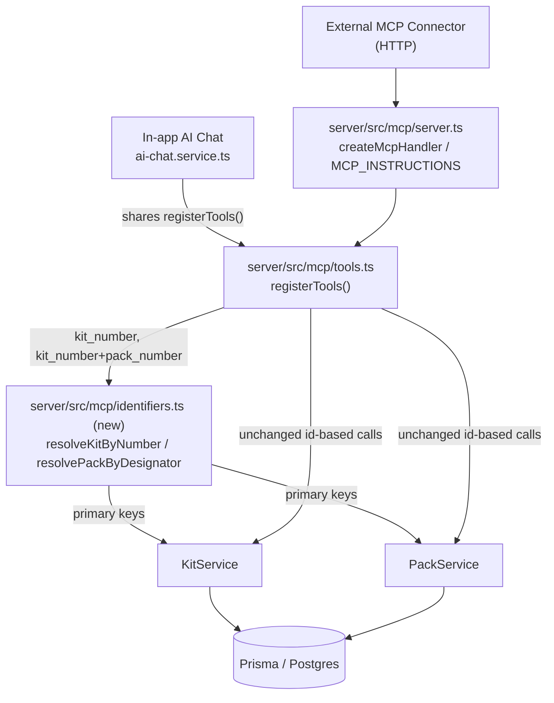

<!-- CLASI: Before changing code or making plans, review the SE process in CLAUDE.md -->

# Sprint 009: Kit and Pack Tool Parameters Take User Numbers

## Goals

Close the path where a number a user speaks aloud ("kit 17", "pack 26/1")
can be silently interpreted as a database primary key instead of the
user-facing identifier it actually is, for every MCP tool parameter that
identifies a **kit** or a **pack**. Both MCP surfaces — the external
connector and the in-app AI chat, which share `registerTools()` — must
benefit from a single fix.

## Problem

Kit tool parameters (e.g. `id` on `get_kit`, `kitId` on `list_packs`) and
pack tool parameters (e.g. `id` on `update_pack`) currently take
`Kit.id`/`Pack.id` database primary keys, but users only ever speak
`Kit.number` and `Pack.displayNumber` (as the printed "kit/pack" label
designator). Because `Kit.number` and `Kit.id` are both small integers
over overlapping ranges, a value that is valid as one is frequently also
valid — and wrong — as the other. Kit number 26 has database id 17, so
`generate_labels(kit_ids=[17])` (observed live in sprint 008) silently
printed labels for Kit 26 instead of Kit 17. No error, no warning — just
the wrong physical output.

The current mitigation is a system-prompt instruction
(`MCP_INSTRUCTIONS` in `server/src/mcp/server.ts`) asking the model to
remember, on every call, that "Kit 17" means kit *number* 17, not
database id 17, and to privately maintain the number→id mapping. This
asks an LLM to get an error-prone bookkeeping task right forever, with a
plausible-looking silent failure the moment it slips — see
`clasi/reflections/2026-09-12-database-ids-in-mcp-interface.md` for how
that failure actually shipped in sprint 008.

## Solution

Rename every kit-identifying and pack-identifying MCP tool parameter to
the identifier the user actually says, and resolve it to the internal
primary key inside the tool layer, via one new shared resolver module:

- Kit-identifying parameters become `kit_number` (`Kit.number`, already
  `Int @unique`).
- Pack-identifying parameters become `kit_number` + `pack_number`
  (`Pack.displayNumber`, already unique per kit via
  `@@unique([kitId, displayNumber])`), also accepting the conventional
  `"26/1"` combined string form printed on the physical label.
- An unresolvable number errors explicitly (e.g. `Kit number 26 not
  found`) — never falls back to treating the value as a database id.
- `MCP_INSTRUCTIONS` rules 2 and 5, which describe and paper over the
  hazard being removed, are rewritten to match the corrected interface.
- A drift-guard test assertion is added so a future kit/pack tool cannot
  silently reintroduce an id-shaped parameter.

No schema migration, no REST API change, no web UI change — this sprint
is scoped entirely to the MCP tool-parameter surface for kits and packs.

## Success Criteria

- Every kit-identifying and pack-identifying MCP tool parameter takes a
  user-facing number, not a database id, and is named accordingly.
- The regression that motivated this — `generate_labels` selecting Kit
  17 by number — produces labels for the correct kit, verified against
  the live collision (kit number 26 has database id 17).
- Both the external MCP connector (HTTP) and the in-app AI chat surface
  the corrected behavior, since both consume `registerTools()`.
- `MCP_INSTRUCTIONS` no longer instructs the model to map user numbers
  to database ids for kits/packs.
- The drift-guard test fails if a kit/pack tool parameter regresses to
  an id-shaped name.
- `npm run test:server` shows no new failures relative to the tracked
  pre-existing baseline (309 passed / 41 failed / 350 total; see
  `clasi/issues/server-test-suite-preexisting-failures-and-stale-test-db-config.md`).

## Scope

### In Scope

- A shared kit/pack identifier-resolution module (new).
- Kit-identifying parameters on: `get_kit`, `update_kit`, `delete_kit`,
  `set_kit_last_inventoried`, `list_packs`, `create_pack`,
  `transfer_kit`, `list_computers`, `create_computer`,
  `update_computer`, `list_issues`, `create_issue`, `generate_labels`.
- Pack-identifying parameters on: `update_pack`, `delete_pack`,
  `renumber_pack`, `list_items`, `create_item`, `list_issues`,
  `create_issue`, `generate_labels`.
- Rewriting `MCP_INSTRUCTIONS` in `server/src/mcp/server.ts`.
- Extending the drift-guard test in
  `tests/server/services/mcp-tool-metadata.test.ts`.
- Verifying both the MCP HTTP surface and the in-app AI chat surface
  (`server/src/services/ai-chat.service.ts:152` shares the same tool
  catalog and needs no code change, only verification).

### Out of Scope

- Site, OperatingSystem, HostName parameters — already strings, no
  integer-collision risk. Explicitly rejected as scope explosion.
- Image, Note, Issue, and Item ID parameters — never spoken by users;
  the assistant only ever obtains these from a prior tool response.
- Any schema migration — `Kit.number` is already `Int @unique` and
  `Pack` already has `@@unique([kitId, displayNumber])`.
- The REST API and the web UI — untouched.
- Converting all ~40 ID-taking tools (an earlier, rejected draft's
  scope) — this sprint stays inside the kit/pack boundary only.

## Test Strategy

- **Collision tests** (the strongest available check): kit number 26
  has database id 17 — both are valid kit numbers pointing at different
  kits. Every converted kit tool must resolve `kit_number` to the
  correct record in this exact case. Packs 503 (`26/1`), 413 (`16/1`),
  535 (`7/1`) provide the equivalent pack-level collision fixtures.
- **Unit tests** per converted tool: a valid number resolves to the
  right record; an unknown number errors explicitly (no fallback to
  id-interpretation).
- **Resolver-level unit tests** for the new shared module, independent
  of any one tool.
- **Drift-guard test**: extend
  `tests/server/services/mcp-tool-metadata.test.ts` to assert no kit- or
  pack-identifying parameter is registered with an `*[Ii]d`-shaped name.
- **Both-surfaces verification**: exercise at least one converted tool
  through the MCP HTTP endpoint and through
  `server/src/services/ai-chat.service.ts`'s `withMcpClient`/chat path
  (existing tests in `tests/server/services/ai-chat-mcp-unification.test.ts`
  and `tests/server/services/ai-chat.service.test.ts` are the natural
  home for this).
- Run via `npm run test:server` (jest, `tests/server/jest.config.js`).
  8 suites already fail for unrelated, tracked reasons — do not attempt
  to fix them; scope pass/fail judgment to the suites this sprint
  touches or adds.

## Architecture

**Substantial** — introduces a new kit/pack identifier-resolution module
that `server/src/mcp/tools.ts` newly depends on (a new cross-module
dependency), touches parameter schemas and handlers across 13 kit tools
and 8 pack tools in that same file, and rewrites `MCP_INSTRUCTIONS` in
`server/src/mcp/server.ts`. No data-model change: `Kit.number` and
`Pack`'s `@@unique([kitId, displayNumber])` already exist and already
support this resolution.

### Architecture Overview

**Responsibilities introduced or changed:**

1. Resolve a user-spoken kit number to its `Kit` record/primary key,
   erroring explicitly when it doesn't exist.
2. Resolve a user-spoken pack designator (`kit_number` + `pack_number`,
   or the combined `"26/1"` string) to its `Pack` record/primary key,
   erroring explicitly when either half doesn't exist.
3. Re-shape the input schema and handler body of every kit- and
   pack-identifying MCP tool to consume (1) and (2) instead of a raw id.
4. Replace the prompt-based ID-mapping mitigation in `MCP_INSTRUCTIONS`
   with instructions matching the corrected interface.
5. Guard against regression via an extended drift-guard test.

**Modules:**

- **`server/src/mcp/identifiers.ts` (new)** — Purpose: resolve
  user-facing kit and pack identifiers to primary keys. Boundary:
  pure resolution functions over `PrismaClient` (or the existing
  `ServiceRegistry`), each returning a resolved record/id or throwing an
  explicit, tool-facing not-found error (`Kit number N not found`,
  `Pack N/M not found`); no MCP schema/registration concerns and no
  business logic beyond lookup live here. Serves SUC-001, SUC-002.
  Used only by `server/src/mcp/tools.ts` — not by the REST routes or
  the web UI, which keep using ids directly via existing services.
- **`server/src/mcp/tools.ts` (existing, modified)** — Purpose: register
  MCP tool schemas and handlers that translate MCP-visible parameters
  into calls against existing services. Boundary unchanged: it already
  owns tool registration and parameter shape; it now delegates
  kit/pack identifier resolution to `identifiers.ts` instead of trusting
  the caller to have already looked up a primary key. Modified: the 13
  kit-identifying and 8 pack-identifying tool registrations listed under
  Scope (some tools, e.g. `generate_labels`, `list_issues`,
  `create_issue`, appear in both sets and are touched by both
  conversions).
- **`server/src/mcp/server.ts` (existing, modified)** — Purpose: assemble
  the MCP server and its `MCP_INSTRUCTIONS` prompt. Boundary unchanged.
  Modified: rules 2 and 5 (the kit-number-vs-id reminder and the
  "use database IDs internally" instruction) no longer describe a real
  hazard once parameters are renamed, and are rewritten rather than left
  to contradict the new interface; rules 1, 3, 4 are retained (still
  correct — they cover identifiers this sprint does not touch: sites,
  OS, host names, computers, images/notes/issues/items).
- **`tests/server/services/mcp-tool-metadata.test.ts` (existing,
  modified)** — Purpose: drift-guard assertions over the registered tool
  catalog, using the existing fake-collector pattern. Boundary
  unchanged. Modified: one new assertion (no kit/pack parameter matches
  an `*[Ii]d`-shaped name); the existing `_meta.requiresQM` assertions
  are untouched.
- **`server/src/services/ai-chat.service.ts` — unmodified.** Its
  `getToolsForRole`/`withMcpClient` already build the assistant's tool
  catalog from `registerTools()` (line ~152), so it automatically
  reflects the renamed parameters with no code change. Verified, not
  modified, by this sprint (SUC-003).
- **`server/src/services/kit.service.ts`, `pack.service.ts` — unmodified.**
  They keep their existing id-based method signatures, since the REST
  API also depends on those signatures and is explicitly out of scope.
  All resolution happens above them, at the MCP boundary.

No entity-relationship diagram: the data model is unchanged. No
separate dependency-direction diagram beyond the component diagram
above: the only new edge is `tools.ts → identifiers.ts`, which is
already shown and does not create a cycle (`identifiers.ts` depends on
nothing in `tools.ts`).

### Design Rationale

**Decision: centralize resolution in one new module, not inline lookups
per tool handler.**
- Context: 13 kit tools and 8 pack tools all need the same "number →
  primary key, explicit not-found" behavior.
- Alternatives considered: (a) inline the lookup in each tool handler;
  (b) extend `KitService`/`PackService`'s existing `get()` methods to
  accept either an id or a number; (c) a dedicated resolver module at
  the MCP layer.
- Why this choice: (c) confines the change to the layer that actually
  has the interface problem. (a) would duplicate near-identical
  lookup/error code across ~21 call sites and risk the error wording
  drifting apart over time. (b) would change method signatures that
  `KitService`/`PackService` also serve to the REST routes — explicitly
  out of scope, and a needless risk to an untouched surface.
- Consequences: every converted tool handler gains one resolution call
  before delegating to the existing service; a future kit/pack MCP tool
  must remember to call the resolver, which is exactly what the
  drift-guard test (ticket 004) exists to catch.

**Decision: packs are identified by `kit_number` + `pack_number`, also
accepting the combined `"26/1"` string, not a single opaque pack code.**
- Context: the physical label reads "26/1"; the issue explicitly
  requires accepting that conventional form since that is what people
  read off the label and say aloud.
- Alternatives considered: (a) `pack_number` alone (unsafe —
  `Pack.displayNumber` is only unique *within* a kit, not globally); (b)
  a synthetic global pack code nobody currently uses; (c) `kit_number` +
  `pack_number` as a structured pair, with the combined `"26/1"` string
  also accepted.
- Why this choice: (c) matches both how the label is printed and how a
  user is likely to type or say it; (a) reintroduces a collision risk
  one level down; (b) invents an identifier with no precedent in the
  product.
- Consequences: pack-identifying tool schemas carry a small validation
  branch (structured pair vs. one combined string). The exact zod shape
  is a ticket-level implementation decision (see Open Questions), not
  fixed further here — the architectural commitment is only to the pair
  of identifiers accepted, not the exact schema encoding.

### Migration Concerns

None for data — no migration is needed anywhere in this sprint.

For the interface itself: per the issue's Compatibility note, MCP tool
schemas are consumed only by the external connector and the in-app AI
chat, and neither pins a tool schema version. Parameters are **replaced
outright**, not added alongside the old ones — keeping an id-based path
alive in parallel would preserve the exact footgun this sprint removes.
This is a breaking change to the affected tools' input schemas, judged
acceptable for that reason.

Sequencing: the resolver module (ticket 001) must land before any tool
conversion (tickets 002, 003); both conversions must land before the
`MCP_INSTRUCTIONS` rewrite and drift-guard assertion (ticket 004), since
that assertion is written to fail against pre-conversion tool schemas.

## Use Cases

### SUC-001: Assistant Resolves a Kit by Spoken Number
Parent: UC-029 (User Chats with the AI Assistant to Find a Kit)

- **Actor**: AI assistant (external MCP connector or in-app AI chat),
  acting on behalf of an authenticated user
- **Preconditions**: The user has referred to a kit by its number in
  conversation (e.g., "kit 17")
- **Main Flow**:
  1. User says "print labels for kit 17" (or similar) via the web chat
     panel or an external Claude connector.
  2. The assistant calls the relevant MCP tool (e.g. `generate_labels`,
     `get_kit`) passing `kit_number: 17` — the number exactly as the
     user said it, with no private number→id mapping step.
  3. The tool resolves `kit_number` to the matching `Kit` record via the
     shared resolver, using `Kit.number` — never `Kit.id`.
  4. If no kit has that number, the tool returns an explicit error
     ("Kit number 17 not found") instead of silently treating the value
     as a database id.
- **Postconditions**: The tool operates on the kit the user actually
  meant, or the call fails explicitly and visibly.
- **Acceptance Criteria**:
  - [ ] Every kit-identifying MCP tool parameter accepts `kit_number`
        and no longer accepts an `id`/`kitId` primary-key parameter.
  - [ ] Kit number 26 (database id 17) and kit number 17 each resolve to
        their own distinct kit record when passed as `kit_number`.
  - [ ] An unrecognized kit number produces an explicit "Kit number N
        not found" error on every converted tool.

### SUC-002: Assistant Resolves a Pack by Its Printed Designator
Parent: UC-018 (Quartermaster Prints Kit and Pack Labels)

- **Actor**: AI assistant, acting on behalf of an authenticated user
- **Preconditions**: The user has referred to a pack by its printed
  designator (e.g., "pack 26/1")
- **Main Flow**:
  1. User says "what's in pack 26/1?" or similar.
  2. The assistant calls the relevant MCP tool (e.g. `list_items`,
     `update_pack`) passing the kit number and pack number — either as
     a structured pair or the combined "26/1" form — exactly as spoken
     or printed.
  3. The tool resolves the designator to the matching `Pack` record via
     the shared resolver: first the kit by number, then the pack by its
     `displayNumber` within that kit.
  4. If the kit, or the pack within that kit, is not found, the tool
     returns an explicit error rather than falling back to a database
     id.
- **Postconditions**: The tool operates on the pack the user actually
  meant, or the call fails explicitly and visibly.
- **Acceptance Criteria**:
  - [ ] Every pack-identifying MCP tool parameter accepts a kit number +
        pack number (structured, or combined "26/1" string), and no
        longer accepts an `id`/`packId` primary-key parameter.
  - [ ] Packs 503 ("26/1"), 413 ("16/1"), and 535 ("7/1") each resolve
        to their own distinct pack record.
  - [ ] An unrecognized kit, or pack-within-kit, produces an explicit
        not-found error on every converted tool.

### SUC-003: Both MCP Surfaces Stay in Sync
Parent: UC-029 (User Chats with the AI Assistant to Find a Kit)

- **Actor**: Quartermaster / developer verifying the fix
- **Preconditions**: `registerTools()` has been updated per SUC-001 and
  SUC-002
- **Main Flow**:
  1. The external MCP connector calls a converted tool with a
     `kit_number`/pack designator over HTTP.
  2. The in-app AI chat (`ai-chat.service.ts`, which builds its tool
     catalog from the same `registerTools()`) is exercised with an
     equivalent request.
  3. Both surfaces resolve the same kit/pack and produce consistent
     results.
- **Postconditions**: No divergence between the two surfaces;
  `MCP_INSTRUCTIONS` no longer tells the model to "use database IDs
  internally" for kits/packs, since there is no longer an id-based path
  to use.
- **Acceptance Criteria**:
  - [ ] `MCP_INSTRUCTIONS` rules 2 and 5 are rewritten to match the new
        interface (no id-mapping guidance remains for kits/packs).
  - [ ] A test exercises a converted tool through both the MCP HTTP
        path and the in-app AI chat path
        (`tests/server/services/ai-chat-mcp-unification.test.ts` /
        `ai-chat.service.test.ts`).
  - [ ] The drift-guard test
        (`tests/server/services/mcp-tool-metadata.test.ts`) fails if any
        kit- or pack-identifying parameter is reintroduced with an
        `*[Ii]d`-shaped name.

## GitHub Issues

(None linked yet.)

## Definition of Ready

Before tickets can be created, all of the following must be true:

- [x] Sprint planning document is complete (sprint.md, including its
      Architecture and Use Cases sections)
- [x] Architecture review passed (or skipped, for changes with no
      architectural impact)
- [ ] Stakeholder has approved the sprint plan

## Tickets

| # | Title | Depends On |
|---|-------|------------|
| 001 | Shared kit/pack identifier resolver module | — |
| 002 | Convert kit-identifying parameters across kit tools | 001 |
| 003 | Convert pack-identifying parameters across pack tools | 001, 002 |
| 004 | Rewrite MCP_INSTRUCTIONS and add drift-guard assertion | 002, 003 |

Tickets execute serially in the order listed.
