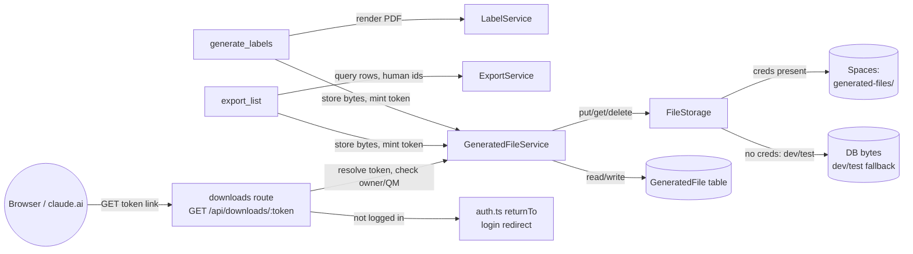

<!-- CLASI: Before changing code or making plans, review the SE process in CLAUDE.md -->

# Sprint 010: AI-Generated Labels and Exports Downloadable via Link

## Goals

Let the assistant actually hand over files it generates. Today
`generate_labels` returns a base64 PDF as an MCP resource block that
external clients (claude.ai) can't turn into a download, and the in-app
AI chat drops it entirely because it keeps only `text` tool-result
content. There is also no MCP tool for exporting a list (CSV/xlsx) of
kits, packs, computers, or items — `ExportService` and the report
queries exist but are only reachable from REST routes and admin pages.

This sprint makes "get me labels" and "I need a list of X" produce a
real, clickable download link, from both external MCP clients and the
in-app chat:

1. Server-side storage for generated files — private DigitalOcean
   Spaces objects under a generated-files prefix, plus a DB record
   (owner, filename, mime type, size, created, expires) — and an
   authenticated download route keyed by an unguessable token (not a
   database id).
2. `generate_labels` returns an absolute download link
   (`https://inventory.jointheleague.org/api/downloads/<token>`) in
   addition to (optionally) its existing inline resource block. Keep
   the 60-label cap and one-PDF-per-stock-size behavior.
3. A new list-export MCP tool that produces a CSV/xlsx of kits, packs,
   computers, or items, honoring the same filters as the existing list
   tools, and using human identifiers (kit numbers, pack designators,
   host names) rather than database ids in the file — consistent with
   sprint 009's user-number convention.
4. The in-app AI chat surfaces the link in its response and the link
   triggers a real browser download rather than SPA navigation.
5. `MCP_INSTRUCTIONS` and the in-app chat system prompt are updated so
   the model presents the link instead of claiming it cannot deliver
   files.
6. Expired generated files (7-day retention, per current default) are
   cleaned up rather than accumulating in Spaces and the DB.

## Problem

The assistant can produce labels and list exports but cannot deliver
them: PDFs arrive as opaque base64 resource blocks external clients
don't render as downloads, the in-app chat discards non-text tool
output outright, and no tool exists at all for list exports. Users are
told the assistant "can't hand over files" for something it has
already generated.

## Solution

Store generated files server-side (private Spaces object + DB record
with owner and expiry) behind an authenticated, token-keyed download
route, and have generation tools return an absolute link to that route
instead of (or alongside) inline content. Add a list-export tool that
reuses the existing `ExportService`/report-query logic. Update both
client surfaces (external MCP clients get a plain link; in-app chat
gets a link that forces a real download) and the instructions/prompts
that describe this capability to the model.

## Success Criteria

- Asking the assistant for labels returns a link that downloads the
  labels PDF in a browser, from both an external MCP client and the
  in-app chat.
- Asking the assistant for a list of kits/packs/computers/items returns
  a link that downloads a CSV/xlsx using human-readable identifiers.
- Links require the requesting user's login session; a logged-out user
  is sent to login and returned to the download.
- Files older than the retention window are no longer retrievable and
  are removed from storage.
- `MCP_INSTRUCTIONS` and the chat system prompt accurately describe
  this capability.

## Scope

### In Scope

- Generated-file storage model: DB table/record (owner, filename, mime
  type, size, created, expires, token) and private Spaces objects
  under a generated-files prefix.
- Authenticated download route (`/api/downloads/<token>`) enforcing
  ownership (creator or quartermaster) and session login, with
  redirect-to-login-and-return for logged-out users.
- A configured base URL (existing `QR_DOMAIN`/`APP_BASE_URL`, or a new
  `PUBLIC_URL`) so tools can build absolute links without a request
  object.
- Updating `generate_labels` (server/src/mcp/tools.ts) to store its
  output and return a download link.
- A new list-export MCP tool (CSV/xlsx) for kits, packs, computers, and
  items, built on `ExportService`, using human identifiers only.
- In-app AI chat (server/src/services/ai-chat.service.ts) changes so a
  returned link is surfaced to the user and triggers a real browser
  download.
- `MCP_INSTRUCTIONS` and the chat system prompt updates describing the
  new delivery mechanism.
- Expiry/cleanup of generated files past the retention window (default
  7 days).

### Out of Scope

- Any change to kit/pack/computer identifier resolution beyond what
  sprint 009 already did — this sprint depends on sprint 009 being
  merged first, since it edits the same MCP tools
  (server/src/mcp/tools.ts), and does not touch sprint 009's artifacts
  or branch.
- New report types or export formats beyond CSV/xlsx of the four listed
  entities.
- Changing label stock sizes, layout, or the 60-label cap.
- General-purpose file upload/attachment handling unrelated to
  assistant-generated downloads.

## Test Strategy

(To be detailed during Detail Mode planning — expected to cover: unit
tests for the download-token/expiry model and access control, an
integration test for the full generate → link → authenticated download
round trip, and coverage for the list-export tool's use of human
identifiers.)

## Architecture

**Sizing: Substantial.** This sprint introduces a new data model
(`GeneratedFile`), a new cross-module dependency (MCP tools →
generated-file storage → object storage), and touches 3+ modules
(MCP tools, a new download route, the AI chat surfaces, the export
service, the scheduler). The full 7-step methodology applies,
including a component diagram.

### Step 1: Understand the Problem

`generate_labels` already renders PDFs but returns them only as
base64 MCP `resource` blocks. External MCP clients (claude.ai) do not
turn those into a downloadable file, and the in-app chat's tool-result
handling keeps only `text` content, so the PDF never reaches the
in-app conversation at all. There is no MCP tool for list exports at
all, even though `ExportService` already has the query logic. The fix
is not "render better" — it's "stop trying to hand the file itself
through the tool-call channel" and instead store the file server-side
and hand back a link. That link then needs: somewhere durable-enough
to store the bytes (Spaces, not local disk — no volumes in the swarm
deployment), a way to build an absolute URL without an HTTP request
(MCP tools run outside request scope), an authenticated route that
works for a browser (redirect-to-login), and both client surfaces
(external MCP client, in-app chat) actually surfacing the link instead
of swallowing it.

### Step 2: Identify Responsibilities

- Storing opaque file bytes under a key and retrieving them later —
  independent of what the file contains or who may access it. Must
  work without real Spaces credentials in dev/test (no existing
  fallback for this: `ImageService` writes to S3 unconditionally).
- Recording *that* a file exists, who owns it, and until when — a
  token-keyed record, independent of where the bytes physically live.
- Deciding whether a given user may fetch a given token, and serving
  the bytes over HTTP with correct headers and a login redirect for
  logged-out browsers.
- Producing the actual file content for the two existing tool
  operations (labels — already exists via `LabelService`; list
  exports — mostly exists via `ExportService`, but only as an
  unfiltered six-entity dump in JSON/XLSX, never CSV, never scoped to
  one entity).
- Building an absolute, externally-resolvable URL from outside an
  Express request (MCP tools have no `req`; today `LabelService`
  privately duplicates the `QR_DOMAIN`/`APP_BASE_URL`/localhost
  fallback chain that `getPublicUrl(req)` also implements, request-bound).
- Telling both the model (`MCP_INSTRUCTIONS`, chat system prompt) and
  the in-app chat client (link rendering) that this delivery mechanism
  exists and how to present it.
- Removing files and their storage/records once they expire, without
  a new bespoke timer — `SchedulerService` + `ScheduledJob` already do
  exactly this for `daily-backup`/`weekly-backup`.

These group into: a storage backend, a file/access-record layer built
on it, an HTTP delivery route, two MCP-tool-level producers (one
existing/modified, one new), a shared URL builder, and two
presentation-layer touch-ups (model instructions, chat client). Each
changes for a different reason (ops swaps the storage backend; product
changes retention/access rules; a new export format is a tool-schema
change; instruction wording is a prompt change) — kept as separate
modules below rather than folded into one "downloads" blob.

### Step 3: Define Subsystems and Modules

- **`baseUrl` helper** (`server/src/config/baseUrl.ts`, new, extracted
  from `LabelService`'s constructor). Purpose: resolve this server's
  externally-visible base URL without an Express `Request`. Boundary:
  pure function over `QR_DOMAIN`/`APP_BASE_URL`/env, no I/O. Serves:
  link-building for generated files and (refactored, behavior
  unchanged) `LabelService`'s QR codes.

- **`FileStorage`** (`server/src/services/file-storage.ts`, new).
  Purpose: store and retrieve opaque bytes by key. Boundary: knows
  nothing about ownership, tokens, expiry, or MIME semantics beyond
  passthrough. Two implementations selected once at the composition
  root by whether `DO_SPACES_KEY`/`DO_SPACES_SECRET` are set:
  `SpacesFileStorage` (private-ACL objects under the existing bucket's
  `generated-files/` prefix, via the existing `getS3Client()`) and
  `DbFileStorage` (bytes in a DB column) for dev/test. Serves: SUC-006
  indirectly (deletion), all generation use cases directly.

- **`GeneratedFileService`** (`server/src/services/generated-file.service.ts`,
  new) + **`GeneratedFile` model** (new Prisma model: id, ownerId →
  User, filename, mimeType, size, objectKey, tokenHash [unique,
  sha256 of a `crypto.randomBytes(32)` token — same pattern
  `ApiToken`/`token.service.ts` already use, so a leaked DB row can't
  be replayed as a download link], createdAt, expiresAt). Purpose:
  answer "mint a token for these bytes" and "may this user download
  this token, and if so, what are its bytes." Boundary: owns the
  `GeneratedFile` table, delegates byte I/O to `FileStorage`, delegates
  the owner-or-quartermaster check to `hasQMAccess` (`contracts`) —
  does not know about PDFs, CSVs, labels, or exports. Serves: SUC-001
  through SUC-006.

- **Download route** (`server/src/routes/downloads.ts`, new, mounted
  `GET /api/downloads/:token`). Purpose: turn a token in a URL into
  either a login redirect or a streamed download. Boundary: HTTP-layer
  translation only — token validity and ownership live in
  `GeneratedFileService`. Reuses the *existing* generic
  `returnTo` mechanism already in `server/src/routes/auth.ts` (`GET
  /api/auth/google?returnTo=<relative-path>`, validated as
  same-origin-relative, redirected back to after Google login) rather
  than the OAuth-client `pendingOAuth` flow in `oauth.ts`, which is a
  different, client-registration-based mechanism for MCP connector
  auth, not a plain browser flow. `requireAuth`'s existing JSON-401
  behavior is the wrong shape here (findings: logged-out requests get
  JSON 401, not a redirect) — this route needs its own light
  authentication check that redirects browsers instead. Serves:
  SUC-004, SUC-005.

- **MCP tool changes** (`server/src/mcp/tools.ts`, modified +
  extended). `generate_labels` (modified): after building each PDF
  bundle via the existing `LabelService`, also stores it via
  `GeneratedFileService` and adds a `download_url` per bundle to the
  JSON manifest text block — the existing inline `resource` blocks,
  60-label cap, and one-PDF-per-stock-size behavior are unchanged.
  `export_list` (new tool): takes `entity` (kits/packs/computers/items),
  `format` (csv/xlsx), and the same filter arguments the corresponding
  `list_*` tool already accepts (e.g. `status` for kits, `kit_number`
  for packs, `pack` designator for items, `site_id`/`kit_number`/
  `disposition`/`unassigned` for computers); stores the result via
  `GeneratedFileService` and returns a `download_url`. Built on
  `ExportService` (modified — see Impact below), never on database
  IDs, consistent with sprint 009's user-facing-identifier convention.

- **Presentation touch-ups** (no new modules): `MCP_INSTRUCTIONS`
  (`server/src/mcp/server.ts`) and `server/src/prompts/ai-chat-system.txt`
  gain a paragraph describing the download-link mechanism.
  `ai-chat.service.ts`'s `McpToolCallResult` doc comment (already
  flagged stale — it claims tools only ever return text, which
  `generate_labels` already contradicts) gets corrected; no functional
  change is needed there because the download link travels inside the
  JSON manifest's `text` content, which the existing text-only filter
  already keeps. `client/src/components/AiChat.tsx`'s markdown link
  renderer is hardened so a download path is never captured by the SPA
  `navigate()` branch even if a relative link is ever emitted — the
  expected case (an absolute link) already falls through to
  `target="_blank"`, which works today given `Content-Disposition:
  attachment`.

- **Cleanup job**: no new module — a `cleanup-generated-files` handler
  registered on the existing `SchedulerService` in `server/src/app.ts`
  (same pattern as `daily-backup`/`weekly-backup`), backed by a
  `ScheduledJob` row seeded in the same migration that adds
  `GeneratedFile` (matching how `daily-backup`/`weekly-backup` rows
  were seeded in `20260310190000_add_scheduled_job_table`). Deletes
  `GeneratedFile` rows past `expiresAt` and their backing objects via
  `FileStorage.delete`.

### Step 4: Diagrams

Component diagram — required: 3+ modules touched and a new
cross-module dependency (MCP tools → `GeneratedFileService` →
`FileStorage`).

Entity-relationship: one new relation, `GeneratedFile.ownerId → User.id`
(many-to-one, same shape as `ApiToken.userId → User.id`) — not
diagrammed separately as it doesn't warrant a standalone ERD beyond
that one line.

Dependency graph: no existing dependency direction changes. The new
edges are additive and flow the same way as everything else —
`mcp/tools.ts` (already depends on services) gains a dependency on
`GeneratedFileService`; `GeneratedFileService` depends on
`FileStorage` and `contracts`; nothing downstream of `services/`
starts depending back upward.

### Step 5: What Changed / Why / Impact / Migration

**What Changed**: New `GeneratedFile` model + migration (with seeded
`cleanup-generated-files` `ScheduledJob` row). New `FileStorage`
abstraction (two implementations). New `GeneratedFileService`. New
`server/src/routes/downloads.ts`, mounted in `app.ts`. New
`server/src/config/baseUrl.ts`, with `LabelService` refactored to use
it (no behavior change). Modified `generate_labels` tool. New
`export_list` tool. Modified `ExportService` (filtered, single-entity,
CSV-capable export — see below). Updated `MCP_INSTRUCTIONS`, chat
system prompt, `ai-chat.service.ts` comment, `AiChat.tsx` link
renderer. New scheduler handler registration in `app.ts`.

**Why**: See Step 1 — the assistant already generates the right bytes;
it has no way to hand them to the user. Every module above is in
service of closing exactly that gap, nothing more (no new report
types, no new label formats — Out of Scope in the sprint plan already
excludes these).

**Impact on Existing Components**:
- `LabelService`: no behavior change, only where its base-URL fallback
  chain lives (extracted, not duplicated).
- `ExportService`: currently always exports all six entities
  unfiltered, JSON or XLSX only. This sprint adds: single-entity
  export (kits/packs/computers/items only — sites/hostNames are not in
  the `export_list` tool's scope, only the REST `/api/export` full-dump
  routes need them), filter parameters mirroring each entity's
  existing `list_*` MCP tool, and CSV output (via `ExcelJS`'s
  single-sheet CSV writer — no new dependency). The existing
  `exportToJson`/`exportToExcel` (full, unfiltered, REST-only) are
  unchanged and keep serving `/api/export`, `/api/export/json`.
- `ai-chat.service.ts`: no functional change to tool-result handling —
  see Step 3. Comment-only fix.
- `mcp/server.ts`: `MCP_INSTRUCTIONS` grows by one section; existing
  rules are unchanged.
- `app.ts`: one new route mount, one new scheduler handler
  registration — same shape as the existing thirty-odd mounts and two
  existing handlers.
- Security note, not a behavior change: the existing `/api/export`
  REST routes (full dump, `requireAuth`-gated, no QM requirement)
  already include plaintext `adminPassword`/`studentPassword` fields
  for computers. `export_list`'s computers entity inherits the same
  fields under the same access level (any non-loanee authenticated
  user) for consistency with that existing precedent — this sprint
  does not change who can see those fields, only adds a second way to
  reach the same data with the same guard.

**Migration Concerns**: One additive Prisma migration (new table +
seed row for the cleanup job) — no data backfill, no changes to
existing tables. `DO_SPACES_KEY`/`DO_SPACES_SECRET` remain
optional-in-dev (`FileStorage` falls back), so this does not newly
require Spaces credentials anywhere they weren't already assumed in
production. No changes to `QR_DOMAIN`/`APP_BASE_URL` — no new env var
is introduced (see Design Rationale).

### Step 6: Design Rationale

**Decision: reuse `QR_DOMAIN`/`APP_BASE_URL`, don't add `PUBLIC_URL`.**
Context: the issue's proposed defaults offered a new `PUBLIC_URL` as an
option. Alternatives: (a) new `PUBLIC_URL` env var: correct in
isolation, but `QR_DOMAIN=https://inventory.jointheleague.org` is
already set in prod (`config/prod/public.env`, `docker-compose.yml`)
and already serves exactly this purpose for `LabelService`; (b) reuse
the existing chain. Chosen: (b) — zero new deploy configuration, and
extracting the chain into `baseUrl.ts` removes the existing
duplication (today only `LabelService` has it) instead of adding a
third copy. Consequence: if `QR_DOMAIN` is ever repurposed for
QR-codes-only semantics, this couples it to download links too — low
risk, both already mean "this server's public URL."

**Decision: a `FileStorage` abstraction with a DB-bytes dev/test
fallback, rather than always writing to Spaces.** Context: the issue
asked for this "if practical." `ImageService` was checked as a
possible existing precedent and does not have one — it writes to S3
unconditionally, and no test currently mocks the `s3.ts` module.
Alternatives: (a) always use Spaces, require real credentials in
CI/dev (matches `ImageService`'s current practice, simplest, but
blocks the stated goal of tests not needing real Spaces); (b) storage
interface selected by credential presence. Chosen: (b) — this sprint's
tests (token/expiry/access-control unit tests, the generate→link→
download round trip) should not depend on network credentials. This
does not retrofit `ImageService`; that's out of scope.

**Decision: `GeneratedFileService` decides authorization
(owner-or-QM), not the route.** Context: the download route could
check ownership itself after fetching the record. Alternatives: (a)
route-level check; (b) service-level check. Chosen: (b) — the same
policy question ("may this user see this file") will recur for any
future generated-file consumer (e.g. an admin UI listing a user's
downloads); keeping it in the service means the route stays a thin
HTTP translation and the policy isn't duplicated.

### Step 7: Open Questions

None block ticketing. Two assumptions made without stakeholder input,
flagged here rather than as blocking questions since both are
low-risk and reversible:
- `export_list` has no row/size cap analogous to `generate_labels`'
  60-label cap — the whole point of a download link (vs. inline
  content) is that size stops being a tool-response-payload concern.
  If a future sprint wants a cap, it's an additive tool-schema change.
- Expiry is fixed from creation time and is not extended by access —
  a file downloaded on day 6 still expires on day 7. If the
  stakeholder wants sliding expiry, that's a one-field change to
  `GeneratedFileService`.

## Use Cases

- **SUC-001 — External MCP client receives a labels download link.**
  A user asks an external MCP client (e.g. claude.ai) for labels for a
  kit/pack/computer selection. `generate_labels` renders the PDF(s) as
  today, additionally stores each via `GeneratedFileService`, and
  returns a `download_url` per stock-size bundle in its JSON manifest.
  The assistant presents the link; clicking it (after Google login if
  needed) downloads the PDF.

- **SUC-002 — In-app chat surfaces a labels download link.** Same
  request, asked through the in-app AI chat. The link travels through
  the existing text-only tool-result path unchanged, the assistant's
  reply includes it as a markdown link, and clicking it triggers a
  real browser download rather than SPA navigation (link is absolute;
  `AiChat.tsx`'s renderer is hardened defensively for the relative
  case too).

- **SUC-003 — List export via download link.** A user asks for "a
  list of kits" (or packs/computers/items, optionally filtered — e.g.
  "computers at Downtown"). The new `export_list` tool applies the
  same filters the corresponding `list_*` tool accepts, builds a
  CSV or xlsx using human identifiers only (kit numbers, pack
  designators, host names — never database ids), stores it, and
  returns a `download_url`.

- **SUC-004 — Logged-out browser is returned to the download after
  login.** A user clicks a download link while logged out (e.g. a
  stale browser session, or a link opened on a different device). The
  download route redirects to Google login via the existing `returnTo`
  mechanism (`/api/auth/google?returnTo=/api/downloads/<token>`) and,
  after successful login, the browser lands back on the same download
  URL and receives the file.

- **SUC-005 — Access is restricted to the owner or a quartermaster.**
  A user other than the file's creator (and not a quartermaster) tries
  a download link — directly, or after guessing/reusing a token they
  observed. The request is denied (the token itself is unguessable —
  a hashed `crypto.randomBytes(32)` value — so this case is expected to
  arise only from a legitimately shared link, not brute force).

- **SUC-006 — Expired files stop being retrievable and are cleaned
  up.** A `GeneratedFile` past its `expiresAt` (7 days by default) is
  no longer served by the download route (expired lookups behave as
  not-found) and is removed — record and backing object — by the
  `cleanup-generated-files` scheduled job on its next daily run.

## GitHub Issues

(GitHub issues linked to this sprint's tickets. Format: `owner/repo#N`.)

## Definition of Ready

Before tickets can be created, all of the following must be true:

- [ ] Sprint planning document is complete (sprint.md, including its
      Architecture and Use Cases sections)
- [ ] Architecture review passed (or skipped, for changes with no
      architectural impact)
- [ ] Stakeholder has approved the sprint plan

## Tickets

| # | Title | Depends On |
|---|-------|------------|
| 001 | Generated-file storage foundation: `GeneratedFile` model, `FileStorage` abstraction, `GeneratedFileService` | — |
| 002 | Authenticated download route with login-redirect and owner/QM access control | 001 |
| 003 | `generate_labels` returns a download link alongside its inline resource blocks | 001, 002 |
| 004 | `export_list` MCP tool: filtered CSV/xlsx export of kits, packs, computers, items | 001, 002 |
| 005 | Scheduled cleanup of expired generated files | 001 |
| 006 | Presentation layer: chat/model instructions and in-app download link handling | 003, 004 |

Tickets execute serially in the order listed.
