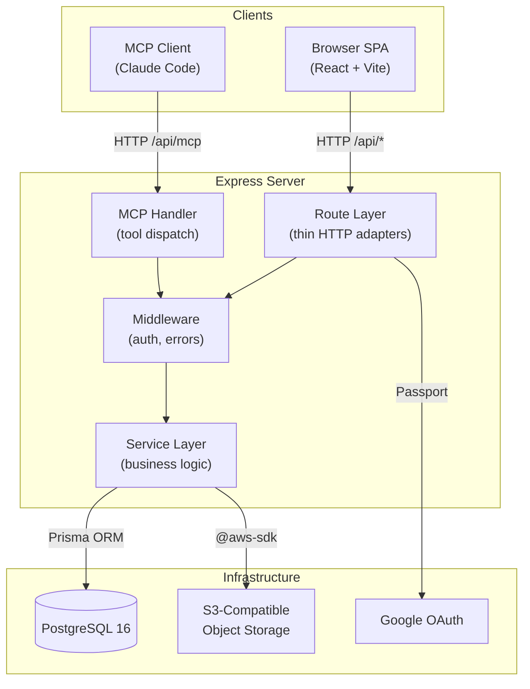
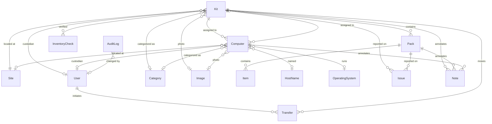
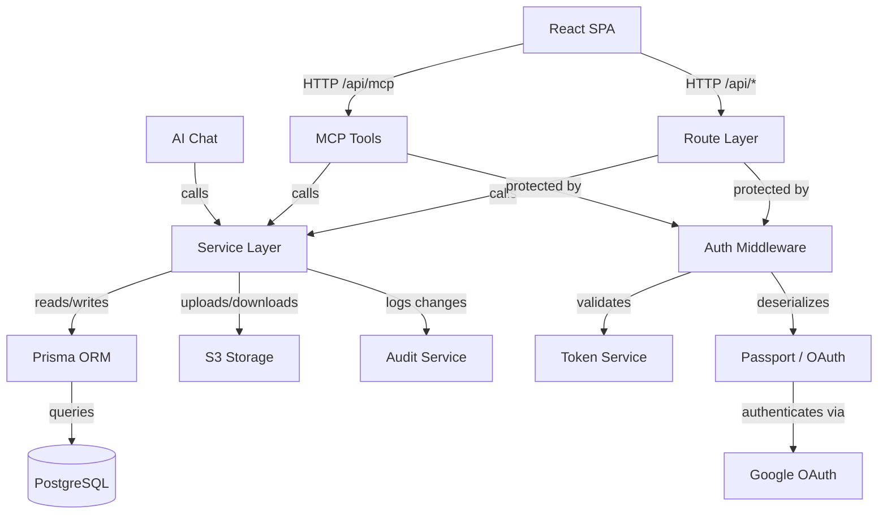

# Architecture — Version 001

> Retroactive architecture document capturing the system as-built through
> sprint 026. Future sprints that change the architecture will produce
> subsequent versions (002, 003, …).

---

## 1. Architecture Overview

The Inventory System is a full-stack TypeScript application for tracking
computing equipment and teaching materials across multiple sites. It follows
a layered architecture with strict separation between HTTP transport, business
logic, and persistence.

---

## 2. Technology Stack

| Layer | Technology | Justification |
|-------|-----------|---------------|
| Backend runtime | Node.js 20 + Express 4 | Template standard; mature TypeScript support |
| Frontend | Vite + React 18 | Template standard; fast dev builds, largest AI training corpus |
| Language | TypeScript (both ends) | Type safety across stack; shared contract types |
| Database | PostgreSQL 16 (Alpine) | Single data store policy — JSONB, LISTEN/NOTIFY eliminate need for Redis/Mongo |
| ORM | Prisma 6 | Type-safe queries, declarative schema, migration management |
| Auth | Passport.js (Google OAuth) | Domain-restricted login for jointheleague.org |
| Object storage | S3-compatible (AWS SDK) | Image attachments for Kits and Computers |
| PDF generation | PDFKit + QRCode | Label printing (Dymo, Avery formats) |
| Spreadsheet I/O | ExcelJS | Import/export for bulk operations |
| AI integration | Anthropic SDK + MCP SDK | Natural-language chat and tool-based programmatic access |
| Orchestration | Docker Compose (dev) / Swarm (prod) | Template standard; swarm secrets built-in |
| Reverse proxy | Caddy | Automatic HTTPS via Docker labels |
| Secrets at rest | SOPS + age | Modern encryption, no GPG complexity |
| Logging | Pino | Structured JSON logs with in-memory ring buffer for admin viewer |

---

## 3. Module Design

### 3.1 Route Layer

**Purpose:** Translate HTTP requests into service calls and service responses
into HTTP responses.

**Boundary:** Parses params, body, and query; calls a service function;
returns the result. Contains no business logic, no direct Prisma calls.

**Use cases served:** All — every user-facing operation enters through a route.

**Key interactions:** Receives `ServiceRegistry` at construction time;
delegates all work to services. Errors propagate to the global error handler.

### 3.2 Service Layer

**Purpose:** Encapsulate all business logic and database access behind a
typed contract interface.

**Boundary:** Services accept contract input types, return contract record
types, and throw `ServiceError` subclasses. Services own validation, audit
logging, and transactional integrity. Nothing outside the service layer
touches Prisma.

**Use cases served:** All — the service layer is the single point of truth
for every domain operation.

**Key interactions:** Uses Prisma client for persistence; calls AuditService
for change tracking; calls S3 client for image storage. Consumed by routes,
MCP tools, import/export, and AI chat.

**Internal structure:**

- `BaseService<TRecord, TCreate, TUpdate>` — Abstract generic class
  providing standard CRUD, audit integration, and error handling.
- Domain services (KitService, ComputerService, PackService, ItemService,
  SiteService, HostNameService, CategoryService, OperatingSystemService)
  extend BaseService.
- Specialized services (TransferService, InventoryCheckService, IssueService,
  LabelService, ExportService, ImportService, SearchService, ReportService,
  ImageService, AiChatService, BackupService) implement domain-specific
  workflows without extending BaseService.
- `ServiceRegistry` — Factory that creates all service instances with a
  shared Prisma client and audit source context.

### 3.3 Contract Layer

**Purpose:** Define the canonical JSON shapes for all domain entities,
decoupling the API surface from the database schema.

**Boundary:** TypeScript interfaces only — no runtime logic. Input types
(`CreateXInput`, `UpdateXInput`) and output types (`XRecord`,
`XDetailRecord`) for each entity.

**Use cases served:** All — contracts are the shared vocabulary between
routes, services, and MCP tools.

### 3.4 Middleware

**Purpose:** Cross-cutting concerns applied before or after route handlers.

**Boundary:** Authentication checks, error mapping, and token validation.
Does not contain business logic.

**Components:**
- `requireAuth` — Rejects unauthenticated requests (session or token).
- `requireAdmin` — Validates admin session flag.
- `tokenAuth` — Extracts and validates Bearer tokens (API/MCP access).
- `errorHandler` — Catches thrown errors and maps `ServiceError` subclasses
  to HTTP status codes.

### 3.5 MCP Server

**Purpose:** Expose inventory operations as MCP tools for AI agent
integration.

**Boundary:** Receives MCP requests over HTTP StreamableTransport,
dispatches to service layer via AsyncLocalStorage context. Does not
contain business logic — tools are thin wrappers around service calls.

**Use cases served:** All CRUD and query operations available through the
API, accessible to Claude Code and other MCP clients.

**Key interactions:** Uses `AsyncLocalStorage` to bind authenticated user
and `ServiceRegistry` to each request context. Tools call
`getContext().services.*` methods.

### 3.6 Frontend SPA

**Purpose:** Provide a mobile-first web interface for inventory operations.

**Boundary:** React components consume `/api/*` endpoints. No direct
database or service access. Role-based UI visibility (Instructor vs
Quartermaster).

**Sub-modules:**
- **Domain pages** — Kit, Computer, Pack, Site, HostName list and detail
  views with inline editing.
- **QR pages** — Mobile-optimized pages for scan-driven workflows
  (check-in, check-out, inventory, photo upload).
- **Admin dashboard** — System configuration, database viewer, user
  management, log viewer, import/export (behind admin password).
- **AI chat sidebar** — Claude-powered natural language interface.
- **Shared components** — Layout, modals (transfer, inventory check, label
  print), toast notifications, sortable tables.

### 3.7 Authentication Module

**Purpose:** Manage user identity and access control.

**Boundary:** Google OAuth flow (Passport), admin password auth, API token
auth. Determines user role (Instructor, Quartermaster, Admin) and enforces
access.

**Key interactions:**
- Passport deserializes Google OAuth users into `req.user`.
- QuartermasterPattern table drives role promotion by email matching.
- TokenService validates Bearer tokens for programmatic access.
- Session persistence via `connect-pg-simple` (PostgreSQL-backed).

### 3.8 Audit Module

**Purpose:** Maintain an immutable record of every data change.

**Boundary:** Append-only `AuditLog` table. Records who changed what, old
and new values, timestamp, and source (UI, Import, API, MCP).

**Use cases served:** UC-5.7 (Audit Log Query), UC-5.8 (User Activity
History), and implicit support for all write operations.

---

## 4. Data Model

### Key Entities

- **Kit** — Primary checkout unit (bag, tote, case). Has a sequential
  number, container type, status (Active/Retired), and QR code.
- **Pack** — Sub-container within a Kit. Inventoried in place, not
  independently checked out.
- **Item** — Line in a Pack's manifest. Either counted (quantity tracked)
  or consumable (presence only).
- **Computer** — Individual device with serial number, disposition state
  machine (Active → Loaned/NeedsRepair/Scrapped/Lost/Decommissioned),
  and optional host name.
- **Site** — Named location with address and GPS coordinates. Includes
  home sites and teaching sites.
- **User** — Google OAuth user with role (Instructor/Quartermaster).
- **Transfer** — Chain-of-custody record for Kit or Computer movements.
- **AuditLog** — Immutable change history for all entities.

---

## 5. Dependency Graph

### Analysis

- **No cycles.** Dependencies flow strictly downward: Clients → Transport
  (Routes/MCP) → Services → Infrastructure (Prisma/S3).
- **Fan-out.** The Service Layer has the highest fan-out (Prisma, S3, Audit),
  justified by its role as the central business logic layer.
- **Stable core.** Prisma, Audit, and the contract types are the
  most-depended-upon modules and are also the most stable (schema changes
  are infrequent after initial sprints).
- **Clear layers.** No lower layer depends on a higher one. Routes never
  import from Frontend; Services never import from Routes.

---

## 6. Security Considerations

### Authentication

Three authentication paths, each serving a distinct use case:

| Method | Users | Mechanism |
|--------|-------|-----------|
| Google OAuth | Instructors, Quartermasters | Passport + session (domain-restricted to jointheleague.org) |
| Admin password | System administrators | Fixed password from environment variable + session flag |
| API tokens | MCP clients, programmatic access | Bearer token (hashed, prefixed `lapi_`, revocable) |

### Authorization

- **Instructor** — Read access to all entities; can check in/out Kits,
  flag issues, perform inventory checks.
- **Quartermaster** — All Instructor capabilities plus create/edit/delete
  any entity, manage Sites and HostNames, import/export, print labels.
  Promoted via email pattern matching (configured by Admin).
- **Admin** — System configuration, user management, database operations,
  backup/restore. Separate from the OAuth user hierarchy.

### Data Protection

- Secrets encrypted at rest via SOPS + age; mounted as Docker Swarm secrets
  in production.
- Audit log is append-only — no delete or update operations exposed.
- Session data stored server-side in PostgreSQL (not in cookies).
- QR landing pages for unauthenticated users show only organization contact
  info, not inventory details.

---

## 7. Design Rationale

### DR-1: Single Service Layer for All Consumers

**Decision:** All database access goes through the service layer — routes,
MCP tools, import/export, and AI chat are all consumers.

**Context:** The system has four distinct entry points (HTTP API, MCP, import
pipeline, AI chat) that all need the same business logic and audit trail.

**Alternatives:** Separate logic per entry point; shared utility functions
without a formal service layer.

**Why this choice:** A single service layer guarantees consistent validation,
audit logging, and error handling regardless of how the operation is
triggered. Contract types enforce a stable interface.

**Consequences:** The service layer is the largest module and a potential
bottleneck for changes. Mitigated by the BaseService abstraction, which
handles the common CRUD pattern.

### DR-2: PostgreSQL as Single Data Store

**Decision:** PostgreSQL handles all data needs — relational data, JSONB
documents, session storage. No Redis, MongoDB, or other data stores.

**Context:** The template mandates this approach. The inventory domain is
inherently relational (Kits contain Packs, Packs contain Items, etc.).

**Alternatives:** Redis for sessions/caching; MongoDB for flexible schemas.

**Why this choice:** Reduces operational complexity. PostgreSQL's JSONB,
LISTEN/NOTIFY, and session storage capabilities cover all requirements
without additional services.

**Consequences:** Session performance depends on PostgreSQL query speed
(acceptable at this scale). No dedicated caching layer (not needed given
the read patterns).

### DR-3: Contract Types Decouple API from Schema

**Decision:** Services accept and return contract types (TypeScript
interfaces), not Prisma model types.

**Context:** The API surface should be stable even as the database schema
evolves (e.g., adding columns, renaming fields).

**Alternatives:** Pass Prisma types directly through routes.

**Why this choice:** Prevents schema changes from cascading to API consumers.
Enables the service layer to reshape data (e.g., flattening relations,
computing derived fields) without changing the route layer.

**Consequences:** Requires mapping between Prisma types and contract types
in each service. The BaseService abstraction reduces this overhead.

### DR-4: MCP via AsyncLocalStorage Context

**Decision:** MCP tool handlers access the authenticated user and service
registry via `AsyncLocalStorage`, not function parameters.

**Context:** MCP SDK tool handlers have a fixed signature that doesn't
easily accommodate dependency injection.

**Alternatives:** Global singleton services; parameter tunneling through
the MCP SDK.

**Why this choice:** AsyncLocalStorage provides per-request isolation
without modifying the MCP SDK's tool registration API. Each request gets
its own user context and audit source.

**Consequences:** Implicit dependency — tool implementations call
`getContext()` rather than receiving dependencies explicitly. Acceptable
given the MCP SDK constraint.

### DR-5: Audit-First Design

**Decision:** Every write operation generates an immutable audit log entry
with old/new values and source attribution.

**Context:** The inventory system replaces a manually maintained spreadsheet.
Knowing who changed what and when is essential for accountability.

**Alternatives:** Audit only high-value operations; rely on database
triggers.

**Why this choice:** Comprehensive auditing at the service layer captures
all sources (UI, import, MCP) with consistent formatting. Database triggers
would miss source attribution.

**Consequences:** Additional write overhead per operation (one audit row per
changed field). Acceptable at this scale.

---

## 8. Open Questions

- **Inventory check workflow:** The overview describes a detailed inventory
  check flow (UC-2.1, UC-2.2) but the current implementation is simpler
  (timestamp-based last-inventoried tracking). Full checklist-based
  inventory verification may need a future sprint.
- **Photo-based computer onboarding (UC-4.3a):** OCR-based device
  registration from photos is in the roadmap but not yet implemented.
- **Label printing formats:** The current PDFKit-based label generation
  covers basic formats. The full set of label sizes (Dymo, Avery 30334,
  orange computer labels) may need refinement.
- **Google Sheets sync:** The overview lists automatic change detection on
  a linked Google Sheet as a future phase. Currently import/export is
  manual only.
- **Dashboard completeness:** Instructor and Quartermaster dashboards are
  implemented but may not yet cover all widgets described in the overview
  (e.g., "Open issues I reported", "Kits needing inventory" sorted by age).
