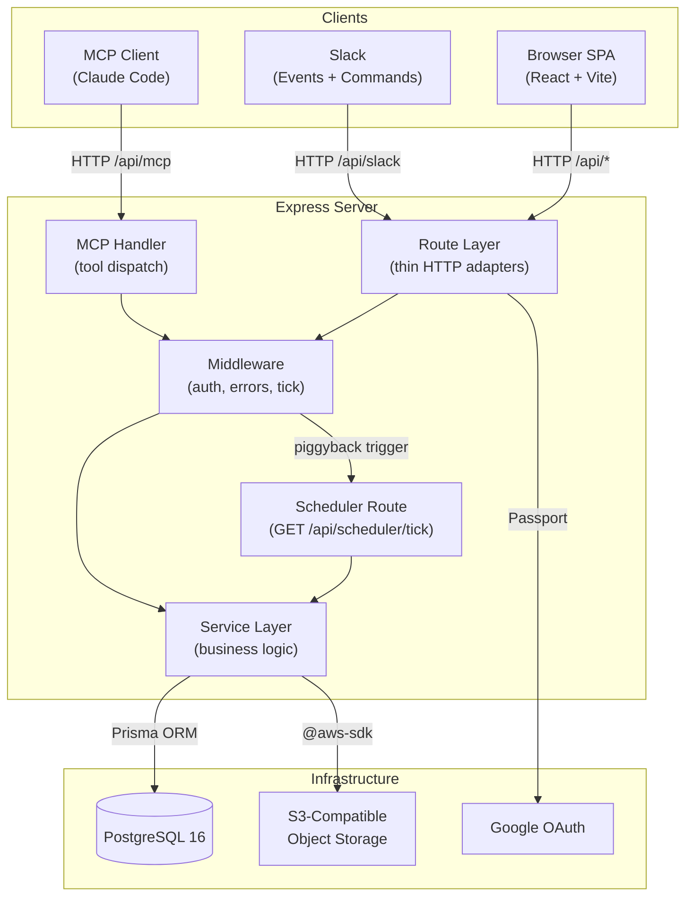
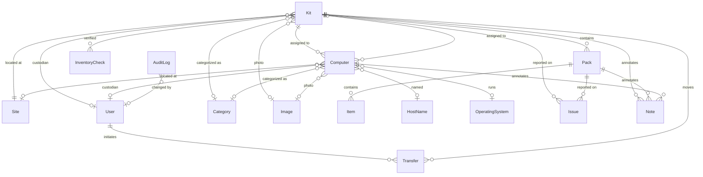
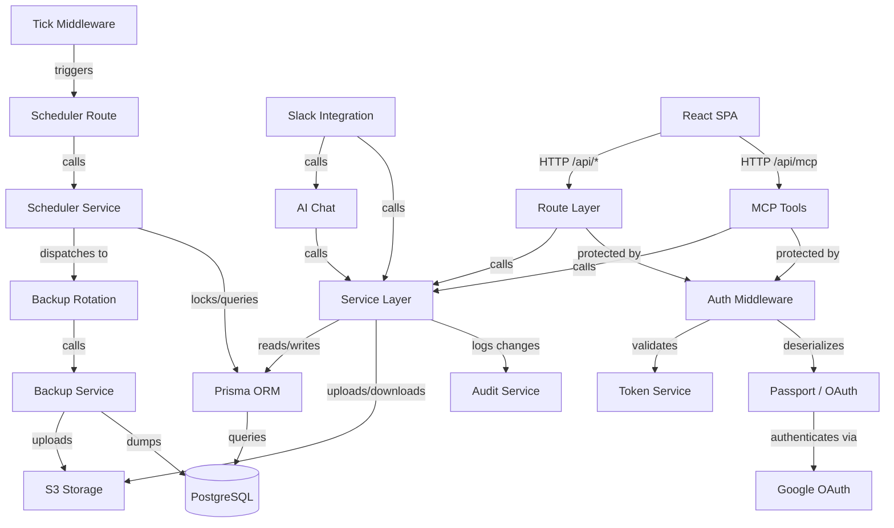

# Architecture — Version 002

> Target state after sprint 027. Changes from version 001: adds Scheduler
> module (service, route, middleware, database table) and extends the Backup
> module with automated rotation logic.

---

## 1. Architecture Overview

The Inventory System is a full-stack TypeScript application for tracking
computing equipment and teaching materials across multiple sites. It follows
a layered architecture with strict separation between HTTP transport, business
logic, and persistence.

Version 002 adds a **Scheduler module** that enables periodic background
tasks (initially: automated backup rotation) via a tick-based execution
model triggered by incoming HTTP traffic.

---

## 2. Technology Stack

| Layer | Technology | Justification |
|-------|-----------|---------------|
| Backend runtime | Node.js 20 + Express 4 | Template standard; mature TypeScript support |
| Frontend | Vite + React 18 | Template standard; fast dev builds, largest AI training corpus |
| Language | TypeScript (both ends) | Type safety across stack; shared contract types |
| Database | PostgreSQL 16 (Alpine) | Single data store policy — JSONB, LISTEN/NOTIFY eliminate need for Redis/Mongo |
| ORM | Prisma 6 | Type-safe queries, declarative schema, migration management |
| Auth | Passport.js (Google OAuth) | Domain-restricted login for jointheleague.org |
| Object storage | S3-compatible (AWS SDK) | Image attachments, database backups |
| PDF generation | PDFKit + QRCode | Label printing (Dymo, Avery formats) |
| Spreadsheet I/O | ExcelJS | Import/export for bulk operations |
| AI integration | Anthropic SDK + MCP SDK | Natural-language chat and tool-based programmatic access |
| Orchestration | Docker Compose (dev) / Swarm (prod) | Template standard; swarm secrets built-in |
| Reverse proxy | Caddy | Automatic HTTPS via Docker labels |
| Secrets at rest | SOPS + age | Modern encryption, no GPG complexity |
| Logging | Pino | Structured JSON logs with in-memory ring buffer for admin viewer |

---

## 3. Module Design

### 3.1 Route Layer

**Purpose:** Translate HTTP requests into service calls and service responses
into HTTP responses.

**Boundary:** Parses params, body, and query; calls a service function;
returns the result. Contains no business logic, no direct Prisma calls.

**Use cases served:** All — every user-facing operation enters through a route.

**Key interactions:** Receives `ServiceRegistry` at construction time;
delegates all work to services. Errors propagate to the global error handler.

### 3.2 Service Layer

**Purpose:** Encapsulate all business logic and database access behind a
typed contract interface.

**Boundary:** Services accept contract input types, return contract record
types, and throw `ServiceError` subclasses. Services own validation, audit
logging, and transactional integrity. Nothing outside the service layer
touches Prisma.

**Use cases served:** All — the service layer is the single point of truth
for every domain operation.

**Key interactions:** Uses Prisma client for persistence; calls AuditService
for change tracking; calls S3 client for image and backup storage. Consumed
by routes, MCP tools, import/export, AI chat, and the scheduler.

**Internal structure:**

- `BaseService<TRecord, TCreate, TUpdate>` — Abstract generic class
  providing standard CRUD, audit integration, and error handling.
- Domain services (KitService, ComputerService, PackService, ItemService,
  SiteService, HostNameService, CategoryService, OperatingSystemService)
  extend BaseService.
- Specialized services (TransferService, InventoryCheckService, IssueService,
  LabelService, ExportService, ImportService, SearchService, ReportService,
  ImageService, AiChatService, BackupService, **SchedulerService**,
  **BackupRotationService**) implement domain-specific workflows without
  extending BaseService.
- `ServiceRegistry` — Factory that creates all service instances with a
  shared Prisma client and audit source context.

### 3.3 Contract Layer

**Purpose:** Define the canonical JSON shapes for all domain entities,
decoupling the API surface from the database schema.

**Boundary:** TypeScript interfaces only — no runtime logic. Input types
(`CreateXInput`, `UpdateXInput`) and output types (`XRecord`,
`XDetailRecord`) for each entity.

**Use cases served:** All — contracts are the shared vocabulary between
routes, services, and MCP tools.

### 3.4 Middleware

**Purpose:** Cross-cutting concerns applied before or after route handlers.

**Boundary:** Authentication checks, error mapping, token validation, and
scheduler tick triggering. Does not contain business logic.

**Components:**
- `requireAuth` — Rejects unauthenticated requests (session or token).
- `requireAdmin` — Validates admin session flag.
- `tokenAuth` — Extracts and validates Bearer tokens (API/MCP access).
- `errorHandler` — Catches thrown errors and maps `ServiceError` subclasses
  to HTTP status codes.
- **`schedulerTick`** — Checks an in-memory timestamp on each request; if
  the tick interval has elapsed, fires an async internal request to the
  scheduler tick route. Single timestamp comparison — no database access,
  no blocking.

### 3.5 MCP Server

**Purpose:** Expose inventory operations as MCP tools for AI agent
integration.

**Boundary:** Receives MCP requests over HTTP StreamableTransport,
dispatches to service layer via AsyncLocalStorage context. Does not
contain business logic — tools are thin wrappers around service calls.

**Use cases served:** All CRUD and query operations available through the
API, accessible to Claude Code and other MCP clients.

**Key interactions:** Uses `AsyncLocalStorage` to bind authenticated user
and `ServiceRegistry` to each request context. Tools call
`getContext().services.*` methods.

### 3.6 Scheduler Module (NEW in v002)

**Purpose:** Execute periodic background tasks on a tick-based schedule.

**Boundary:** The scheduler does not run on a clock — it is triggered by
incoming HTTP traffic via the tick middleware. It queries the `ScheduledJob`
table for due jobs, locks them with `FOR UPDATE SKIP LOCKED` to prevent
double execution, runs the handler, and updates the job record.

**Does NOT do:** Real-time scheduling, sub-minute precision, external cron
management. The scheduler is "eventually consistent" — jobs run within one
tick interval of their scheduled time.

**Components:**
- `ScheduledJob` (Prisma model) — Stores job name, frequency, last/next
  run times, error state, and enabled flag.
- `SchedulerService` — Tick logic, job dispatch, locking, error capture.
  Maps job names to handler functions.
- `schedulerRouter` (`GET /api/scheduler/tick`) — Invokes the tick, returns
  `{ executed: number }`. No authentication (returns only a count).
- `schedulerTick` middleware — Piggyback trigger (see Middleware above).

**Key interactions:**
- SchedulerService dispatches to registered handlers (e.g.,
  `BackupRotationService.runDaily()`).
- SchedulerService uses raw Prisma queries for `FOR UPDATE SKIP LOCKED`.
- Tick middleware fires an internal HTTP request to the scheduler route.

### 3.7 Backup Module (EXTENDED in v002)

**Purpose:** Create, store, list, restore, and rotate database backups.

**Boundary:** Runs `pg_dump`/`pg_restore` locally, uploads to S3. The
rotation service manages naming conventions and retention policies.

**Components:**
- `BackupService` — Core backup/restore operations (existing).
- **`BackupRotationService`** — Naming conventions and retention logic for
  daily (6 retained) and weekly (4 retained) automated backups. Manual
  backups (admin button) are never auto-deleted.

**Naming conventions:**
- Daily: `daily-<dow>-<YYYY-MM-DD>.dump` (dow = day of week, 0–6)
- Weekly: `weekly-<YYYY-MM-DD>.dump`
- Manual: `backup-<timestamp>.dump` (existing format, untouched by rotation)

### 3.8 Frontend SPA

**Purpose:** Provide a mobile-first web interface for inventory operations.

**Boundary:** React components consume `/api/*` endpoints. No direct
database or service access. Role-based UI visibility (Instructor vs
Quartermaster).

**Sub-modules:**
- **Domain pages** — Kit, Computer, Pack, Site, HostName list and detail
  views with inline editing.
- **QR pages** — Mobile-optimized pages for scan-driven workflows
  (check-in, check-out, inventory, photo upload).
- **Admin dashboard** — System configuration, database viewer, user
  management, log viewer, import/export, **scheduled jobs viewer** (behind
  admin password).
- **AI chat sidebar** — Claude-powered natural language interface.
- **Shared components** — Layout, modals (transfer, inventory check, label
  print), toast notifications, sortable tables.

### 3.9 Authentication Module

**Purpose:** Manage user identity and access control.

**Boundary:** Google OAuth flow (Passport), admin password auth, API token
auth. Determines user role (Instructor, Quartermaster, Admin) and enforces
access.

**Key interactions:**
- Passport deserializes Google OAuth users into `req.user`.
- QuartermasterPattern table drives role promotion by email matching.
- TokenService validates Bearer tokens for programmatic access.
- Session persistence via `connect-pg-simple` (PostgreSQL-backed).

### 3.10 Audit Module

**Purpose:** Maintain an immutable record of every data change.

**Boundary:** Append-only `AuditLog` table. Records who changed what, old
and new values, timestamp, and source (UI, Import, API, MCP).

### 3.11 Slack Integration Module

**Purpose:** Receive Slack events and slash commands, dispatch to AI chat
and inventory services, respond in Slack channels.

**Boundary:** Verifies Slack signatures, resolves Slack users to inventory
users, screens messages for relevance, dispatches to AiChatService or
direct service calls. Sends immediate receipt messages for long-running AI
operations.

---

## 4. Data Model

**Standalone tables** (no foreign keys to other entities):
- **ScheduledJob** — Periodic task definitions (see below).

### Key Entities

- **Kit** — Primary checkout unit (bag, tote, case). Has a sequential
  number, container type, status (Active/Retired), and QR code.
- **Pack** — Sub-container within a Kit. Inventoried in place, not
  independently checked out.
- **Item** — Line in a Pack's manifest. Either counted (quantity tracked)
  or consumable (presence only).
- **Computer** — Individual device with serial number, disposition state
  machine (Active → Loaned/NeedsRepair/Scrapped/Lost/Decommissioned),
  and optional host name.
- **Site** — Named location with address and GPS coordinates. Includes
  home sites and teaching sites.
- **User** — Google OAuth user with role (Instructor/Quartermaster).
- **Transfer** — Chain-of-custody record for Kit or Computer movements.
- **AuditLog** — Immutable change history for all entities.
- **ScheduledJob** (NEW) — Periodic task definition with frequency,
  last/next run times, error state, and enabled flag. Self-contained —
  no foreign keys to other entities.

---

## 5. Dependency Graph

### Analysis

- **No cycles.** Dependencies flow strictly downward: Clients → Transport
  (Routes/MCP/Scheduler) → Services → Infrastructure (Prisma/S3).
- **Fan-out.** The Service Layer has the highest fan-out (Prisma, S3, Audit),
  justified by its role as the central business logic layer. The new
  SchedulerService has fan-out of 2 (Prisma, BackupRotation) — acceptable.
- **Stable core.** Prisma, Audit, and the contract types are the
  most-depended-upon modules and are also the most stable.
- **Clear layers.** No lower layer depends on a higher one. The tick
  middleware triggers the scheduler route via HTTP (not direct import),
  maintaining layer separation.
- **New module isolation.** SchedulerService and BackupRotationService are
  isolated — they depend on Prisma and BackupService but nothing depends
  on them except the scheduler route and tick middleware.

---

## 6. Security Considerations

### Authentication

Three authentication paths, each serving a distinct use case:

| Method | Users | Mechanism |
|--------|-------|-----------|
| Google OAuth | Instructors, Quartermasters | Passport + session (domain-restricted to jointheleague.org) |
| Admin password | System administrators | Fixed password from environment variable + session flag |
| API tokens | MCP clients, programmatic access | Bearer token (hashed, prefixed `lapi_`, revocable) |

### Authorization

- **Instructor** — Read access to all entities; can check in/out Kits,
  flag issues, perform inventory checks.
- **Quartermaster** — All Instructor capabilities plus create/edit/delete
  any entity, manage Sites and HostNames, import/export, print labels.
  Promoted via email pattern matching (configured by Admin).
- **Admin** — System configuration, user management, database operations,
  backup/restore, scheduled job management. Separate from the OAuth user
  hierarchy.

### Scheduler Security

The scheduler tick route (`GET /api/scheduler/tick`) is unauthenticated.
This is acceptable because:
- It returns only `{ executed: number }` — no sensitive data.
- Side effects (backups) are beneficial, not destructive.
- The route is idempotent — repeated calls are harmless (jobs locked or
  already up-to-date).

### Data Protection

- Secrets encrypted at rest via SOPS + age; mounted as Docker Swarm secrets
  in production.
- Audit log is append-only — no delete or update operations exposed.
- Session data stored server-side in PostgreSQL (not in cookies).
- QR landing pages for unauthenticated users show only organization contact
  info, not inventory details.
- Database backups stored in S3 with the same access credentials as images.

---

## 7. Design Rationale

### DR-1 through DR-5

Unchanged from architecture-001. See version 001 for details.

### DR-6: Tick-Based Scheduler via Request Piggyback (NEW)

**Decision:** The scheduler is triggered by incoming HTTP requests checking
an in-memory timestamp, not by a system cron job or in-process timer
(`setInterval`).

**Context:** The application needs periodic tasks (backups) but runs in
Docker containers where cron setup is non-trivial and `setInterval` can
drift or fire in multiple replicas.

**Alternatives considered:**
1. System cron inside the container — requires cron daemon, adds complexity.
2. External cron service hitting an endpoint — requires infrastructure
   outside the application.
3. `setInterval` in Node.js — fires in every replica, requires distributed
   lock coordination.
4. Request piggyback — checks a timestamp on each request, fires tick when
   interval elapses.

**Why this choice:** The piggyback approach is zero-infrastructure: no cron
daemon, no external service, no replica coordination (row-level locking
handles concurrent ticks). The trade-off is that jobs only fire when the
app receives traffic, but for a tool used during business hours this is
acceptable. The tick route can also be called externally as a fallback.

**Consequences:** Jobs may be delayed if the app receives no traffic
(overnight, weekends). For daily/weekly backups this is fine — the job
runs on the first request after the scheduled time. Sub-minute scheduling
precision is not achievable.

### DR-7: Backup Rotation Naming Convention (NEW)

**Decision:** Automated backups use prefixed names (`daily-<dow>-<date>`,
`weekly-<date>`) distinct from manual backups (`backup-<timestamp>`).

**Context:** The system needs to distinguish backups it can auto-delete
(rotation) from backups the admin created manually (never deleted).

**Alternatives:** Single naming scheme with metadata tags; separate S3
prefixes; database tracking of backup types.

**Why this choice:** Filename-based convention is simple, visible in S3
listings, and requires no database tracking. The day-of-week number in
daily backups enables O(1) cleanup (delete the file with the same dow
before creating the new one).

**Consequences:** The naming convention is a contract — changing it later
requires migration of existing backup files.

---

## 8. Open Questions

- **Inventory check workflow:** The overview describes a detailed inventory
  check flow but the current implementation is simpler (timestamp-based).
- **Photo-based computer onboarding:** OCR-based device registration is in
  the roadmap but not yet implemented.
- **Google Sheets sync:** Automatic change detection on a linked sheet is a
  future phase.
- **Dashboard completeness:** Instructor and Quartermaster dashboards may
  not yet cover all widgets described in the overview.
- **Scheduler job types:** Currently only backup jobs are defined. Future
  jobs (e.g., stale inventory alerts, report generation) will follow the
  same pattern — register a handler in SchedulerService's dispatch map.
