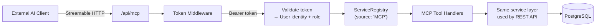

# Sprint 010 Technical Plan

## Architecture Version

- **From version**: Post-sprint-009 (service layer OO refactor)
- **To version**: Adds MCP server layer and token auth

## Architecture Overview

This sprint adds two new subsystems that sit alongside the existing
Express REST API:



The MCP server reuses the existing `ServiceRegistry` and service classes,
ensuring that all validation, business logic, and audit logging is
identical whether changes come from the REST API or an MCP tool call.

A new `ApiToken` Prisma model stores hashed tokens linked to users.
Token authentication is a new middleware path separate from session auth,
used only for MCP endpoints.

**Key architectural decisions (from architecture review):**

- **Singleton MCP server**: A single `McpServer` instance is created at
  startup with all tools registered once. Per-request authentication
  context is injected via the SDK's handler API, not by creating new
  server instances per request.
- **Audit source propagation**: `AuditService` accepts a `defaultSource`
  constructor parameter. `ServiceRegistry.create()` accepts an optional
  `source` parameter, forwarded to `AuditService`. MCP handlers create
  a `ServiceRegistry` with `source: 'MCP'`, so all audit entries from
  MCP operations are automatically tagged without changing any service
  method signatures.
- **Session middleware on MCP routes**: The existing global session
  middleware runs on MCP routes but is a no-op when there is no session
  cookie. No middleware restructuring is needed.

## Component Design

### Component: ApiToken Model

**Use Cases**: SUC-001, SUC-002

New Prisma model for personal API tokens:

```prisma
model ApiToken {
  id          Int        @id @default(autoincrement())
  label       String
  tokenHash   String     @unique
  prefix      String     // First 8 chars for display
  userId      Int
  role        UserRole   // Snapshot of user's role at creation
  lastUsedAt  DateTime?
  revokedAt   DateTime?
  expiresAt   DateTime?  // Optional expiration (nullable = no expiry)
  createdAt   DateTime   @default(now())

  user User @relation(fields: [userId], references: [id], onDelete: Cascade)

  @@index([userId])
}
```

The `User` model must be updated with `apiTokens ApiToken[]` relation.

- `tokenHash`: SHA-256 hash of the full token. Lookup by hashing the
  incoming Bearer token and querying by hash.
- `prefix`: First 8 characters stored in plaintext for display in the UI.
- `role`: Captured at creation time. When a user's role changes, all
  their active tokens are automatically revoked to prevent privilege
  retention via stale tokens.
- `revokedAt`: Non-null means the token is revoked (soft delete).
- `expiresAt`: Optional expiration date. If set and past, token is
  rejected. Initially nullable (no expiry) — UI can expose this later.

### Component: TokenService

**Use Cases**: SUC-001, SUC-002

New service class `server/src/services/token.service.ts`:

- `create(userId, label)` → generates 32-byte random hex token, stores
  SHA-256 hash, returns `{ id, label, prefix, token }` (plaintext token
  returned only on create).
- `list(userId?)` → if userId provided, returns that user's non-revoked
  tokens. If omitted, returns all tokens across all users (admin use).
- `revoke(id, userId?)` → sets `revokedAt` timestamp. If userId provided,
  verifies ownership. If omitted, allows admin revocation of any token.
- `revokeAllForUser(userId)` → revokes all active tokens for a user.
  Called automatically when a user's role changes.
- `validate(rawToken)` → hashes token, looks up by hash, checks not
  revoked and not expired, updates `lastUsedAt`, returns
  `{ userId, role }` or throws.

### Component: Token Auth Middleware

**Use Cases**: SUC-003

New middleware `server/src/middleware/tokenAuth.ts`:

- Extracts `Authorization: Bearer <token>` header.
- Calls `TokenService.validate(token)`.
- Sets `req.user` with the token owner's user record and role.
- Returns 401 if token is missing, invalid, revoked, or expired.
- Used only on MCP routes — session auth continues for REST API routes.

### Component: Token Management Routes

**Use Cases**: SUC-001, SUC-002

New route file `server/src/routes/tokens.ts`:

- `POST /api/tokens` — create token (requires **session auth** via
  `requireAuth`). Not accessible via API tokens.
- `GET /api/tokens` — list current user's tokens (requires **session auth**).
- `DELETE /api/tokens/:id` — revoke token (requires **session auth**).
- `GET /api/admin/tokens` — list all tokens across all users (requires
  **session auth** + **Quartermaster** role). Returns token info with
  owning user's name/email.
- `DELETE /api/admin/tokens/:id` — admin revoke any token (requires
  **session auth** + **Quartermaster** role).

**Security note**: Token management endpoints use session-based
authentication only. They must NOT be accessible via Bearer token auth.
This prevents an MCP client from creating or revoking tokens.

### Component: Audit Source Propagation

**Use Cases**: SUC-005

- Add `MCP` to the `AuditSource` enum in `schema.prisma`.
- Add `defaultSource` constructor parameter to `AuditService`
  (defaults to `'UI'`).
- Add optional `source` parameter to `ServiceRegistry.create()`,
  forwarded to `AuditService`.
- MCP tool handlers create `ServiceRegistry.create(prisma, 'MCP')`.
- No changes to individual service method signatures — the source
  is carried as state in the `AuditService` instance.

### Component: MCP Server

**Use Cases**: SUC-003, SUC-004

New file `server/src/mcp/server.ts`:

- Uses `@modelcontextprotocol/sdk` with Streamable HTTP transport.
- Mounted at `/api/mcp` via Express middleware.
- Token auth middleware runs before the MCP handler.
- **Singleton instance**: Created once at startup with all tools
  registered. Per-request user context is injected via the SDK's
  request handler API.

MCP tools are thin wrappers around service methods:

| MCP Tool | Service Call | Role Required |
|----------|-------------|---------------|
| `list_sites` | `services.sites.list()` | Any |
| `get_site` | `services.sites.get(id)` | Any |
| `create_site` | `services.sites.create(input, userId)` | QM |
| `update_site` | `services.sites.update(id, input, userId)` | QM |
| `list_kits` | `services.kits.list()` | Any |
| `get_kit` | `services.kits.get(id)` | Any |
| `create_kit` | `services.kits.create(input, userId)` | QM |
| `update_kit` | `services.kits.update(id, input, userId)` | QM |
| `list_packs` | `services.packs.list(kitId)` | Any |
| `create_pack` | `services.packs.create(input, userId, kitId)` | QM |
| `update_pack` | `services.packs.update(id, input, userId)` | QM |
| `delete_pack` | `services.packs.delete(id, userId)` | QM |
| `list_items` | `services.items.list(packId)` | Any |
| `create_item` | `services.items.create(input, userId, packId)` | QM |
| `update_item` | `services.items.update(id, input, userId)` | QM |
| `delete_item` | `services.items.delete(id, userId)` | QM |
| `list_computers` | `services.computers.list()` | Any |
| `get_computer` | `services.computers.get(id)` | Any |
| `create_computer` | `services.computers.create(input, userId)` | QM |
| `update_computer` | `services.computers.update(id, input, userId)` | QM |
| `list_hostnames` | `services.hostNames.list()` | Any |
| `checkout_kit` | `services.checkouts.checkOut(input, userId)` | Any |
| `checkin_kit` | `services.checkouts.checkIn(id, input, userId)` | Any |

**Note on deletions**: Kits are retired (soft delete via status change),
not hard-deleted. Computers are updated (disposition change), not
deleted. Only packs and items support hard deletion, which is reflected
in the tool table above. Sites use deactivation (soft delete).

### Component: MCP Tool Handlers

**Use Cases**: SUC-003, SUC-004

New file `server/src/mcp/tools.ts`:

- Each tool is registered with the MCP server with a JSON Schema for its
  input parameters.
- Tool handlers extract parameters, call the service method, and return
  the result as JSON.
- Permission checks happen via a `requireRole` wrapper that checks the
  authenticated user's role before calling the service.
- Service errors (`NotFoundError`, `ValidationError`) are caught and
  returned as MCP tool errors with appropriate error codes.

### Component: User Account Page with MCP Config

**Use Cases**: SUC-001, SUC-002

New page `client/src/pages/account/Account.tsx`:

- Shows the user's profile info (name, email, role).
- **MCP Connection section**: a read-only code block showing the JSON
  configuration snippet the user pastes into their AI client (Claude
  Desktop `claude_desktop_config.json`, Claude Code `.mcp.json`, etc.).
  The snippet includes the server URL and the user's current API token:
  ```json
  {
    "mcpServers": {
      "inventory": {
        "url": "https://inventory.jtlapp.net/api/mcp",
        "headers": {
          "Authorization": "Bearer <token>"
        }
      }
    }
  }
  ```
- **"Copy" button**: copies the entire JSON snippet to the clipboard.
- **"Regenerate Token" button**: revokes the current token, creates a
  new one, and rebuilds the snippet with the new token. Confirms before
  regenerating ("This will disconnect any clients using the current
  token").
- If no token exists yet, shows a "Generate Token" button that creates
  the first one and displays the snippet.
- The server URL in the snippet is derived from `APP_DOMAIN` (production)
  or the current window origin (development).
- Accessible from sidebar under the user's name or an Account link.

### Component: Admin Token Management UI

**Use Cases**: SUC-006

New section on the existing admin dashboard page:

- **Token list table**: Shows all tokens across all users with columns:
  token prefix, owning user (name + email), role, created date, last
  used date, and status (active/revoked/expired).
- **Revoke button**: Per-row action to revoke any token. Confirms before
  revoking ("This will disconnect the user's MCP client").
- **Filters**: Filter by status (active/revoked) and by user.
- Data fetched from `GET /api/admin/tokens` (session auth + Quartermaster).
- Revoke calls `DELETE /api/admin/tokens/:id`.
- Only visible to Quartermaster-role users.

### Component: MCP Documentation

New file `docs/mcp.md`:

- What the MCP server is and what it enables (external AI access)
- How to create an API token from the UI
- How to connect Claude Desktop, Claude Code, or other MCP clients
  (server URL, token configuration)
- List of available tools with descriptions and required roles
- Example MCP client configuration snippets
- Security notes (token scoping, revocation, audit trail)

## Decisions

1. **MCP SDK transport**: Use Streamable HTTP transport from
   `@modelcontextprotocol/sdk`. Include a spike in the first ticket to
   verify the transport works with Express middleware mounting before
   building all tools.

2. **Token role snapshot vs live lookup**: Use role snapshot at creation
   time. When a user's role is changed, automatically revoke all their
   active tokens. This prevents privilege retention while keeping the
   token validation path simple (no extra DB join on every request).

3. **MCP tool granularity**: Separate tools per operation (not bundled).
   This is MCP-idiomatic and gives AI models clear affordances for
   each action.
