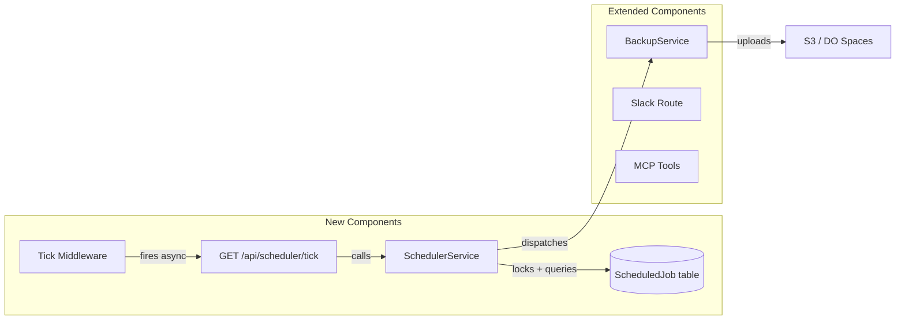

# Sprint 027 Technical Plan

## Architecture Version

- **From version**: architecture-001
- **To version**: architecture-002 (adds Scheduler module, extends Backup module)

## Architecture Overview

This sprint introduces a new **Scheduler module** comprising a database
table, service, route, and middleware. It extends the existing **Backup
module** with rotation logic. Two smaller changes fix Slack UX and an MCP
bug.



## Component Design

### Component: ScheduledJob Model (Prisma)

**Use Cases**: SUC-001, SUC-003

New Prisma model:

```prisma
model ScheduledJob {
  id          Int       @id @default(autoincrement())
  name        String    @unique
  description String?
  frequency   String    // cron-like or simple: "daily", "weekly"
  lastRunAt   DateTime?
  nextRunAt   DateTime
  lastError   String?
  enabled     Boolean   @default(true)
  createdAt   DateTime  @default(now())
  updatedAt   DateTime  @updatedAt
}
```

Migration seeds two jobs: `daily-backup` (runs daily at ~2:00 AM, or first
tick after) and `weekly-backup` (runs weekly on Sunday at ~3:00 AM).

### Component: SchedulerService

**Use Cases**: SUC-001, SUC-002

New service at `server/src/services/scheduler.service.ts`.

**Responsibilities:**
- `tick()`: Query due jobs, lock with `FOR UPDATE SKIP LOCKED`, execute
  handler, update timestamps, capture errors.
- Job dispatch: Map job names to handler functions (e.g., `daily-backup`
  → `BackupRotationService.runDaily()`).
- `listJobs()`: Return all scheduled jobs for admin display.

**Locking pattern:**
```sql
SELECT * FROM "ScheduledJob"
WHERE "nextRunAt" <= NOW() AND "enabled" = true
FOR UPDATE SKIP LOCKED
```

This ensures concurrent tick calls don't double-execute. Each job is
processed in its own transaction.

**Error handling:** Job handler errors are caught, written to `lastError`,
and logged via Pino. The job's `nextRunAt` is still advanced to prevent
retry storms.

### Component: Scheduler Route

**Use Cases**: SUC-001

New route at `server/src/routes/scheduler.ts`.

- `GET /api/scheduler/tick` — Calls `schedulerService.tick()`, returns
  `{ executed: number }`.
- No authentication required (returns only a count, triggers no external
  side effects beyond database operations and S3 uploads).

### Component: Tick Middleware

**Use Cases**: SUC-002

New middleware at `server/src/middleware/schedulerTick.ts`.

- Stores `nextTickTime` as a module-level `let` variable (shared across
  all requests in the same process).
- On each request: if `Date.now() >= nextTickTime`, reset timer to
  `now + TICK_INTERVAL_MS` and fire `fetch('http://localhost:3000/api/scheduler/tick')`
  without awaiting (fire-and-forget).
- `TICK_INTERVAL_MS` defaults to 5 minutes, configurable via environment
  variable `SCHEDULER_TICK_INTERVAL_MS`.
- Mounted early in the middleware chain in `app.ts`.

### Component: BackupRotationService

**Use Cases**: SUC-003

Extends backup functionality at `server/src/services/backupRotation.service.ts`.

**Methods:**
- `runDaily()`: Create backup with naming `daily-<dow>-<YYYY-MM-DD>.dump`.
  Delete any existing S3 object matching `backups/daily-<dow>-*`. List
  all `daily-*` backups and delete oldest if more than 6 exist.
- `runWeekly()`: Create backup with naming `weekly-<YYYY-MM-DD>.dump`.
  List all `weekly-*` backups and delete oldest if more than 4 exist.
- Uses existing `BackupService` for the actual `pg_dump` and S3 upload.
- Manual backups (prefix `backup-`) are never touched by rotation.

**Day-of-week numbering:** 0=Sunday, 1=Monday, ..., 6=Saturday (JavaScript
`Date.getDay()` convention).

### Component: Slack Immediate Receipt

**Use Cases**: SUC-004

Modify `server/src/routes/slack.ts`.

For event-based messages (DMs, mentions, threads) that will be processed
by `AiChatService`:
1. After the relevance screen passes, immediately post a receipt message
   to the channel/thread: "Got your message — working on it now."
2. Then invoke `AiChatService` and post the full response.

For slash commands that use AI (`/checkout`, `/checkin`, `/transfer`,
`/report`):
1. The immediate Slack response already works (slash commands return
   acknowledgment). Add a "Processing..." message for longer operations.

### Component: MCP Kit Category Fix

**Use Cases**: SUC-005

Modify `server/src/mcp/tools.ts` and `server/src/services/kit.service.ts`.

**Investigation:**
1. Check `zIdParam()` coercion — does it handle string-to-number correctly
   for categoryId?
2. Check if the MCP tool description mentions categoryId and its expected
   values.
3. Add `'categoryId'` to the `auditFields` array in KitService so category
   changes are tracked.

**Fix:** Update the `update_kit` tool description to explicitly list valid
category IDs or instruct the AI to look them up first. Ensure `zIdParam()`
correctly coerces the value before passing to the service.

### Component: Admin Scheduled Jobs Panel

**Use Cases**: SUC-001

New admin page at `client/src/pages/admin/ScheduledJobsPanel.tsx`.

- Table showing all scheduled jobs: name, description, frequency,
  lastRunAt, nextRunAt, lastError, enabled.
- Highlight jobs with errors (red `lastError` display).
- Toggle enabled/disabled per job.
- Manual "Run Now" button per job.
- Linked from the admin sidebar.

## Data Model Changes

### New: ScheduledJob

| Field | Type | Notes |
|-------|------|-------|
| id | Int (PK) | Auto-increment |
| name | String (unique) | Job identifier |
| description | String? | Human-readable description |
| frequency | String | "daily", "weekly", or cron expression |
| lastRunAt | DateTime? | Last successful execution |
| nextRunAt | DateTime | Next scheduled execution |
| lastError | String? | Error from last run (null if clean) |
| enabled | Boolean | Default true |
| createdAt | DateTime | Auto |
| updatedAt | DateTime | Auto |

### Modified: KitService audit fields

Add `'categoryId'` to the `auditFields` array.

## Open Questions

None — all design decisions resolved in the TODO files and stakeholder
conversation.
