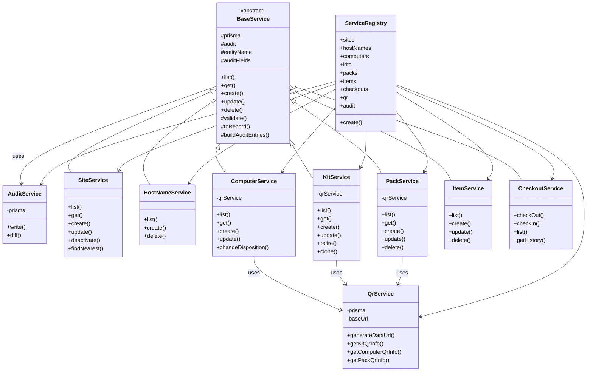
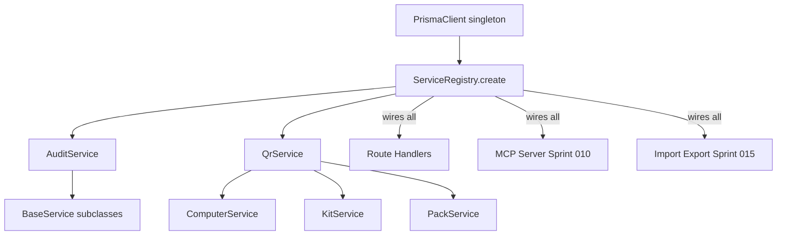

# Sprint 009: Service Layer OO Refactor

## Goals

Refactor the service layer from standalone exported functions into
proper TypeScript classes. Introduce a `BaseService` abstract class
that standardizes common patterns (CRUD, audit logging, error handling)
and establish dependency injection of the Prisma client and audit
service through constructors.

## Problem

Sprint 008 introduced a service layer, but every service module is a
collection of independent exported functions sharing module-level
imports of the Prisma singleton and audit helpers. This has several
problems:

1. **No polymorphism** — every service reimplements the same CRUD
   patterns (find, validate, create, audit) with copy-pasted
   boilerplate.
2. **Tight coupling** — functions import the Prisma singleton directly,
   making them impossible to test with a mock or transaction-scoped
   client.
3. **No dependency injection** — the audit logger, Prisma client, and
   QR code generator are hard-wired via module imports rather than
   injected, making substitution for tests or alternative contexts
   (MCP server, import/export) difficult.
4. **Inconsistent structure** — some services have 6 functions, some
   have 3, and they use different internal patterns for field lists,
   includes, and validation despite doing fundamentally similar work.
5. **TypeScript is object-oriented** — standalone functions ignore
   the language's core design paradigm and miss opportunities for
   encapsulation, inheritance, and interface-driven design.

## Solution

### Class Hierarchy



### Dependency Injection Flow



### Class Responsibilities

#### `BaseService<TRecord, TCreate, TUpdate>`

Abstract generic base class that standardizes the CRUD pattern:

- Receives `PrismaClient` and `AuditService` via constructor
- Declares `entityName` and `auditFields` for audit logging
- Provides default `list`, `get`, `create`, `update`, `delete`
  template methods that subclasses override
- Encapsulates the validate → persist → audit → return-record
  pipeline
- `toRecord()` maps Prisma model instances to contract types
- `buildAuditEntries()` wraps the diff-for-audit pattern

Subclasses override the template methods where their logic diverges
from the base (e.g., `SiteService.deactivate`, `KitService.clone`).

#### `AuditService`

Extracted from the current `auditLog.ts` standalone functions:

- `write(entries)` — writes one or more audit log entries
- `diff(userId, objectType, objectId, old, new, fields)` — compares
  two objects and returns audit entries for changed fields

Constructor receives `PrismaClient`. This class has no base class —
it is a dependency injected into `BaseService` and its subclasses.

#### `QrService`

Merges the existing `qrCode.ts` (generation) and `qrService.ts`
(entity lookup) into a single class:

- `generateDataUrl(path)` — generates QR code data URL
- `getKitQrInfo(id)` — looks up kit + generates QR
- `getComputerQrInfo(id)` — looks up computer + generates QR
- `getPackQrInfo(id)` — looks up pack + generates QR

Constructor receives `PrismaClient` and optional `baseUrl`.

#### `ServiceRegistry`

A composition root that constructs all services with their
dependencies and exposes them as named properties:

```typescript
const registry = ServiceRegistry.create(prisma);
// registry.sites.list()
// registry.kits.clone(id, userId)
// registry.checkouts.checkOut(input, userId)
```

Routes receive the registry (or individual services from it) at
startup. The MCP server (Sprint 010) and import/export (Sprint 015)
use the same registry, ensuring a single composition point.

A `ServiceRegistry.create()` static factory method accepts an optional
`PrismaClient`, defaulting to the singleton. Tests can pass a
transaction-scoped client for isolation.

### Route Handler Migration

Route files change from:

```typescript
import * as siteService from '../services/siteService';
router.get('/sites', async (req, res, next) => {
  try { res.json(await siteService.listSites()); }
  catch (err) { next(err); }
});
```

To:

```typescript
export function sitesRouter(services: ServiceRegistry): Router {
  const router = Router();
  router.get('/sites', async (req, res, next) => {
    try { res.json(await services.sites.list()); }
    catch (err) { next(err); }
  });
  return router;
}
```

Routes become factory functions that receive the registry, eliminating
module-level imports of service singletons.

## Success Criteria

- All service modules are classes extending `BaseService` (or standalone
  classes for `AuditService` and `QrService`)
- `ServiceRegistry` is the single composition root for all services
- Constructor-based dependency injection for `PrismaClient` and
  cross-service dependencies
- Route files receive services via `ServiceRegistry`, not module imports
- All existing API tests pass without modification
- Round-trip test passes without modification
- No standalone exported service functions remain (only class methods)
- 85% line coverage on `server/src/services/` via direct service tests
- Coverage threshold enforced in Jest config

## Scope

### In Scope

- `BaseService` abstract class with generic CRUD template methods
- Refactor all 8 service modules into classes
- `AuditService` class (extracted from `auditLog.ts`)
- `QrService` class (merged from `qrCode.ts` + `qrService.ts`)
- `ServiceRegistry` composition root
- Route handler factory functions receiving `ServiceRegistry`
- Update `server/src/index.ts` to create registry and wire routes
- Jest coverage configuration for services directory
- Direct service layer tests for every service class

### Out of Scope

- New features or API endpoints
- Frontend changes
- Data contract changes (contracts stay the same)
- Auth routes, admin routes, test auth routes (remain as-is)
- Service error types (unchanged from Sprint 008)

## Test Strategy

- **Service layer tests** (`tests/server/services/`) — direct tests
  for every service class exercising all public methods, both happy
  paths and error paths. Target 85% line coverage, 70% branch coverage.
- **Coverage enforcement** — Jest `coverageThreshold` configured for
  `server/src/services/` so CI fails if coverage drops below threshold.
- **Existing API tests** (`tests/server/`) must pass unchanged — this
  is a pure refactor with no behavioral changes.
- **Round-trip test** must pass unchanged.
- **TypeScript compilation** must succeed with no errors.
- **Verify no standalone service function exports** via grep.

## Architecture Notes

- The `BaseService` uses the Template Method pattern: define the
  skeleton of the CRUD algorithm in the base class, let subclasses
  override specific steps.
- Services that don't fit the standard CRUD pattern (e.g.,
  `CheckoutService` with `checkOut`/`checkIn`) still extend
  `BaseService` for access to the Prisma client and audit service,
  but override the template methods entirely.
- The `ServiceRegistry` uses the Composition Root pattern from
  dependency injection: all object construction happens in one place,
  and the rest of the application receives fully-constructed objects.
- Contract types remain unchanged — this sprint only changes the
  internal organization of services, not their public API.

## Definition of Ready

Before tickets can be created, all of the following must be true:

- [ ] Sprint planning documents are complete (sprint.md, use cases, technical plan)
- [ ] Architecture review passed
- [ ] Stakeholder has approved the sprint plan

## Tickets

(To be created after sprint approval.)
